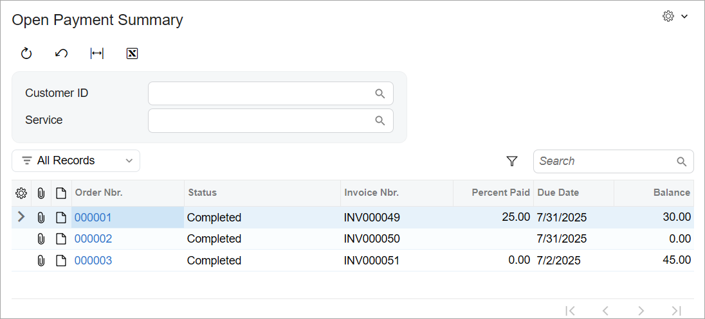

# Filtering Parameters:To Display the Filter Values in the URL {#_e31b7716-a90f-4b82-a5a6-d2d0c9ec540f .task}

When a form contains filtering parameters, it can be useful to have the selected parameter values in the form URL so that the same form \(that is, the form with the same selections made\) can be opened elsewhere without the filter parameter values needing to be entered again.

## Story { .section}

Suppose that the users of the custom Open Payment Summary \(RS401000\) inquiry form would like to easily share filtered inquiry results with other users by just sharing a link to the form without specifying which values need to be selected. You need to implement this functionality for the form.

## Process Overview { .section}

You will implement this behavior by adding the PageLoadBehavior property and setting its value to `PopulateSavedValues` in the graphInfo decorator in the TypeScript file of the form. The filter values of the primary view will be placed in the form URL. You’ll then test the implemented behavior.

## System Preparation { .section}

Before you begin performing the steps of this activity, do the following:

1.  Prepare an Acumatica ERP instance by performing the [Test Instance for Customization: To Deploy an Instance with a Custom Form that Implements a Workflow](../StudioDeveloperGuide/CodeCustomization_PrepareInstance_Activity_DeployInstanceT240.md) prerequisite activity.
2.  Complete the steps described in the following prerequisite activities:
    1.  [Inquiry Forms: To Set Up an Inquiry Form](UIDev_InquiryForm_Activity_SetupForm.md)
    2.  [Inquiry Forms: To Create the UI of an Inquiry Form with Only a Grid](UIDev_InquiryForm_Activity_UI.md)
    3.  [Filtering Parameters: To Add a Filter for an Inquiry Form](UIDev_FilteringParameters_Activity_ConfigureFilter.md)

## Step 1: Displaying the Filter Values in the URL of the Inquiry Form { .section}

To display the filter values in the URL of the form, do the following:

1.  In the `RS401000.ts` file, add PXPageLoadBehavior to the list of import directives.
2.  Add the PageLoadBehavior property in the graphInfo decorator, as the following code shows.

    ```language-javascript
    @graphInfo({
    	graphType: "PhoneRepairShop.RSSVPaymentPlanInq",
    	primaryView: "Filter",
    	pageLoadBehavior: PXPageLoadBehavior.PopulateSavedValues,
    })
    ```

    The system inserts into the URL the filter values of the primary view only \(in this case, the values of the `PXFilter<RSSVWorkOrderToPayFilter> Filter` view\).

    **Tip:** If you used the `development` folder to modify the TypeScript and HTML files of the form, you need to update these files in the customization project before publishing it. You do this by using the **Detect Modified Files** button on the [Modern UI Files](../Shared/../UserGuide/AU_20_46_00.md) page.

3.  Publish the customization project.

## Step 2: Testing the Filtering Parameters of the Inquiry Form { .section}

In this step, you’ll test the Open Payment Summary \(RS401000\) inquiry form with the filtering parameters. To test the filtering parameters, do the following:

1.  In Acumatica ERP, open the Open Payment Summary \(RS401000\) form.

    The form should look as shown below. Notice that the form contains a form toolbar, the Selection area with UI elements that correspond to the filtering parameters, and a table with a toolbar.

    

2.  On the Repair Work Orders \(RS301000\) form, do the following:
    1.  Create a repair work order and specify the following settings:
        -   **Customer ID**: *C000000003*
        -   **Service**: *Battery Replacement*
        -   **Device**: *Nokia 3310*
        -   **Description**: `Battery replacement, Nokia 3310`
    2.  On the form toolbar, click **Remove Hold**, **Assign**, **Complete**, and **Create Invoice**.
3.  On the Open Payment Summary form, in the **Customer ID** box, select *C000000001*.

    The table displays work orders for the *C000000001* customer. Notice that the page URL \(shown below\) includes the form ID and customer ID values.

    ```
    http://localhost/SmartFix_T250/Main?ScreenId=RS401000&CustomerID=C000000001
    ```

4.  In the **Service** box, select the *Battery Replacement* service.

    The table now displays the work orders for the *C000000001* customer and the *Battery Replacement* service. Notice that the page URL \(shown below\) contains the form ID, customer ID, and service ID values.

    ```
    http://localhost/SmartFix_T250/Main?ScreenId=RS401000&CustomerID=C000000001&ServiceID=1
    ```

    This URL can be copied and shared with other users.

5.  On the form toolbar, click **Cancel**.

    Notice that the boxes in the Selection area have been cleared and that the URL no longer includes the filter values.


**Parent topic:**[Adding Filtering Parameters to a Form](../DeveloperGuide/UIDev_FilteringParameters_Mapref.md)

