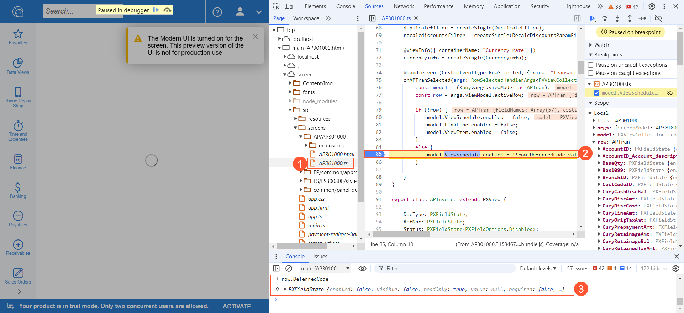

# UI Events: Debugging the UI Code in the Browser {#_8016ed6d-54c7-4a74-8e0b-e5640511f21b .concept}

You can debug any typescript code including the code of event handlers using developer tools.

On the **Sources** tab of the developer tools, you can find the source code of the form. You can use this code for debugging.

**Note:** For easier debugging, you need to build the UI source code with the `build-dev` command. For details about building the source code, see [Modern UI Development: Building the Source Code](UIDev_ModernUI_BuildingSources.md).

You can set a breakpoint in the code. When the breakpoint is hit, in the **Console** tab in the bottom of the **Sources** tab, you can type the name of the variable to see its value, type an expression to evaluate it, or change the value of a variable to check how the system works with this value.

For example, in the following screenshot, the TypeScript code of the [Bills and Adjustments](../UserGuide/AP_30_10_00.md) \(AP301000\) form is open, as Item 1 shows. A breakpoint is set for a line in the code \(Item 2\). This breakpoint is hit during the opening of the form, and the debugger has stopped on this line. In the console, the `row.DeferredCode` name has been entered, and the value of this variable is displayed \(Item 3\).

**Parent topic:**[Handling UI Events](../DeveloperGuide/UIDev_HandlingEvents_Mapref.md)

