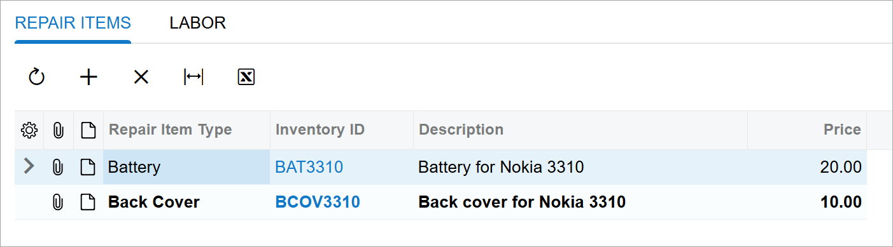
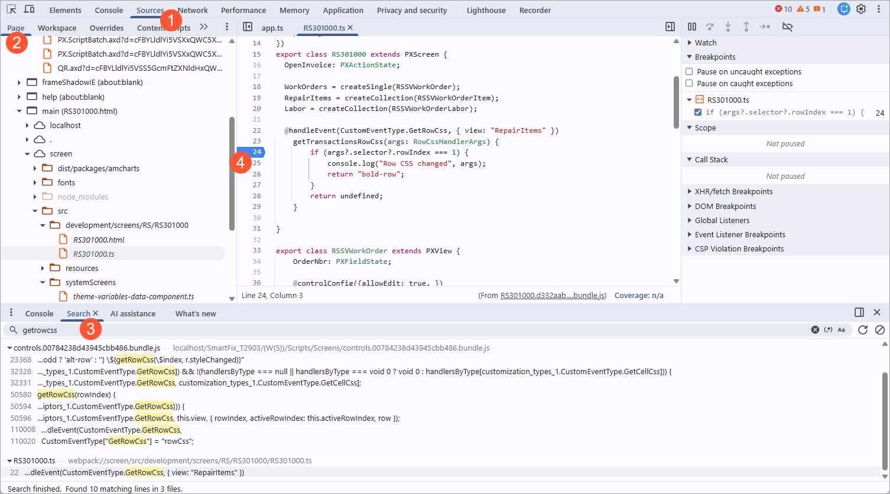
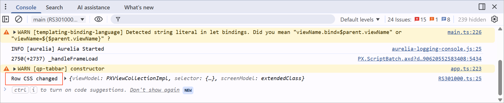

# Activity 7.2.1: To Implement and Debug an Event Handler {#_2fde834c-ec4e-4331-bbc3-21756781db0d .task}

This activity will walk you through implementing an event handler and debugging it by using the developer tools in the browser.

## Story { .section}

Suppose that you need to highlight the second line in a table in bold and print the message in the Console window when it happens.

## Process Overview { .section}

You will implement the GetRowCss event handler, in which you will print the message in the Console window and return the new CSS class for the second line of a table. Then you will debug the code by using the developer tools.

## Step 1: Implementing the Event Handler { .section}

To implement the GetRowCss event handler, do the following:

1.  In the `RS301000` screen class of the `RS301000.ts` file, add the following event handler.

    ```
    export class RS301000 extends PXScreen {
      ...
    
      @handleEvent(CustomEventType.GetRowCss, { view: "RepairItems" })
    	getTransactionsRowCss(args: RowCssHandlerArgs) {
      }
    }
    ```

    You’ve used the handleEvent decorator to indicate that the method is an event handler. As the first parameter of the decorator, you’ve specified the type of the event, and in the second parameter, you’ve specified the view for which the event handler is intended.

2.  In the body of the event handler, check the number of the row, print the message in the Console window, and return the name of the CSS class in string format.

    ```
      @handleEvent(CustomEventType.GetRowCss, { view: "RepairItems" })
    	getTransactionsRowCss(args: RowCssHandlerArgs) {
    		if (args?.selector?.rowIndex === 1) {
    			console.log("Row CSS changed", args);
    			return "bold-row";
    		}
    		return undefined;
    	}
    ```

    **Note:** You can find the names of the available CSS classes in the `FrontendSources/screen/static/custom.css` file.

3.  Rebuild your code.

## Step 2: Test the Event Handler { .section}

To test the event handler, do the following:

1.  Refresh the Repair Work Orders \(RS301000\) form.
2.  Create a repair work order with the following settings:
    -   **Customer ID**: *C000000001*
    -   **Service**: *BATTERYREPLACE*
    -   **Device**: *NOKIA3310*
3.  On the **Repair Items** tab, two lines appear.

    The second line is bold, as shown below.

    


## Step 3: Debugging the Code { .section}

To debug the code of the event handler, do the following:

1.  Open the developer tools of your browser.
2.  Open the **Sources** tab \(Item 1 below\).

    

3.  On the **Page** tab \(Item 2 above\), locate the source code of the RS301000 screen according to the following path.

    ```
    top/main (RS301000.html)/screen/src/development/screens/RS/RS301000/RS301000.ts
    ```

    **Note:** You can also search for the needed line on the **Search** tab \(Item 4\) of the developer tools.

4.  Put the breakpoint on line 24 \(Item 3\).
5.  Open the Repair Work Orders \(RS301000\) form.
6.  Create a new repair work order with the same settings as you entered in the previous step.
7.  When the breaking point is hit, go through the steps for the first line and the second line of the table on the **Repair Items** tab.
8.  On the **Console** tab, notice the messages from the event handler, as shown below.

    


**Parent topic:**[Handling UI Events](../DeveloperGuide/UIDev_HandlingEvents_Mapref.md)

