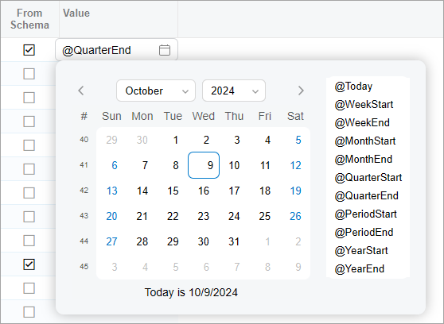

# UI Events: Displaying of Relative Dates {#_1f0e5a43-41d2-450f-b85b-d8150c50754f .concept}

The date and time control can display relative dates—that is, values such as *@Today* or *@WeekStart* \(shown below\).



To specify that a user can enter relative dates in the control, you need to implement the [RowSelected](https://help.acumatica.com/(W(28))/Help?ScreenId=ShowWiki&pageid=3577810d-417e-0518-74be-587de1c13771) event handler. In the event handler, you call the [PXDatetimeFieldState.showRelativeDates](https://help.acumatica.com/(W(28))/Help?ScreenId=ShowWiki&pageid=0b0b99e2-1fcd-403d-76d6-fd586c54c9be) method to indicate that the values are allowed.

An example of such a handler is shown in the following code.

```language-javascript
@handleEvent(CustomEventType.RowSelected, { view: "Rules" })
  onEPRuleConditionSelected(
    args: RowSelectedHandlerArgs<PXViewCollection<EPRuleCondition>>) 
{
    const ar = args.viewModel.activeRow;

    ar.Value?.to(PXDatetimeFieldState).showRelativeDates();
}
```

**Parent topic:**[Handling UI Events](../DeveloperGuide/UIDev_HandlingEvents_Mapref.md)

