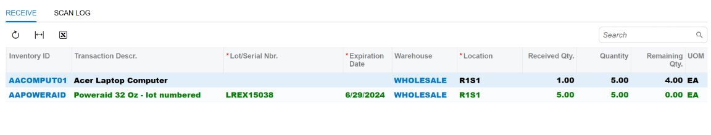

# UI Events: Changing of the CSS for a Row of a Table {#_cf2a8dce-5600-4abb-add6-29e81e0e4115 .concept}

You can implement an event handler for the GetRowCss event to change the CSS for any row of a table, such as the bold rows shown in the following screenshot.



In the `PO302020` screen class in the following example, the `Received` view property is defined for the `ReceiptSplitsForReceive` view class. In this screen class, the `getReceivedRowCss` method has the handleEvent decorator, which indicates that the method handles the GetRowCss event for the `Received` view instance. The handler method returns the name of the CSS class to be applied to the row of the `ReceiptSplitsForReceive` type.

```
export class PO302020 extends PXScreen {​
    **Received** = createCollection(**ReceiptSplitsForReceive**);​
​
    @handleEvent(CustomEventType.GetRowCss, { view: "**Received**" })​
    getReceivedRowCss(args: RowCssHandlerArgs<**ReceiptSplitsForReceive**>): string {​
        const split = args?.selector?.row;​
​
        if (split != null && split.ReceiveQty.value > split.Qty.value) {​
            return "bold-row";​
        }​
        return undefined;​
    }​
}​
```

**Tip:** You can use the CSS classes that are defined in the `FrontendSources\screen\static\custom.css` file or define your own classes in a CSS file for the form, such as in `EP503010.css`.

**Parent topic:**[Handling UI Events](../DeveloperGuide/UIDev_HandlingEvents_Mapref.md)

