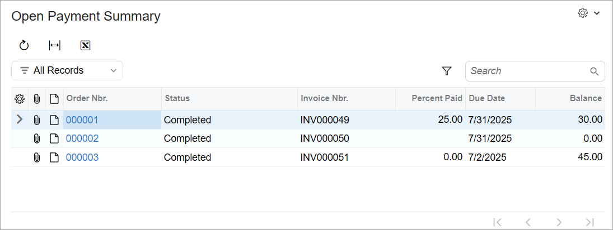
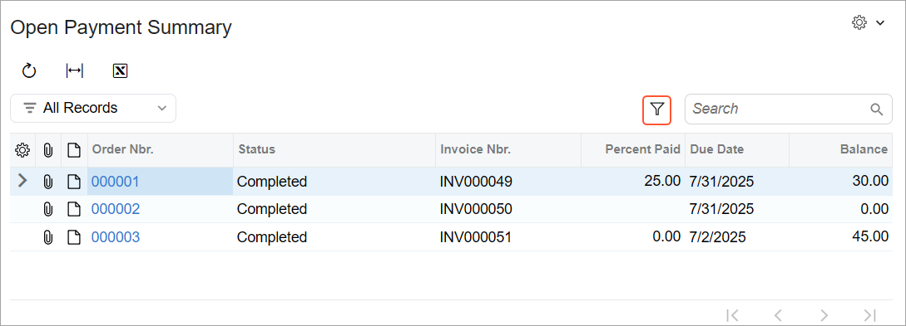
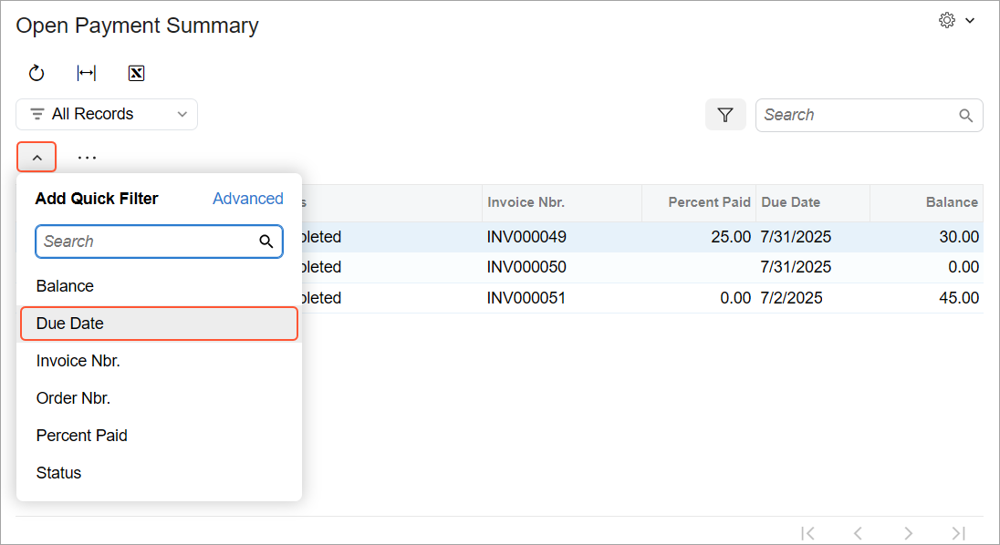
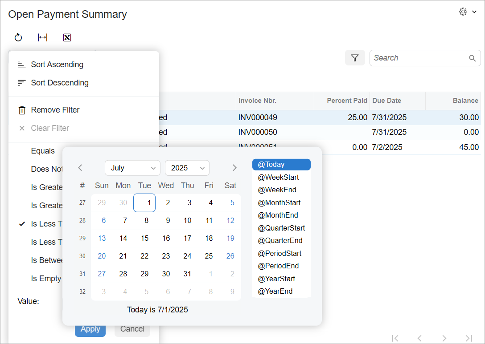
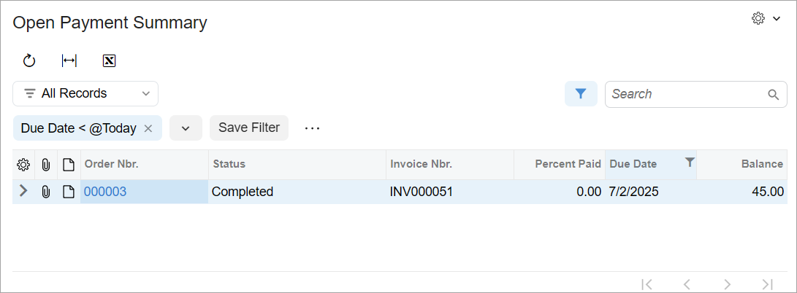

# Inquiry Forms:To Create the UI of an Inquiry Form with Only a Grid {#_f8da253f-db96-4c99-a7ab-2e10e2935597 .task}

This activity will walk you through the process of developing the UI of an inquiry form.

## Story { .section}

Suppose that you need to develop the Open Payment Summary \(RS401000\) form in the Modern UI. The form will have a table, as shown below.



You’ve already implemented the backend for the form, which includes the `RSSVPaymentPlanInq` graph and the `RSSVWorkOrderToPay` data access class \(DAC\).

## Process Overview { .section}

You will modify the TypeScript and HTML files for the Open Payment Summary \(RS401000\) form as follows:

-   In the TypeScript file, you’ll define the screen class and view class for the form. You will also define the `DetailsView` view, which is bound to the `RSSVWorkOrderToPay` DAC.
-   In the HTML file, you’ll define the layout of the form.

You will then test the form.

## System Preparation { .section}

Before you begin creating the UI of the Open Payment Summary \(RS401000\) form, complete the following prerequisite activities:

1.  [Test Instance for Customization: To Deploy an Instance with a Custom Form that Implements a Workflow](../StudioDeveloperGuide/CodeCustomization_PrepareInstance_Activity_DeployInstanceT240.md)
2.  [Inquiry Forms: To Set Up an Inquiry Form](UIDev_InquiryForm_Activity_SetupForm.md)

To be able to create and pay invoices, you need to configure the deployed instance as follows:

1.  On the [Enable/Disable Features](../Shared/../UserGuide/CS_10_00_00.md) \(CS100000\) form, enable the *Advanced SO Invoices* feature.
2.  On the [Item Classes](../Shared/../UserGuide/IN_20_10_00.md) \(IN201000\) form, select the *STOCKITEM* class. On the **General** tab \(**General Settings** section\), select the **Allow Negative Quantity** check box. On the form toolbar, click **Save**.
3.  On the [Accounts Receivable Preferences](../Shared/../UserGuide/AR_10_10_00.md) \(AR101000\) form, on the **General** tab \(**Data Entry Settings** section\), clear the **Validate Document Totals on Entry** and **Require Payment Reference on Entry** boxes to simplify the process of releasing an invoice. On the form toolbar, click **Save**.

## Step 1: Defining the Screen Class of the Form { .section}

To define the view of the Open Payment Summary \(RS401000\) form in the TypeScript file of the form, you define a screen class and a property for the data view of the form. Do the following:

1.  Open the `RS401000.ts` file.

    **Tip:** You can open a TypeScript file of a form from one of the following locations:

    -   On the [Modern UI Files](../Shared/../UserGuide/AU_20_46_00.md) page of the Customization Project Editor
    -   In the `FrontendSources\screen\src\development\screens` folder of your Acumatica ERP instance. \(The files appear in the file system if you click **Export to Development Folder** on the toolbar of the [Modern UI Files](../Shared/../UserGuide/AU_20_46_00.md) page.\)
2.  In the `RS401000.ts` file, make sure the following import directives as included.

    ```language-javascript
    import { createCollection, PXScreen, graphInfo, viewInfo,
    	PXView, PXFieldState, gridConfig, PXFieldOptions, GridPreset
    } from "client-controls";
    ```

3.  In the `RS401000` screen class, modify the graphInfo decorator, and specify the graph and the primary view of the form in the decorator properties, as the following code shows.

    ```language-javascript
    @graphInfo({
    	graphType: "PhoneRepairShop.RSSVPaymentPlanInq",
    	primaryView: "DetailsView",
    })
    export class RS401000 extends PXScreen {
    }
    ```

4.  Define the property for the data view of the form, as the following code shows. For the data view that’s used to display a table, you need to initialize the property with the createCollection method. The method takes as the input parameter an instance of the view class, which you will define in the next step.

    ```language-javascript
    export class RS401000 extends PXScreen {
        @viewInfo({containerName: "Work Orders with Open Payments"})
        DetailsView = createCollection(RSSVWorkOrderToPay);
    }
    ```

    In the viewInfo decorator, you’ve specified the name of the container for the table.


## Step 2: Defining the View Class of the Form { .section}

In the TypeScript file of the form, you need to define a view class for the table on the Open Payment Summary \(RS401000\) form, which is `RSSVWorkOrderToPay`. Proceed as follows:

1.  Define the `RSSVWorkOrderToPay` view class as follows.

    ```language-javascript
    export class RSSVWorkOrderToPay extends PXView {
    	OrderNbr: PXFieldState;
    	Status: PXFieldState;
    	InvoiceNbr: PXFieldState;
    	PercentPaid: PXFieldState;
    	ARInvoice__DueDate: PXFieldState;
    	ARInvoice__CuryDocBal: PXFieldState;
    }
    ```

    To add a joined field to the UI of the form, you’ve separated the name of the joined DAC and the field name in this DAC with two underscores.

2.  Add the gridConfig decorator to the `RSSVWorkOrderToPay` view class, as the following code shows. In the gridConfig decorator, you must specify the preset property. Because the table is used on the inquiry form, you use the *Inquiry* preset. For details about presets, see [Form Layout: Grid Presets](UIDev_DesigningLayout_GridPresets.md).

    ```language-javascript
    @gridConfig({
    	preset: GridPreset.Inquiry
    })
    export class RSSVWorkOrderToPay extends PXView {
    ... 
    }
    ```

3.  Remove the `MasterView = createSingle(MasterViewClass);` and `DetailsView = createCollection(DetailsViewClass);` properties from the screen class. Also, remove the `MasterViewClass` and `DetailsViewClass` classes. These properties and classes are part of the boilerplate code that was generated by the system.
4.  Save your changes.

## Step 3: Defining the Layout in HTML { .section}

The Open Payment Summary \(RS401000\) form contains only a table. To define the layout of the form, do the following:

1.  Open the `RS401000.html` file.

    **Tip:** You can open an HTML file of a form from one of the following locations:

    -   On the [Modern UI Files](../Shared/../UserGuide/AU_20_46_00.md) page of the Customization Project Editor
    -   In the `FrontendSources\screen\src\development\screens` folder of your Acumatica ERP instance. \(The files appear in the file system if you click **Export to Development Folder** on the toolbar of the [Modern UI Files](../Shared/../UserGuide/AU_20_46_00.md) page.\)
2.  Remove the existing boilerplate code from the file. Add the qp-grid tag and bind it to the `DetailsView` view, as the following code shows.

    ```language-xml
    <template>
        <qp-grid id="gridDetailsView" view.bind="DetailsView"></qp-grid>	
    </template>
    ```

3.  Save your changes.

    **Tip:** If you used the `development` folder to modify the TypeScript and HTML files of the form, you need to update these files in the customization project before publishing it. You do this by using the **Detect Modified Files** button on the [Modern UI Files](../Shared/../UserGuide/AU_20_46_00.md) page.

4.  Publish the customization project.

## Step 4: Preparing Data for Testing { .section}

In this step, you will add some repair work orders, invoices, and payments to the database. To add these invoices and payments, do the following:

1.  On the Repair Work Orders \(RS301000\) form, remove all existing repair work orders from hold. Then assign the work orders, complete them, and create invoices for them.
2.  Open any work order with the *Completed* status \(for example, *000001*\) and do the following:
    1.  Open the invoice for the chosen work order: Note the invoice number in the **Invoice Nbr.** box and open this invoice on the [Invoices](../UserGuide/SO_30_30_00.md) \(SO303000\) form.
    2.  On the form toolbar, click **Remove Hold**, **Release**, and then **Pay**. The [Payments and Applications](../UserGuide/AR_30_20_00.md) \(AR302000\) form opens.
    3.  On the **Documents to Apply** tab, type `10` in the **Amount Paid** column.
    4.  On the form toolbar, click **Remove Hold** and then **Release**.
3.  Open another work order with the *Completed* status \(for example, *000003*\), and do the following:
    1.  Open the invoice for the chosen work order: Note the invoice number in the **Invoice Nbr.** box and open this invoice on the [Invoices](../UserGuide/SO_30_30_00.md) \(SO303000\) form.
    2.  Change the invoice’s **Due Date** to tomorrow's date and save your changes.

## Step 5: Testing the Form { .section}

In this step, you will test the Open Payment Summary \(RS401000\) inquiry form with the added invoices and payments. Do the following:

1.  Open the Open Payment Summary inquiry form.

    The form should look similar to the one shown below. Notice that the table has a toolbar with standard buttons and the **Filter Settings** button.

    

2.  Change the current business date to the day after tomorrow.
3.  On the table toolbar, click the **Filter Settings** button. The filtering area appears.
4.  In the filtering area, click the arrow button and click **Due Date** \(shown below\). A Quick Filter button appears for the **Due Date** column.

    

5.  Click the Quick Filter button for the **Due Date** column. The Quick Filter drop-down menu opens.
6.  In the menu, do the following:
    1.  Click **Is Less Than**.
    2.  Click the Calendar button in the **Value** box.
    3.  In the Calendar dialog box, click *@Today* \(see below\).

        

    4.  Click **Apply**.
7.  With these filter settings, the form displays overdue payments, as shown in the example below.

    

8.  To clear the filter, in the Quick Filter drop-down menu, click **Clear Filter**.
9.  Change the business date to the current date.

**Parent topic:**[Defining an Inquiry Form](../DeveloperGuide/UIDev_InquiryForm_Mapref.md)

