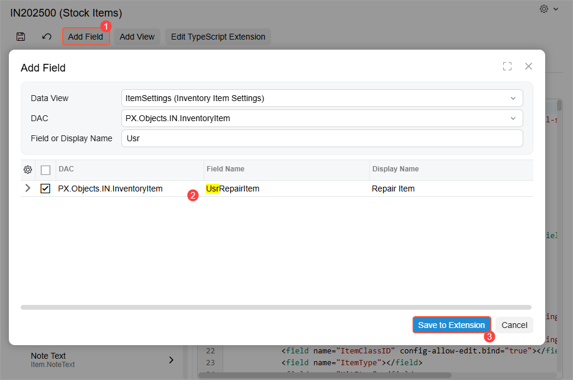
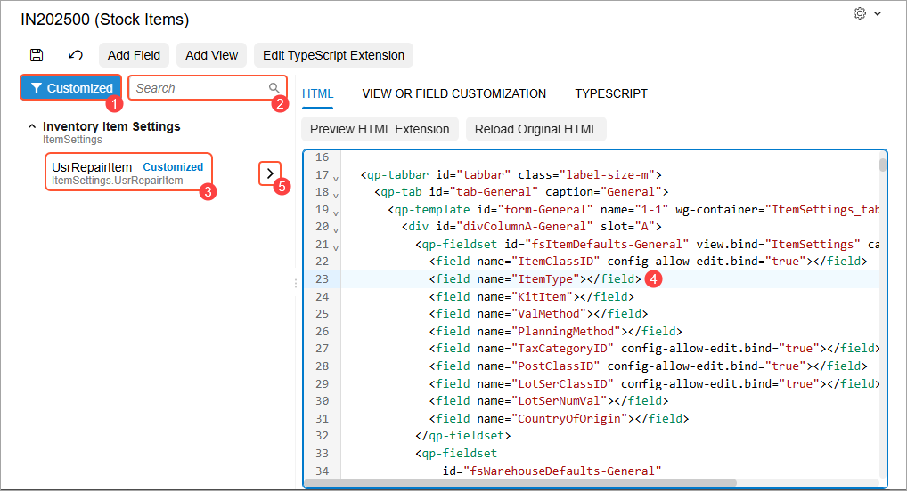

# Modern UI Editor: To Add a Field {#_57cac02a-f2c4-4638-91e5-f81dfc0b9c28 .task}

To add a custom field to a fieldset, you need to create TypeScript and HTML extensions of the form. You can use the Modern UI Editor to generate these extensions. The generated files are automatically saved to the customization project and can later be built and published.

This activity will walk you through the process of adding a custom field to a fieldset and generating the corresponding TypeScript and HTML extension files.

## Story { .section}

Suppose that you need to add a custom field, `UsrRepairItem`, to the **Item Settings** section on the **General** tab of the [Stock Items](../UserGuide/IN_20_25_00.md) \(IN202500\) form. You need to create a TypeScript extension, which will include the definition of this custom field. You also need to create an HTML extension to place the field in the appropriate fieldset.

## Process Overview { .section}

By using the **Add Field** button of the Modern UI Editor, you will add the custom field and generate the TypeScript extension. You’ll then use the element tree to locate the custom field, add the field in the appropriate position in the HTML layout, and create an HTML extension.

## System Preparation { .section}

Before you begin performing the steps of this activity, do the following:

1.  Install an Acumatica ERP instance \(Version 2026 R1 or later\) with the *T100* dataset.
2.  Create a customization project and customize an existing form, such as [Stock Items](../UserGuide/IN_20_25_00.md) \(IN202500\), by adding a custom field to the corresponding database table and creating a DAC extension.

## Step 1: Adding the Field and Generating the TypeScript Extension { .section}

To add the custom field and generate the extension:

1.  Open the Modern UI Editor for this form.
2.  On the page toolbar, click **Add Field** \(Item 1 below\), which opens the **Add Field** dialog box.
3.  Specify the data view where the new field is accessible. The corresponding DAC is selected automatically.
4.  Specify the field name in the **Field or Display Name** box; the field appears automatically in the table as you start typing its name \(Item 2\).

    

5.  Select the unlabeled check box for the field in the table.
6.  Click **Save to Extension** \(Item 3\), which closes the dialog box.
7.  Click **Save** on the page toolbar.

    The system adds the file with the generated TypeScript extension to your customization project and lists it on the [Modern UI Files](../UserGuide/AU_20_46_00.md) page of the Customization Project Editor.

8.  To apply the changes, publish the customization project. The system validates and builds the frontend code, including the TypeScript extension.

## Step 2: Adding the Field to the HTML Code and Generating the HTML Extension { .section}

To customize the HTML layout, you can use the Modern UI Editor to generate the HTML extension. The file is automatically saved to the customization project and can later be built and published.

To add the custom field to the **Item Settings** section on the **General** tab of the [Stock Items](../UserGuide/IN_20_25_00.md) \(IN202500\) form:

1.  Open the Modern UI Editor for the form.
2.  In the element tree, locate the custom field you want to add to the HTML template: Click **Customized** \(Item 1 below\) to list all the custom views and fields, or use the Search box \(Item 2\) to find the custom field.

    Notice the blue *Customized* tag next to the `UsrRepairItem` field \(Item 3\), which indicates that this is a custom field.

3.  On the **HTML** tab of the Modern UI Editor, find the fieldset where the field should be. Place the cursor after the definition of the element you want it to follow \(Item 4\).

    **Tip:** To quickly find the location of an existing control in the code editor on the **HTML** tab, you can click the control in the element tree. Once you click it, the system automatically scrolls to the right place in the code editor and highlights the code line corresponding to the control. This is useful when you're trying to add a custom control to the HTML code and need to place it before or after an existing control.

    

4.  In the element tree, click the arrow button next to the new field \(Item 5 above\).

    The new field tag appears in the HTML code.

5.  On the page toolbar, click **Save**. The generated file is added to the [Modern UI Files](../UserGuide/AU_20_46_00.md) page.
6.  To apply the changes, publish the customization project.

The editor handles the technical details of creating properly formatted customization files so that you can focus on your code changes rather than file management.

**Parent topic:**[Customizing Modern UI Forms in the Customization Project Editor](../DeveloperGuide/UIDev_ModernUIEditor_Mapref.md)

