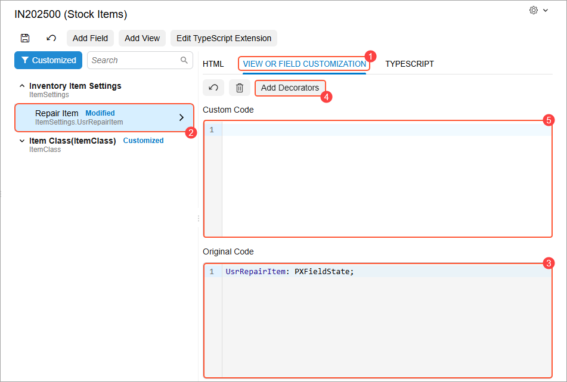
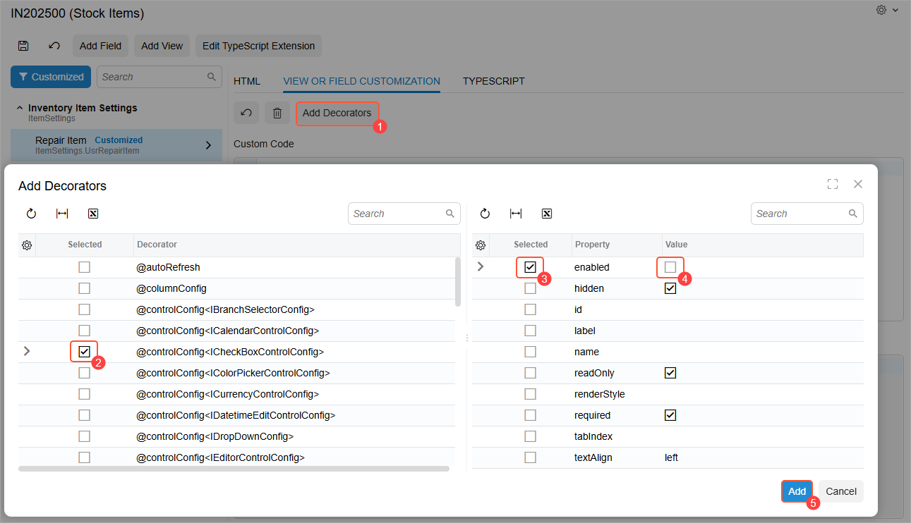
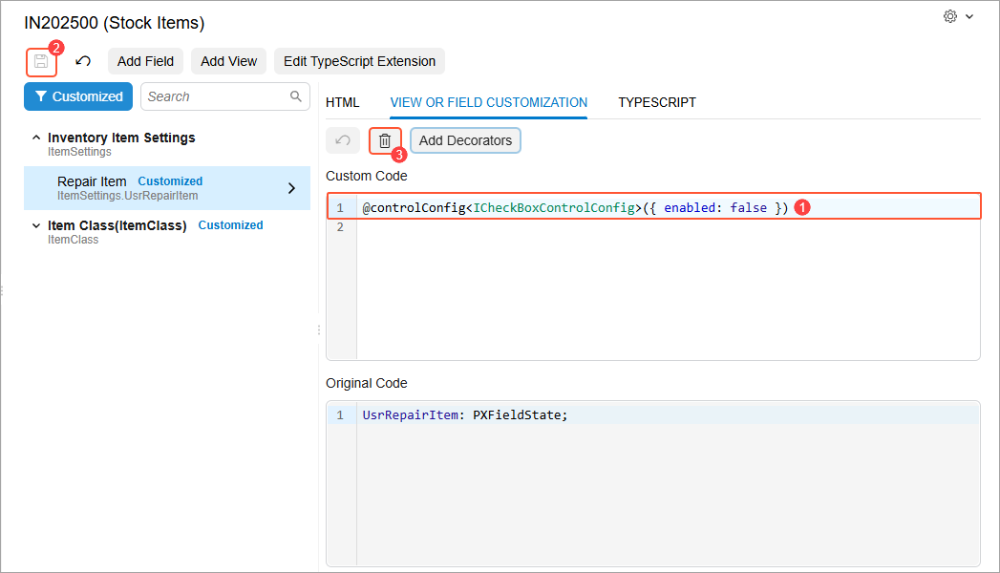

# Modern UI Editor: Adding Decorators to the Selected View or Field {#_b764caf7-6207-4386-a82b-09b8df42f40e .concept}

By using the Modern UI Editor, you can view and customize the TypeScript properties of a view or field. You use the **View or Field Customization** tab \(Item 1 below\) of the Modern UI Editor page to view or customize the TypeScript properties of a view or field that is selected in the element tree \(Item 2\). The original code of the selected view or field is displayed in the **Original Code** area \(Item 3\).

You use the **Add Decorators** button \(Item 4\) on the tab toolbar to add new decorators to the selected view or field and customize the corresponding properties of each decorator. The added decorator code is displayed in the **Custom Code** area \(Item 5\). You can also manually write the code in this area to customize the TypeScript properties of a view or field.

**Attention:** Currently, the system only supports adding new decorators to the selected view or field. You can’t view and edit the properties of decorators that are already applied to the selected view or field in the original code.

The following section describes the general steps you perform to add a decorator to a selected field.

## Adding Decorators to the Selected View or Field { .section}

Suppose that you need to specify that the `UsrRepairItem` field, represented by the **Repair Item** check box in the UI, should be disabled by default. You need to add the @controlConfig&lt;ICheckBoxControlConfig&gt; decorator to this field and set its enabled property to `false`. You’d perform the following steps:

1.  Click the **Add Decorators** button on the tab toolbar \(Item 1 below\).
2.  In the left table of the dialog box that opens, select the check box in the **Selected** column for the *@controlConfig&lt;ICheckBoxControlConfig&gt;* decorator \(Item 2\).
3.  In the right table, for the *enabled* property, select the check box in the **Selected** column \(Item 3\) and clear the check box in the **Value** column \(Item 4\).
4.  Click **Add** \(Item 5\).

    

    The added decorator code is displayed in the **Custom Code** area \(Item 1 below\).

5.  Click **Save** on the page toolbar \(Item 2\).

    

    The system updates the corresponding TypeScript extension file with the added code.

6.  To apply the changes, publish the customization project.

To remove the decorator code at any time, you click **Delete** \(Item 3 above\) and then **Save** on the page toolbar. To apply the changes, publish the customization project again.

**Parent topic:**[Customizing Modern UI Forms in the Customization Project Editor](../DeveloperGuide/UIDev_ModernUIEditor_Mapref.md)

