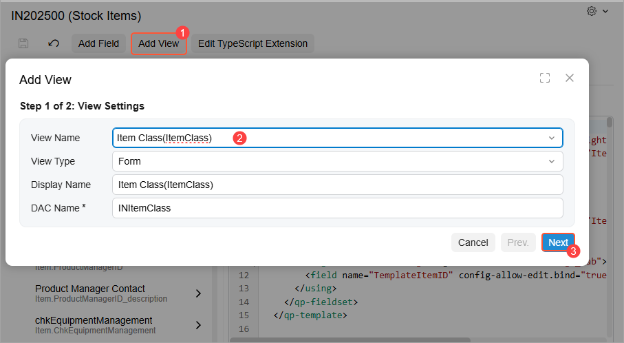
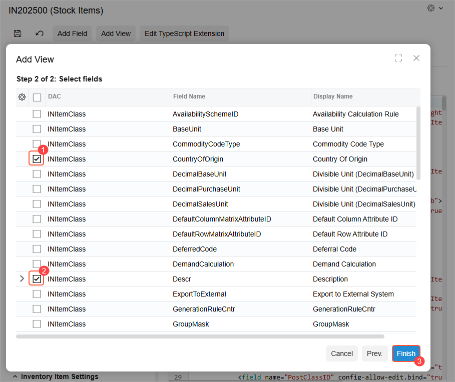

# Modern UI Editor: Adding a View {#_e3943104-3bbc-4b11-9ee1-c83738b9c17c .concept}

In the Modern UI Editor you can quickly add a view that you’ve declared in a form’s graph or a graph extension to the frontend code. You click **Add View** on the page toolbar to open the wizard you’ll use to add the view. Once you’ve finished, the system generates a TypeScript extension with the `_generated` suffix in its file name.

## Adding a View { .section}

To add an existing view to a form’s TypeScript code, perform these general steps:

1.  Open the Modern UI Editor for the form.
2.  On the page toolbar, click **Add View** \(Item 1 below\) to open the corresponding wizard.
3.  In Step 1, specify the view in the **View Name** box \(Item 2\). The remaining boxes are filled in automatically. Verify that their values are accurate and click **Next** \(Item 3\).

    

4.  In Step 2, in the table with the fields of the selected view, select the unlabeled check boxes for the fields you want to add \(Items 1 and 2 below\). Click **Finish** \(Item 3\).

    

5.  Click **Save** on the page toolbar.

    The system adds the file with the generated TypeScript extension to your customization project and lists it on the [Modern UI Files](../UserGuide/AU_20_46_00.md) page of the Customization Project Editor.

    **Attention:** If you’ve previously generated an extension for the form by clicking **Add Field** or **Add View**, the system adds the new view and the selected fields to the existing extension file.

6.  To apply the changes, publish the customization project. The system validates and builds the frontend code, including the TypeScript extension.
7.  To make the view’s selected fields available in the UI, customize the HTML layout of the form, as described in Step 2 of [Modern UI Editor: To Add a Field](UIDev_ModernUIEditor_AddField_Activity.md).

**Parent topic:**[Customizing Modern UI Forms in the Customization Project Editor](../DeveloperGuide/UIDev_ModernUIEditor_Mapref.md)

