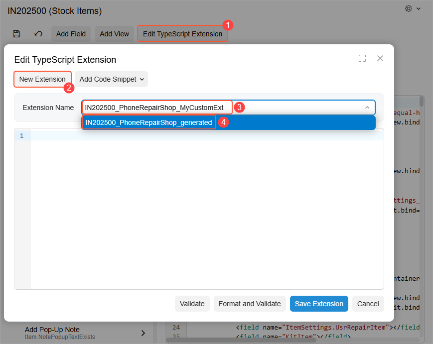
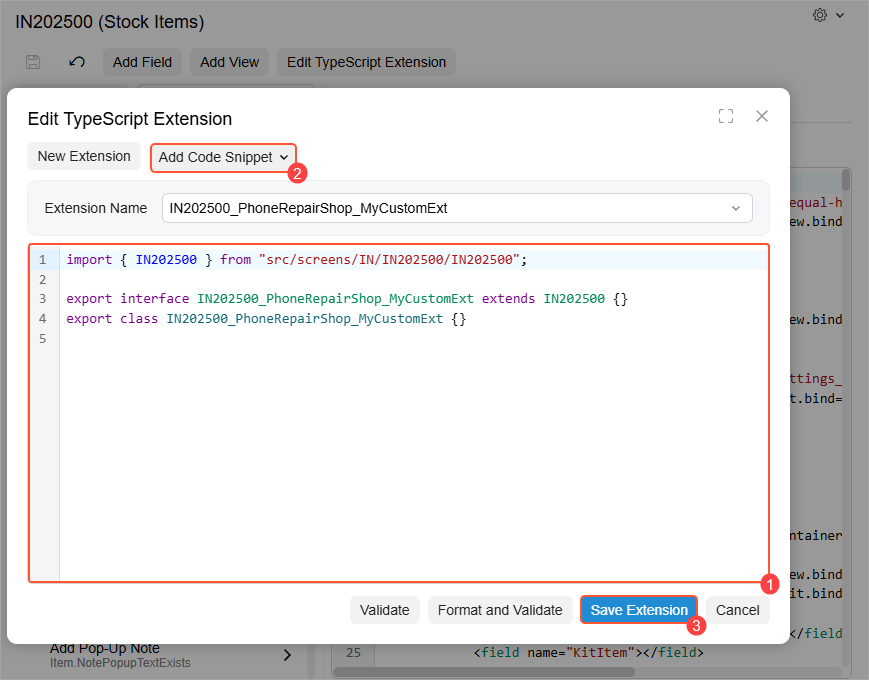

# Modern UI Editor: Creating and Editing a Custom TypeScript Extension {#_577361b7-6134-4fbf-84ec-431b274ad0aa .concept}

The Modern UI Editor gives you the ability to create and edit custom TypeScript extensions. You click **Edit TypeScript Extension** on the page toolbar to begin creating this extension. Then you specify its name and add your TypeScript code. The system generates the TypeScript extension file using your specified name.

## Creating and Editing the Extension { .section}

To create a custom TypeScript extension for a form, perform these general steps:

1.  Open the Modern UI Editor for the form.
2.  On the page toolbar, click **Edit TypeScript Extension** \(Item 1 below\), which opens the **Edit TypeScript Extension** dialog box.
3.  Optional: Click **New Extension** \(Item 2\) to clear any previously selected extension in the **Extension Name** box.
4.  Specify your extension’s name in the **Extension Name** box \(Item 3\). As you start typing, a drop-down list appears showing existing custom and system-generated extensions \(Item 4\).

    

5.  Once you’ve finished typing the name, move the focus away from the **Extension Name** box. The system generates the boilerplate code for your extension, which is displayed in the code editor \(Item 1 below\).
6.  Modify the code in the code editor. You can also use the options of the **Add Code Snippet** drop-down menu \(Item 2\) to quickly add boilerplate code for a field, view, data view extension, grid view or custom event handler. For details, see [Modern UI Editor](../UserGuide/AU_20_10_80.md).
7.  Click **Save Extension** \(Item 3\).

    

8.  Click **Save** on the page toolbar.

    The system adds the file with the generated extension to your customization project and lists it on the [Modern UI Files](../UserGuide/AU_20_46_00.md) page of the Customization Project Editor.

9.  To apply the changes, publish the customization project. The system validates and builds the frontend code, including the TypeScript extension.

    **Attention:** If you add a view or field while creating or editing a TypeScript extension, you must publish the customization project before you can access this view or field in the element tree of the Modern UI Editor.

To edit the extension, you click **Edit TypeScript Extension** on the page toolbar, which opens the **Edit TypeScript Extension** dialog box. Select the extension in the **Extension Name** box. You then use the code editor to make the changes. Once you’ve finished, click **Save Extension**.

**Tip:** You can also view the code of system-generated extensions on the **Edit TypeScript Extension** dialog box. However, you can’t edit these extensions.

**Parent topic:**[Customizing Modern UI Forms in the Customization Project Editor](../DeveloperGuide/UIDev_ModernUIEditor_Mapref.md)

