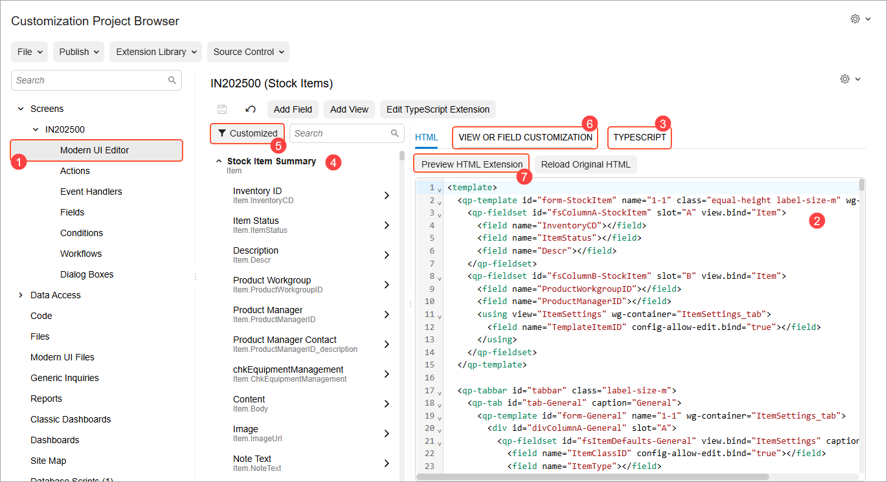
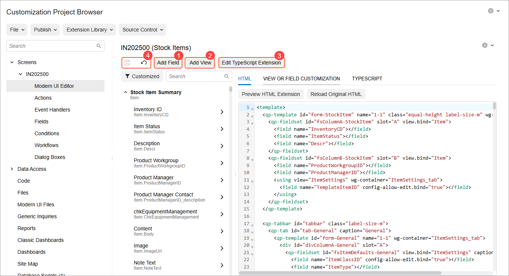

# Modern UI Editor: General Information {#_5edf94aa-6c31-43de-a89e-ed641a12ee9c .concept}

In the Customization Project Editor, you can use the [Modern UI Editor](../UserGuide/AU_20_10_80.md) page to customize the Modern UI forms that you’ve added to your customization project. These include custom forms that you’ve developed for the Modern UI from scratch, as well as existing Acumatica ERP forms that you’ve switched to the Modern UI in your instance.

## Learning Objectives { .section}

In this chapter, you’ll learn how to do the following:

-   View the HTML and TypeScript code of a form
-   Browse all view classes and fields relevant to a form in a convenient tree structure
-   Add a custom field to a form
-   Add a view to a form
-   Create a custom TypeScript extension for a form
-   Customize the TypeScript properties of a view or field

## Applicable Scenarios { .section}

You customize a form in the Modern UI by using the Modern UI Editor in the following cases:

-   You want to customize the layout of a new or existing form and automatically generate the necessary extension file.
-   You’ve added a new field or a view to a form in the backend code, and you now need to configure it so that it’s accessible in the Modern UI of the form.
-   You need to create a custom TypeScript extension for a form to address a specific scenario.
-   You need to customize the TypeScript properties of a view or field by adding new decorators to it.

## Overview of the Modern UI Editor { .section}

The Modern UI Editor fits seamlessly into your customization process, as shown in the example below of customizing the [Stock Items](../UserGuide/IN_20_25_00.md) \(IN202500\) form. To open the editor, click **Modern UI Editor** \(Item 1\) in the navigation pane under **Screens**.

Here’s what you can do for any form that’s been migrated to the Modern UI:

-   **View code directly:**See HTML and TypeScript files \(Items 2 and 3\).

    **Tip:** The code displayed on the HTML and TypeScript tabs represents the actual state of a form. It combines the code from system files and published customization projects, as well as changes that are currently saved but unpublished.

-   **Navigate easily:**Browse all view classes and fields relevant to the form in the element tree \(Item 4\) or click **Customized** \(Item 5\) to show only the customized ones.
-   **Customize a view or a field:** Select a view or field in the element tree; then view its original TypeScript properties or add new ones on the **View or Field Customization** tab \(Item 6\).
-   **Customize the HTML Code:** Edit the HTML code to add your customized fields and views. The system generates an HTML extension that implements the differences between the original and customized HTML code. You can preview these changes by clicking **Preview HTML Extension** on the tab toolbar \(Item 7\).

But that’s not all: The page toolbar of the Modern UI Editor provides the following capabilities for quickly customizing any form that has been migrated to the Modern UI:

-   **Add a field or view:**Add a field or view to your form \(Items 1 and 2 below\). When you save your changes, the system generates a TypeScript extension for new views and fields. The file names of these extensions have the `_generated` suffix.
-   **Create and edit a custom TypeScript extension:**Click **Edit TypeScript Extension** \(Item 3\) to quickly create or edit a custom TypeScript extension. You can also view the code of system-generated TypeScript extensions, but you can’t edit them.
-   **Quickly save or cancel changes:** Use the **Save** and **Cancel** buttons on the page toolbar \(Item 4\) to save or discard changes that you’ve made to an HTML or TypeScript extension on the **HTML** or **View or Field Customization** tabs.

The generated TypeScript and HTML extensions are automatically added to your customization project.

For more details about the features of the Modern UI Editor, see [Modern UI Editor](../UserGuide/AU_20_10_80.md).

**Parent topic:**[Customizing Modern UI Forms in the Customization Project Editor](../DeveloperGuide/UIDev_ModernUIEditor_Mapref.md)

