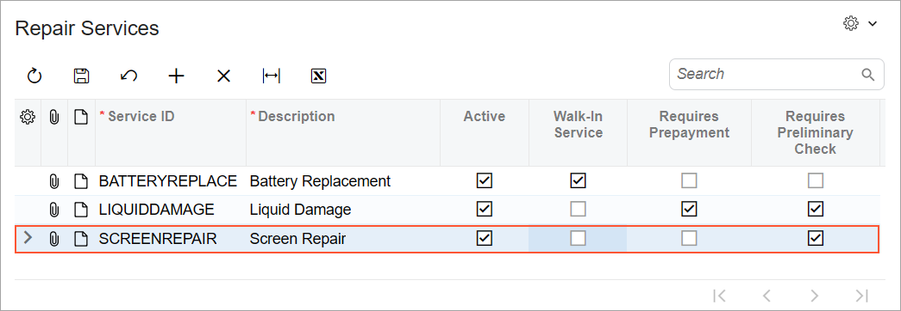

# Modern UI Development:To Build the Source Code of a Particular Form for the Modern UI Development {#_1c9994ff-252f-4487-9953-0ff2afb29d60 .task}

The following activity will walk you through the process of building the source code of a particular form that is defined in the Modern UI.

## Story { .section}

Suppose that you have defined the Repair Services \(RS201000\) form in the Modern UI for the Smart Fix company.You need to build the source code of this form in the `FrontendSources\screen` folder of your instance.

## Process Overview { .section}

You will execute a command to start building the source code for the Repair Services \(RS201000\) form. You will then review the UI of the form.

## System Preparation { .section}

Before you begin building the source code for the Repair Services \(RS201000\) form, you need to perform the prerequisite actions and complete the steps as described in [UI Definition in HTML and TypeScript: To Create the UI of a Form](UIDev_UIDefinition_Activity_CreateForm.md). You should have the following results:

-   The node version manager \(nvm\), Node.js, and the node package manager \(npm\) have been installed correctly on your computer.
-   The required dependencies needed to build the sources have been installed installed correctly in the `FrontendSources` folder of your instance.
-   The source code has been built for the first time for all the forms available in the Modern UI.
-   The source files for the Serviced Devices form has been generated in the `FrontendSources\screen\src\development\screens\RS\RS201000` folder of your instance.

## Step 1: Building the Source Code for a Particular Form { .section}

To build the sources for the Repair Services \(RS201000\) form, do the following in a command line tool \(You can use terminal in Visual Studio Code, or Windows PowerShell or a similar program.\):

1.  Switch to the `FrontendSources\screen` folder.
2.  Run the following command in the `FrontendSources\screen` folder.

    ``` {#codeblock_ljr_bnt_khc .language-bourne}
    npm run build-dev --- --env customFolder=development screenIds=RS201000
    ```

    You have specified the ID of the Repair Services form in the `screenIds` parameter to indicate that the sources should be built for only the Repair Services form.

    Once the command finishes executing, you should see a message about successful compilation of a webpack.


## Step 2: Viewing the Form in the Modern UI { .section}

To test your changes, do the following:

1.  Open the Repair Services \(RS201000\) form.

    **Note:** If the form is not opened from the workspace, try entering the RS201000 id in the page URL.

    The form opens in the Modern UI.

    **Note:** In case the form opens in the Classic UI, click **Tools** &gt; **Switch to Modern UI** on the form title bar.

2.  In the *ScreenRepair* row, clear the **Walk-In Service** check box, as shown on the following screenshot.

    

3.  Notice that the **Requires Preliminary Check** check box has been selected automatically.
4.  Select the **Walk-In Service** check box in the *ScreenRepair* row.
5.  Notice that the **Requires Preliminary Check** check box has been cleared automatically.
6.  Save your changes.

## Step 3 \(Optional\): Setting Up Automatic Rebuild of the Source Code for a Form { .section}

During developmental activities of the Modern UI, you make changes to the source files in the `FrontendSources\screen` folder of your instance. To see the changes that you make to a form, you need to rebuild the corresponding source files every time a change is made. To save time, you can run a command that causes the source files for a particular form to be rebuilt automatically each time a file is modified and saved in this folder.

To rebuild the source files automatically for the Repair Services \(RS201000\) form, use Windows PowerShell or a similar program to run the following command in the `FrontendSources\screen` folder. You need to run this command only once: `npm run watch --- --env customFolder=development screenIds=RS201000`.

**Parent topic:**[Getting Started with the Modern UI](../DeveloperGuide/UIDev_ModernUI_Mapref.md)

