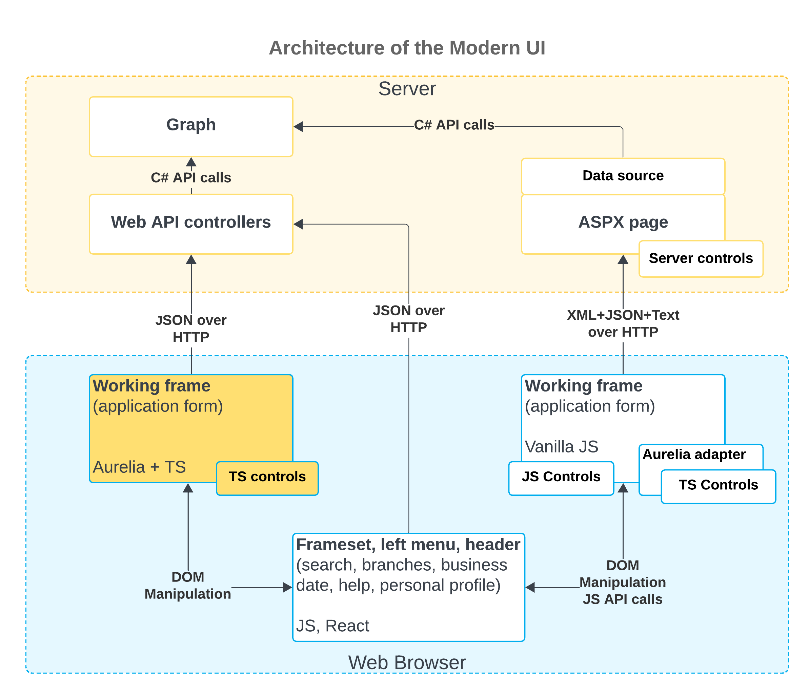

# Modern UI Development: General Information {#_0e8cba73-cecc-4739-bb71-b0b2c32b17ab .concept}

The Modern UI is a .NET-compatible product that delivers updated UI capabilities without relying on ASPX pages. On the server side, the Modern UI is represented by web services. On the client side, it’s represented by a template-based single-page application \(SPA\) framework based on [Aurelia](https://aurelia.io/).

The application code is written in TypeScript. The framework transcribes this code into JavaScript code for execution in the web browser. This approach simplifies code maintenance. Developers use HTML and CSS to design form layouts.

## Learning Objectives { .section}

In this chapter, you will learn how to do the following:

-   Enable the Modern UI while deploying an instance
-   Use the `development` folder for creating Modern UI source files for custom and customized forms
-   Verify that certain prerequisite installation and configuration tasks have been performed before building the UI from the source code
-   Build the Modern UI from the source code
-   Automatically rebuild the source code for a form when its source files are modified and saved
-   Switch a form between the Modern UI and the Classic UI

## Applicable Scenarios { .section}

You will work with the Modern UI in the following cases:

-   You need to make it possible to use the Modern UI for your instance.
-   You need to convert any number of forms of your Acumatica ERP instance to the Modern UI.
-   You need to create a new form that is based on the Modern UI.
-   You need to be able to switch between the Modern UI and the Classic UI of a form.

## Enabling of the Modern UI in the Acumatica ERP Configuration Wizard { .section}

By default, the system uses the Modern UI for a newly deployed instance. That is, the **Use Modern UI as Default** check box is selected on the Website Configuration page of the Acumatica ERP Configuration wizard, as shown below.

**Attention:** Make sure that you have the **Install NodeJS** check box selected so that the Acumatica ERP Configuration wizard installs the needed version of Node.js for compilation of the customization code of the Modern UI. If you want to use the version of Node.js that has already been installed in your system, you can clear the **Install NodeJS** check box and add the following key to the `appSettings` section of the `Web.config` file of your instance: `<add key="NodeJs:NodeJsPath" value="C:\Program Files\NodeJs"/>`. In this key, `value` specifies the path to the location where Node.js has been installed.

When the **Use Modern UI as Default** check box is selected, the system sets the value of the **Default UI** box to *Modern* on the [Site Preferences](../UserGuide/SM_20_05_05.md) \(SM200505\) form.

## Architecture of the Modern UI { .section}

The architecture of the Modern UI is based on the [Model-View-ViewModel \(MVVM\) pattern](https://learn.microsoft.com/en-us/dotnet/architecture/maui/mvvm), with the parts of the architecture represented as follows:

-   A view is represented by an HTML template.
-   A view model is represented by the code written in TypeScript.
-   A model is represented by a graph on the server that exchanges data from the client side.

The following diagram shows the architecture of the Modern UI and the interaction between its components.

Currently, the Modern UI is embedded in the infrastructure of the Classic UI. The Modern UI is represented by a new frame that enables TypeScript controls in the Classic UI infrastructure. Also, the Modern UI includes web API controllers that are added to the controllers of the Classic UI. Some parts of the Modern UI have been connected to the Classic UI architecture via an Aurelia adapter, which adapts TypeScript's controllers to work in the Classic UI architecture. The forms that are fully converted to the Modern UI \(highlighted in yellow in the preceding diagram\) work directly with web API controllers.

JSON serves as the protocol between the client side and the server side. As a result, all requests can be seen in a unified format and used for debugging.

## Capabilities of the Modern UI {#section_vv2_1y4_y4b .section}

The Modern UI provides a variety of new capabilities for both developers and users. For developers, the Modern UI provides the following capabilities in comparison to the Classic UI:

-   The template \(HTML and CSS\) and presentation logic layers \(TypeScript\) are fully customizable.
-   The client-side model can be programmed by using the event-driven model, which is similar to the server-side model.
-   The graph code generally does not require any modifications. The Modern UI and the Classic UI share the same graph.
-   The developers can always switch between the Modern UI and the Classic UI.

**Parent topic:**[Getting Started with the Modern UI](../DeveloperGuide/UIDev_ModernUI_Mapref.md)

