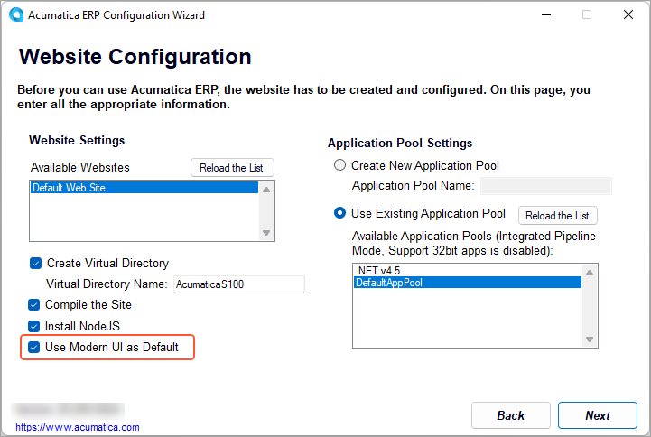
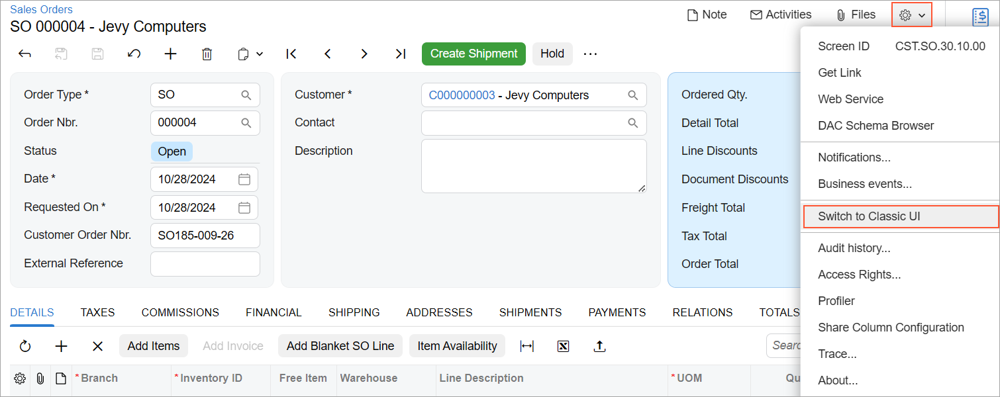
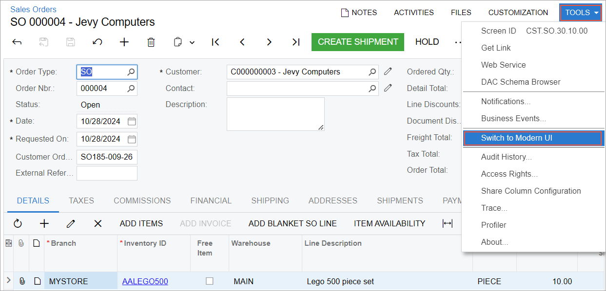
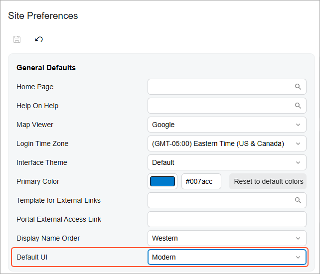
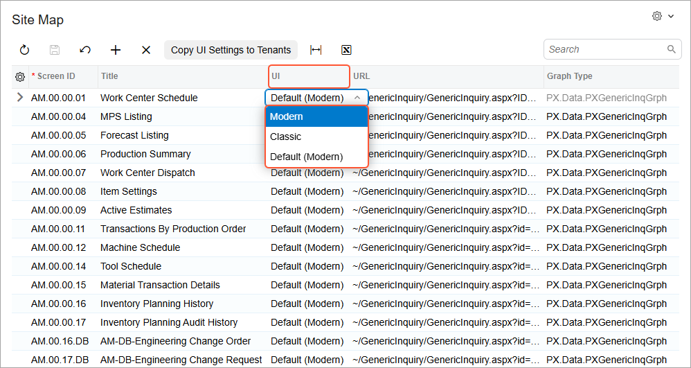

# Modern UI Development: Switching a Form Between the Modern UI and the Classic UI {#_59153fe6-0dff-4a16-85ef-133431af5d81 .concept}

Acumatica ERP provides a number of ways that you can use to switch an Acumatica ERP form that’s using the Modern UI to the Classic UI or vice versa.

When you deploy or update an instance of Acumatica ERP in the Acumatica ERP Configuration wizard, make sure the **Use Modern UI as Default** check box is selected \(the default state\), as shown below.

Before you use any of the methods described in the following sections, you may need to make a change to the `Web.config` file of your Acumatica ERP instance. In the `appSettings` section, check if the `<add key="EnableSiteMapSwitchUI" value="False" />` key has been added. If it has, remove this key from the file and save your changes. This is because this key disables the option to switch the UI of a form in the instance. By removing the key, you enable the option to switch the UI of a form.

**Important:** If you switch a form's UI by using the methods described below, the form's UI will be switched for all users. Thus, this capability is not provided to all users. Only users with the *Edit* level of access rights to the [Site Map](../UserGuide/SM_20_05_20.md) \(SM200520\) form can switch the UI of a form.

## Switching the UI of the Particular Form { .section}

While viewing a form in the Modern UI, you can click the Settings button on the form title bar and then **Switch to Classic UI** to switch the form to the Classic UI.

While viewing a form in the Classic UI, you can click **Tools** &gt; **Switch to Modern UI** on the form title bar to switch the form to the Modern UI.

**Attention:** The **Switch to Modern UI** command is available for only the forms that have been migrated to the Modern UI.

## Switching the UI of the Entire Site {#section_rnb_t3f_3gc .section}

To specify the user interface for all forms, use the **Default UI** setting on the [Site Preferences](../UserGuide/SM_20_05_05.md) \(SM200505\) form. It defines the UI to be used by default \(*Modern UI* or *Classic UI*\) for all users of the current tenant.

**Attention:** The form will use the interface specified as the default UI, if the form supports the selected UI.

## Switching the UI of Multiple Forms { .section}

You can use the [Site Map](../UserGuide/SM_20_05_20.md) \(SM200520\) form to specify the default UI to be displayed for any number of forms.

To cause a form to be displayed in the Modern UI or the Classic UI, you select *Modern*, *Classic*, or *Default* in the **UI** column of the row that corresponds to the form, as shown in the following screenshot.

The [Site Map](../UserGuide/SM_20_05_20.md) form also has the **Copy UI Settings to Tenants** button on the form toolbar. By using this button, you can copy the UI settings of all the listed forms to other tenants. When you click this button, the system displays a dialog box where you can select the tenants to which you want to copy the UI settings.

**Parent topic:**[Getting Started with the Modern UI](../DeveloperGuide/UIDev_ModernUI_Mapref.md)

