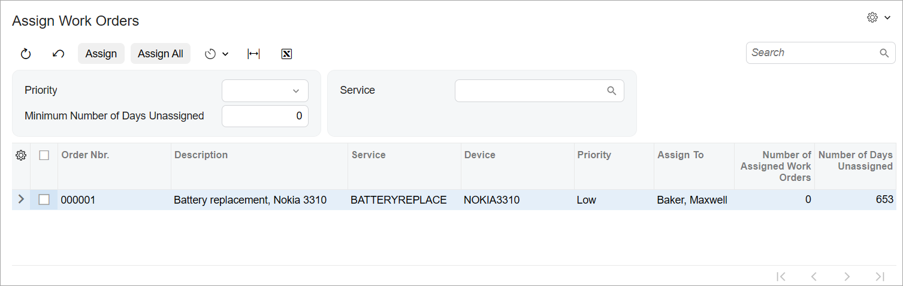

# Processing Form:To Create the UI of a Processing Form {#_dc359417-dc9b-4b83-becc-e9fc9950c30b .task}

The following activity will walk you through the process of developing the UI of a processing form.

## Story { .section}

Suppose that you need to develop the Assign Work Orders \(RS501000\) form in the Modern UI. The form will have the Selection area and a table, as shown in the following screenshot.



You have already implemented the backend for the form, which includes the `RSSVAssignProcess` graph and the `RSSVWorkOrder` and `RSSVWorkOrderToAssignFilter` data access classes \(DACs\). You have also already added the corresponding tables to the application database.

## Process Overview { .section}

You will create TypeScript and HTML files for the Assign Work Orders \(RS501000\) form. In the TypeScript file, you will define the screen class and view classes for the form. You will also define the following views:

-   `Filter`, which is bound to the Selection area of the form
-   `WorkOrders`, which is bound to the table of the form

In the HTML file, you will define the layout of the form.

## System Preparation { .section}

Before you begin creating the UI of the Assign Work Orders \(RS501000\) form, do the following:

1.  Complete the following prerequisite activity: [Modern UI Development: To Deploy an Instance with Custom Forms and the Modern UI](UIDev_ModernUI_Activity_PrepareInstance.md). Make sure the prepared instance contains the following items:
    -   The `RSSVAssignProcess` graph in the customization code
    -   The `RSSVWorkOrder` and `RSSVWorkOrderToAssignFilter` DACs in the customization code
    -   The `RSSVWorkOrder` database table
2.  To take the prerequisite actions and build the source code for the first time, perform the following prerequisite activity: [Modern UI Development: To Build the Source Code of All Acumatica ERP Forms for Modern UI Development](UIDev_ModernUI_Activity_BuildingSourcesAll.md).

## Step 1: Creating Files for the Form { .section}

To implement the Modern UI version of the Assign Work Orders \(RS501000\) form, you need to create the TypeScript and HTML files for the form. Create the files as follows:

1.  In the `FrontendSources\screen\src\development\screens` folder of your Acumatica ERP instance, create a folder with the `RS` name if one has not been created yet. You will store the UI sources for all forms with the *RS* prefix in this folder.
2.  In the `FrontendSources\screen\src\development\screens\RS` folder, create a folder with the `RS501000` name if it has not been created yet.
3.  In the `FrontendSources\screen\src\development\screens\RS\RS501000` folder, create the following files:
    -   `RS501000.ts`
    -   `RS501000.html`

## Step 2: Defining the Screen Class in TypeScript { .section}

To define the view of the Assign Work Orders \(RS501000\) form in the TypeScript file of the form, you define a screen class and a property for the data view of the form. Do the following:

1.  In the `RS501000.ts` file, add the import directives as follows.

    ```language-javascript
    import {
    	PXScreen, createCollection, graphInfo,
    	viewInfo, createSingle,
    } from "client-controls";
    ```

2.  Define the screen class for the form, as the following code shows. The class name is the ID of the form.

    ```language-javascript
    export class RS501000 extends PXScreen {}
    ```

3.  For the screen class, add the graphInfo decorator, and specify the graph and the primary view of the form in the decorator properties, as the following code shows.

    ```language-javascript
    @graphInfo({
    	graphType: "PhoneRepairShop.RSSVAssignProcess",
    	primaryView: "Filter"
    })
    export class RS501000 extends PXScreen {}
    ```

4.  Define the property for the data views of the form, as the following code shows. To initialize the data view of the Selection area of the form, you should use the createSingle method. For the data view that is used to display a table, you need to initialize the property with the createCollection method. The method takes as the input parameter an instance of the view class, which you will define in the next step.

    **Attention:** The names of the data view properties should be the same as those in the graph. For example, if the `WorkOrders` view is declared in the `RSSVAssignProcess` graph, the property with the same name should be declared in the `RS501000` screen class.

    ```language-javascript
    export class RS501000 extends PXScreen {
    	@viewInfo({containerName: "Filter Parameters"})
    	Filter = createSingle(RSSVWorkOrderToAssignFilter);
    	
    	@viewInfo({containerName: "Work Orders to Assign"})
    	WorkOrders = createCollection(RSSVWorkOrder);
    }
    ```

    In the viewInfo decorators, you have specified the name of the container for the Selection area and the table.


## Step 3: Defining the View Class for the Selection Area in TypeScript { .section}

In the TypeScript file of the form, you need to define a view class for the primary data view of the Assign Work Orders \(RS501000\) form, which is `Filter`.

Proceed as follows:

1.  In the `RS501000.ts` file, update the list of import directives, as the following code shows.

    ```language-javascript
    import {
    	PXScreen, createCollection, graphInfo,
    	viewInfo, createSingle,
    	PXView, PXFieldOptions, PXFieldState,
    } from "client-controls";
    ```

2.  Define the `RSSVWorkOrderToAssignFilter` class as follows.

    ```language-javascript
    export class RSSVWorkOrderToAssignFilter extends PXView {}
    ```

3.  In the view class, specify the properties for all data fields of the data view that should be displayed in the UI, as shown below. You use the name of the data field as the property name.

    ```language-javascript
    export class RSSVWorkOrderToAssignFilter extends PXView {
    	Priority: PXFieldState<PXFieldOptions.CommitChanges>;
    	TimeWithoutAction: PXFieldState<PXFieldOptions.CommitChanges>;
    	ServiceID: PXFieldState<PXFieldOptions.CommitChanges>;
    }
    ```

    All fields of the view should be defined so that changes are committed to the server; therefore, you have used the PXFieldOptions.CommitChanges option for the property type.


## Step 4: Defining the View Class for the Table in TypeScript { .section}

In the TypeScript file of the form, you need to define a view class for the table on the Assign Work Orders \(RS501000\) form, which is `RSSVWorkOrder`. Proceed as follows:

1.  In the `RS501000.ts` file, add gridConfig, columnConfig, and GridPreset to the list of import directives.
2.  Define the `RSSVWorkOrder` view class as follows.

    ```language-javascript
    export class RSSVWorkOrder extends PXView { 
    	@columnConfig({ allowCheckAll: true })
    	Selected: PXFieldState; 
    
    	@columnConfig({ hideViewLink: true })
    	OrderNbr: PXFieldState;
    	Description: PXFieldState;
    
    	@columnConfig({ hideViewLink: true })
    	ServiceID: PXFieldState;
    	
    	@columnConfig({ hideViewLink: true })
    	DeviceID: PXFieldState;
    
    	Priority: PXFieldState;
    	
    	@columnConfig({ hideViewLink: true})
    	AssignTo: PXFieldState<PXFieldOptions.CommitChanges>;
    	NbrOfAssignedOrders: PXFieldState;
    	TimeWithoutAction: PXFieldState;
    }
    ```

    For the `Selected` field, in the [columnConfig](https://help.acumatica.com/Help?ScreenId=ShowWiki&pageid=174c3931-2148-bc0c-ee45-705f27e1aec6) decorator, you have specified that a user should be able to select all records on the page by clicking the check box in the column header.

    For the `OrderNbr`, `ServiceID`, `DeviceID` fields, and `AssignTo` fields, in the columnConfig decorator, you have specified that the selector link should not be displayed.

    For the `AssignTo` field, you have specified that changes in this field should be committed to the server.

3.  Add the gridConfig decorator to the `RSSVWorkOrder` view class, as the following code shows. In the gridConfig decorator, you must specify the preset property. Because the table is used on the processing form, you use the *Processing* preset. For details about presets, see [Form Layout: Grid Presets](UIDev_DesigningLayout_GridPresets.md).

    ```language-javascript
    @gridConfig({
    	preset: GridPreset.Processing,
    	autoAdjustColumns: true
    })
    export class RSSVWorkOrder extends PXView { 
    ... 
    }
    ```

    In the gridConfig decorator, you have also specified that the table width should be adjusted to the screen width. Otherwise, some of the columns may not be wide enough to display values.

4.  Save your changes.

## Step 5: Defining the Layout in HTML { .section}

The Assign Work Orders \(RS501000\) form contains the Selection area and a table below it. The Selection area has two columns, which you can arrange by using the 17-17-14 template, which is a recommended one for processing forms. To define the layout of the form, do the following:

1.  Define the Selection area of the form by adding the qp-template tag with the 17-17-14 template. For the first two slots, define a fieldset, as shown in the following code. To leave the third slot empty, do not specify any tags for it.

    ```language-xml
    <template>
      <qp-template
        id="form-Filter"
        name="17-17-14"
        class="equal-height"
      >
        <qp-fieldset
          id="fsColumnA-Filter"
          slot="A"
          view.bind="Filter"
          class="label-size-xm"
        >
        </qp-fieldset>
        <qp-fieldset id="fsColumnB-Filter" slot="B" view.bind="Filter">
        </qp-fieldset>
      </qp-template>
    </template>
    ```

    Each fieldset has been bound to the same `Filter` view.

    For details about the qp-template tag and slots, see [Form Layout: Predefined Templates](UIDev_DesigningLayout_Templates.md).

2.  In each fieldset, add the field tags for the fields that should be displayed in the corresponding fieldset, as the following code shows.

    ```language-xml
        <qp-fieldset
          id="fsColumnA-Filter"
          slot="A"
          view.bind="Filter"
          class="label-size-xm"
        >
          <field name="Priority"></field>
          <field name="TimeWithoutAction"></field>
        </qp-fieldset>
        <qp-fieldset id="fsColumnB-Filter" slot="B" view.bind="Filter">
          <field name="ServiceID"></field>
        </qp-fieldset>
    ```

    In the first fieldset, you have also specified the width of the labels by using the *label-size-xm* class. For more details about CSS classes, see [Form Layout: CSS Classes](UIDev_DesigningLayout_CSSClasses.md).

3.  Define the table that displays repair work orders: After the qp-template tag, add the qp-grid tag and bind it to the `WorkOrders` view, as the following code shows.

    ```language-xml
      <qp-grid id="grid-WorkOrders" view.bind="WorkOrders"> </qp-grid>
    ```

4.  Save your changes.

## Step 6: Building and Viewing the Form { .section}

To build the source files for the Assign Work Orders \(RS501000\) processing form and view its Modern UI version, do the following:

1.  Run the following command in the `FrontendSources\screen` folder of your instance.

    ```language-bourne
    npm run build-dev --- --env customFolder=development screenIds=RS501000
    ```

2.  After the source files have been built successfully, launch your Acumatica ERP instance, and open the Assign Work Orders form.
3.  On the form title bar, click **Tools** &gt; **Switch to Modern UI**. The Modern UI version of the Assign Work Orders form is displayed. The form should look similar to the form shown in the screenshot in the *Story* section of this activity.
4.  In the **Priority** box, select *High*. Make sure that only repair work orders with the *High* priority \(if any\) are displayed in the table.
5.  Click **Cancel** on the form toolbar.
6.  On the form toolbar, click **Assign All**. After all repair work orders in the table have been processed, a report opens with the result of processing.

**Parent topic:**[Defining a Processing Form](../DeveloperGuide/UIDev_ProcessingScreen_Mapref.md)

