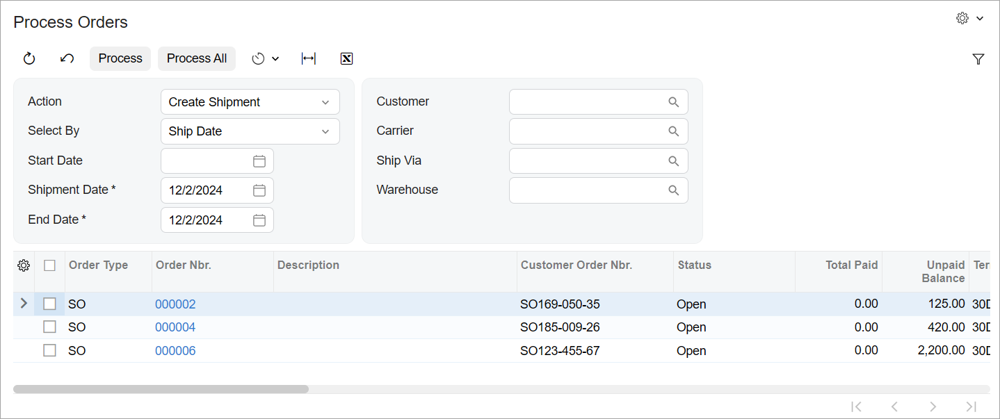

# Processing Form: General Information {#_3b1df48c-8a3f-4751-a19e-a00397046a90 .concept}

On a processing form, a user can perform an operation on multiple selected records at once.

## Learning Objectives { .section}

In this chapter, you'll learn how to organize the layout of the processing form.

## Applicable Scenarios { .section}

You implement a processing form if you need to provide the ability for the user to invoke an operation on multiple records at once.

## Processing Forms { .section}

Processing forms look similar to inquiry forms. A processing form usually has the following components:

-   A table \(which is also referred to as a *grid*\) that displays the list of records retrieved by the processing data view. The table includes:
    -   A column with an unlabeled check box, which gives the user the ability to select one record or multiple records in the grid for processing.
    -   Additional columns that contain key settings of each listed record, including its ID or number.
    -   Optional: A redirection button or link that can be clicked to open the data entry form for any selected record.
-   Optional: Table filters \(also known as quick filters\) that are displayed above the table.
-   A form toolbar that includes the **Process**, **Process All**, and **Cancel** buttons.
-   Optional: An area that provides selection criteria \(for narrowing the records that are listed and may be processed\) or configuration settings—or both—for the processing method.

The screenshot below shows an example of a processing form with a Selection area and a grid.



## Naming Conventions for Processing Forms { .section}

Processing forms have IDs that start with a two-letter abbreviation \(indicating the functional area of the form\) followed by *50* \(indicating a processing form\), such as *RS501000*.

The names of the graphs that work with processing forms have the *Process* suffix. For instance, `RSSVAssignProcess` will be the name of the graph for the Assign Work Orders \(RS501000\) form.

For more details about these naming conventions, see [Form and Report Numbering](../StudioDeveloperGuide/DA__con_Form_Numbering.md#) and [Graph Naming](../StudioDeveloperGuide/DA__con_Graph_Naming.md#).

## Definition of the Processing Graph and Data View { .section}

To configure the graph that works with the processing form, you do the following:

-   You define the data view for the processing form.

    To do this, you use the SelectFrom&lt;Table&gt;.ProcessingView class. This class is derived from the [PXProcessingBase&lt;Table&gt;](https://help.acumatica.com/Help?ScreenId=ShowWiki&pageid=8c52ed4e-6eec-2fa9-d037-14a481f5a6b7) class, which is a base class for the data views of processing forms. You can also use one of the types that use the traditional BQL style of data queries, such as PXProcessing or PXProcessingJoin

    **Important:** To ensure the history of a processing operation is saved correctly, the main DAC of the processing view must contain the `NoteID` field. This field must have the PXNote attribute declared on it.

-   You add the `Cancel` action to the processing graph.

    You do this by using the PXCancel class. If the processing form does not have a filter, you use the main DAC of the processing data view as the type parameter, as shown in the following code.

    ```language-csharp
    // Definition of the Cancel button for processing without filtering
    public class SalesOrderProcess : PXGraph<SalesOrderProcess>
    {
        public SelectFrom<SalesOrder>.ProcessingView SalesOrders;
        // Main DAC of the processing data view
        public PXCancel<**SalesOrder**> Cancel;
    }
    ```

-   Optional: You replace the names of the default buttons in the graph constructor.

    By default, any form that has a data view of a type derived from PXProcessingBase&lt;Table&gt; has the **Process** and **Process All** buttons on the form toolbar. To override the button captions, you use the SetProcessCaption\(\) and SetProcessAllCaption\(\) methods, as the following code shows.

    ```language-csharp
    public RSSVAssignProcess()
    {
        WorkOrders.SetProcessCaption("Assign");
        WorkOrders.SetProcessAllCaption("Assign All");
    }
    ```


You also need to specify the processing action. For details, see [Processing Operations: General Information](../StudioDeveloperGuide/CodeCustomization_ProcessingOperations_GeneralInfo.md).

## Selected Data Field and Column { .section}

You must add the unbound `Selected` data field of the Boolean type to the DAC that provides the records to process for the processing form and then add the column for this field to the form. If a user doesn’t want to process all listed records, the user will select the check box in this column for each record to be processed. You define the `Selected` data field as unbound by using the PXBool type attribute. \(Unlike the PXDBBool attribute, the PXBool attribute does not have *DB* in its name. *DB* indicates a bound data type.\)

**Tip:** `Selected` is the default name for the data field for this check box; you can define the data field with any name and override the default `Selected` name in the graph constructor with the SetSelected\(\) method of the PXProcessing class.

You make all columns in the grid \(except for the column that corresponds to the `Selected` field\) unavailable for editing by specifying the `Processing` preset for the grid. For the `Selected` field, you set the allowCheckAll property to `true`. This lets users select all records on the current page of the table for processing by selecting the check box in the column header.

**Parent topic:**[Defining a Processing Form](../DeveloperGuide/UIDev_ProcessingScreen_Mapref.md)

