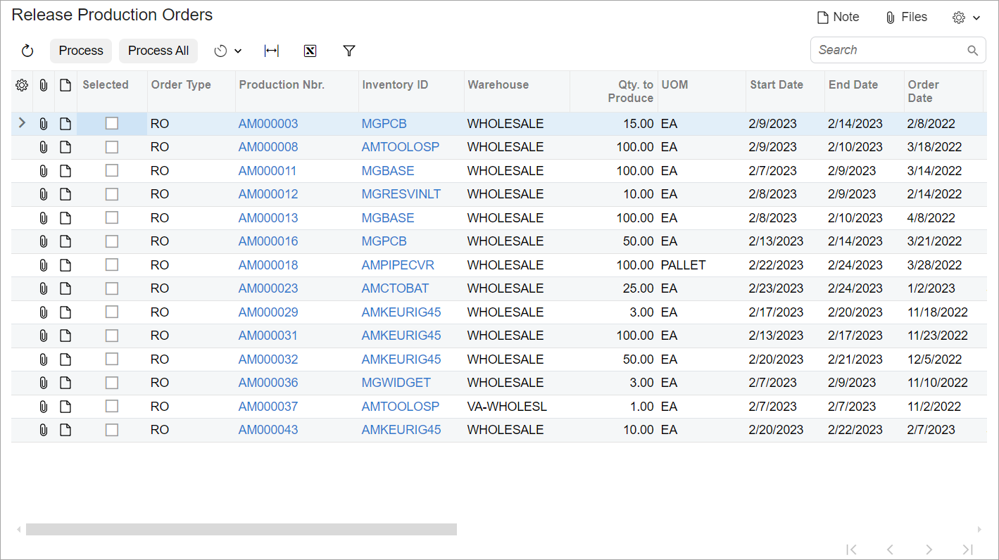

# Processing Form: A Form with Only a Grid {#_d8ecfa47-e5fa-4170-aad3-1b11ac6696d5 .concept}

The following topic describes how to configure a processing form that contains only a table and does not contain the Selection area or table filters \(also called quick filters\). \(In the Classic UI, these forms were based on the GridView template.\) The following screenshot shows an example of a form with this layout.



## View Definition in TypeScript { .section}

For a processing form with only a table \(and no Selection area or table filters\), you need to use the following in the TypeScript file of the form:

-   The createCollection method to define a property for the data view to display a table.
-   A class that extends PXView with the full list of fields for the table.
-   The Processing preset for the table. For details about presets, see [Form Layout: Grid Presets](UIDev_DesigningLayout_GridPresets.md).

The following code shows an example of this implementation of a processing form.

```language-javascript
import {
    PXView, PXFieldState, commitChanges, graphInfo, PXScreen, createCollection
} from "client-controls";
 
@graphInfo({
    graphType: 'PX.Objects.CR.CRActivitySetupMaint',
    primaryView: 'ActivityTypes'
})
export class CR102000 extends PXScreen {
    ActivityTypes = createCollection(ActivityTypes);
}
 
@gridConfig({
    preset: GridPreset.Processing,
    quickFilterFields: ['ClassID', 'Type', 'Description']
})
export class ActivityTypes extends PXView {
    ClassID: PXFieldState
    Type: PXFieldState;
    Description: PXFieldState;
    Active: PXFieldState;
    IsDefault: PXFieldState;
    Application: PXFieldState<PXFieldOptions.CommitChanges>;
    ImageUrl: PXFieldState;
    PrivateByDefault: PXFieldState<PXFieldOptions.CommitChanges>;
    RequireTimeByDefault: PXFieldState<PXFieldOptions.CommitChanges>;
    Incoming: PXFieldState;
    Outgoing: PXFieldState;
}
```

## Layout in HTML { .section}

For a processing form with only a table \(and no Selection area or table filters\), you define the layout by adding one `qp-grid` control to the HTML code of the form, as shown in the following example.

```language-xml
<template>
    <qp-grid id="grid" view.bind="ActivityTypes">
    </qp-grid>
</template>
```

**Parent topic:**[Defining a Processing Form](../DeveloperGuide/UIDev_ProcessingScreen_Mapref.md)

