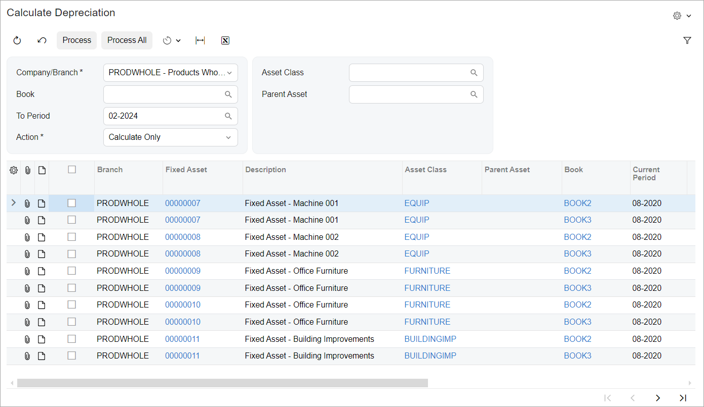
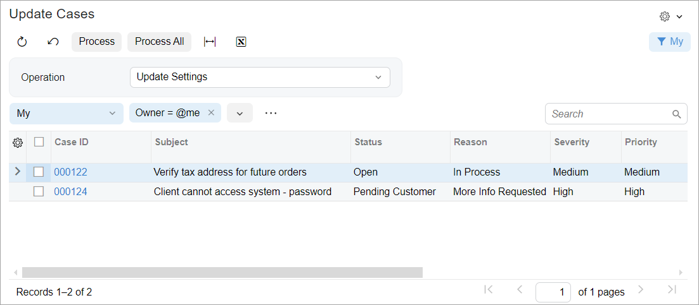
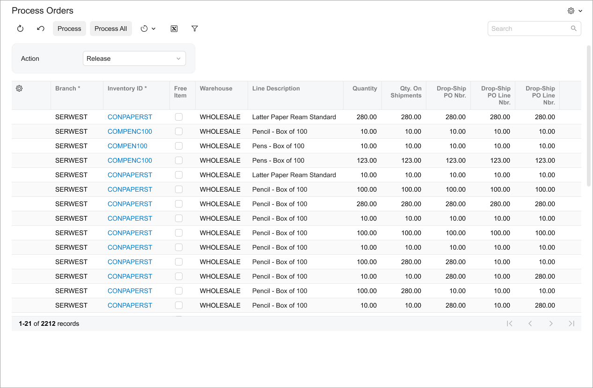

# Processing Form: A Form with a Selection Area and a Grid {#_659d137c-7152-4e55-9dca-d29a614d50fd .concept}

The following topic describes how to configure a processing form that contains the Selection area and a table. \(In the Classic UI, these forms were based on the FormDetail template.\)

## Examples of Form Layout { .section}

The following screenshot shows an example of a form that contains the Selection area and a table but does not contain table filters \(also called quick filters\).



An example of a processing form that contains the Selection area, table filters \(also called quick filters\), and a table is shown in the following screenshot. The table filters are stored in the system data and are displayed for the table whose data view has the PXFilterable attribute. For an example of a form with stored table filters, see [Assign Opportunities](../UserGuide/CR_50_31_10.md) \(CR503110\) form.



An example of a form that contains a single element in the Selection area and a table is shown in the following screenshot.



## View Definition in TypeScript { .section}

For a processing form with the Selection area and a table \(but no table filters\), you need to do the following in the TypeScript file of the form:

-   For the view that displays elements of the Selection area, you use the createSingle method.
-   For the view that displays the table, you use the createCollection method.
-   For each view, you use a class that extends PXView with the full list of fields to be displayed.
-   You use the [gridConfig](https://help.acumatica.com/Help?ScreenId=ShowWiki&pageid=0307daab-31d8-32d7-f9d0-d61137b7919f) decorator for the table and the [columnConfig](https://help.acumatica.com/Help?ScreenId=ShowWiki&pageid=174c3931-2148-bc0c-ee45-705f27e1aec6) decorator for the columns. For details, see [Table \(Grid\): Configuration of the Table and Its Columns](UIDevRef_Grid_Configuration.md).
-   You use the [PXFieldOptions.CommitChanges](https://help.acumatica.com/(W(7))/Help?ScreenId=ShowWiki&pageid=da180a08-b380-09c7-07c6-b5b63a806087) option for a field that corresponds to a filtering parameter in TypeScript to enable callback.

-   A preset for the table: Processing. For details about presets, see [Form Layout: Grid Presets](UIDev_DesigningLayout_GridPresets.md).

The following code shows an example of this implementation of a processing form.

```language-javascript
import {
    PXScreen, createSingle, createCollection, graphInfo, PXView, PXFieldState, 
    gridConfig, columnConfig, linkCommand, PXActionState, PXFieldOptions
} from 'client-controls';
 
@gridConfig({ preset: GridPreset.Processing })
export class FABookBalance extends PXView {
 
    @columnConfig({ allowCheckAll: true })
    Selected: PXFieldState;
 
    @columnConfig({ hideViewLink: true })
    FixedAsset__BranchID: PXFieldState;
 
    @linkCommand('ViewAsset')
    @columnConfig({ allowUpdate: false })
    AssetID: PXFieldState;
 
    FixedAsset__Description: PXFieldState;
 
    @linkCommand('ViewClass')
    @columnConfig({ allowUpdate: false })
    ClassID: PXFieldState;
 
    @columnConfig({ hideViewLink: true })
    FixedAsset__ParentAssetID: PXFieldState;
 
    @linkCommand('ViewBook')
    @columnConfig({ allowUpdate: false })
    BookID: PXFieldState;
 
    @columnConfig({ allowUpdate: false })
    CurrDeprPeriod: PXFieldState;
 
    @columnConfig({ allowNull: false })
    YtdDeprBase: PXFieldState;
 
    @columnConfig({ allowUpdate: false })
    FixedAsset__BaseCuryID: PXFieldState;
 
    FADetails__ReceiptDate: PXFieldState;
 
    FixedAsset__UsefulLife: PXFieldState;
 
    @columnConfig({ hideViewLink: true })
    FixedAsset__FAAccountID: PXFieldState;
 
    @columnConfig({ hideViewLink: true })
    FixedAsset__FASubID: PXFieldState;
 
    FADetails__TagNbr: PXFieldState;
 
    @columnConfig({ hideViewLink: true })
    Account__AccountClassID: PXFieldState;
}
 
export class Filter extends PXView {
    OrgBAccountID: PXFieldState<PXFieldOptions.CommitChanges>;
    BookID: PXFieldState<PXFieldOptions.CommitChanges>;
    PeriodID: PXFieldState<PXFieldOptions.CommitChanges>;
    Action: PXFieldState<PXFieldOptions.CommitChanges>;
    ClassID: PXFieldState<PXFieldOptions.CommitChanges>;
    ParentAssetID: PXFieldState<PXFieldOptions.CommitChanges>;
}
 
@graphInfo({ graphType: 'PX.Objects.FA.CalcDeprProcess', primaryView: 'Filter' })
export class FA502000 extends PXScreen {
 
    ViewBook: PXActionState;
    ViewAsset: PXActionState;
    ViewClass: PXActionState;
 
    Filter = createSingle(Filter);
 
    Balances = createCollection(FABookBalance);
}
```

## Layout in HTML { .section}

You define the layout for a processing form with the Selection area and a table \(but no table filters\) by adding the following elements to the HTML code of the form:

-   A qp-template element to display the elements of the Selection area. For details on using templates, see [Form Layout: Predefined Templates](UIDev_DesigningLayout_Templates.md).
-   A qp-grid element with the list of records to process.

The following code shows an example of a processing form with this layout.

```language-xml
<template>
    <qp-template name="17-17-14" id="formFilter" wg-container="Filter_form">
        <qp-fieldset slot="A" id="columnFirst" view.bind="Filter">
            <field name="OrgBAccountID" control-type="qp-branch-selector"></field>
            <field name="BookID"></field>
            <field name="PeriodID"></field>
            <field name="Action"></field>
        </qp-fieldset>
        <qp-fieldset slot="B" id="columnSecond" view.bind="Filter">
            <field name="ClassID"></field>
            <field name="ParentAssetID"></field>
        </qp-fieldset>
    </qp-template>
    <qp-grid id="grid" view.bind="Balances">
    </qp-grid>
</template>
```

**Parent topic:**[Defining a Processing Form](../DeveloperGuide/UIDev_ProcessingScreen_Mapref.md)

