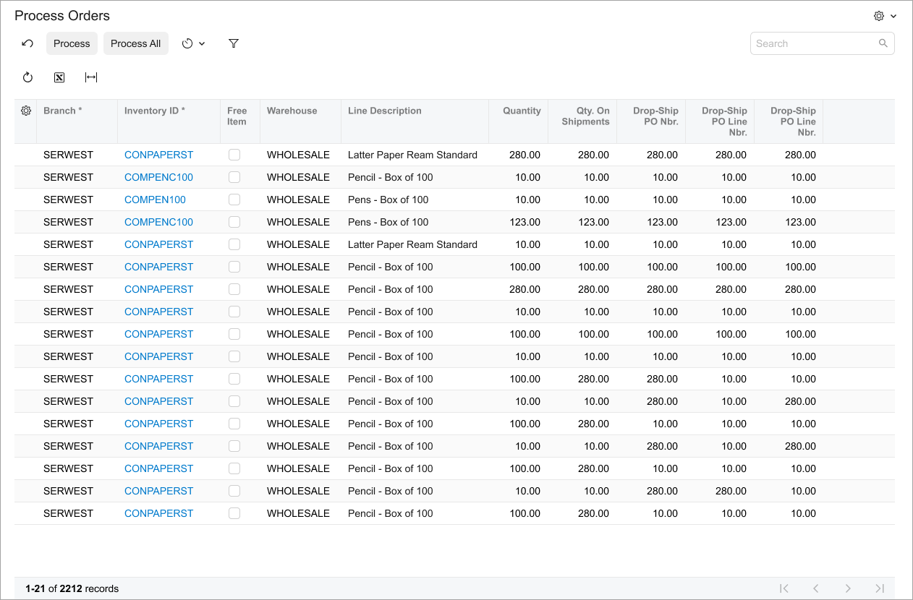
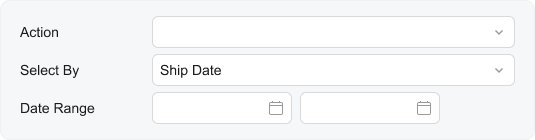

# Processing Form: UI Guidelines {#_904f9296-40dd-4d5a-acbf-9c615cc462b2 .concept}

In this topic, you can learn the UI guidelines for the processing forms.

## Template, Label Sizes, and Other Layout Settings { .section}

By default, you should use the following guidelines while designing a processing form:

-   For the Selection area, you use the `17-17-14` or `17-14-17` template. For more details about templates, see [Form Layout: Predefined Templates](UIDev_DesigningLayout_Templates.md).
-   For the Selection area, you use the default label sizes.
-   For the table area, you use the Processing preset. For details about presets, see [Form Layout: Grid Presets](UIDev_DesigningLayout_GridPresets.md).
-   No **Activities**, **Files**, and **Notes** buttons in the form title bar should be displayed.
-   No **Files** and **Notes** buttons in the table should be displayed.

    **Attention:** For particular forms, the **Notes** and **Files** buttons can be required. For example, on the [Process Export Scenarios](../UserGuide/SM_20_70_35.md) \(SM207035\) form, this is the only way a user can download an exported file.

-   Sections in the Selection area can have captions if the captions make sense.

## Recommendations for Organizing the Layout { .section}

The following table shows recommendations for organizing the layout of a processing form.

|Correct|Incorrect|
|-------|---------|
|Put all commands on a single toolbar.|Do not separate commands into two toolbars.|
|||
|Use a single `field` tag for an element with the **Date Range** label and two date and time controls for the selection of the start date and the end date.

 This approach applies only to processing forms.

|Do not use two separate fields in a fieldset for the **Start Date** and **End Date** boxes on processing forms.|
|||

## UX and Functional Guidelines { .section}

The form design should be tailored for screens with a resolution of 1280 x 720.

The number of a processing form should start with *50*. For details, see [Form and Report Numbering](../StudioDeveloperGuide/DA__con_Form_Numbering.md).

**Parent topic:**[Defining a Processing Form](../DeveloperGuide/UIDev_ProcessingScreen_Mapref.md)

