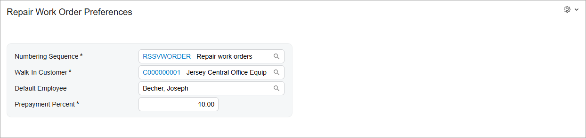

# UI of a Setup Form:To Create the UI of a Setup Form {#_0cd1c05d-8dcd-4084-9a63-89c4d84583d1 .task}

The following activity will walk you through the process of creating the UI of an Acumatica ERP setup form.

## Story { .section}

The Smart Fix company uses the Repair Work Orders \(RS301000\) data entry form to create and manage repair work orders. The Repair Work Order Preferences \(RS101000\) setup form, for which you will develop the Modern UI, will be used by an administrative user to specify the company's preferences for the repair work orders. The following screenshot shows what this form should look like.



You have already implemented the backend for the form, which includes the `RSSVSetup` data access class \(DAC\) and the `RSSVSetupMaint` graph. Also, you have added the `RSSVSetup` table to the application database.

## Process Overview { .section}

You will create TypeScript and HTML files for the Repair Work Order Preferences \(RS101000\) form. In the TypeScript file, you will define the screen class and view class for the form. In the HTML file, you will define the layout of the form.

## System Preparation { .section}

Before you begin the creation of the UI of the Repair Work Order Preferences \(RS101000\) form, do the following:

1.  Complete the following prerequisite activity: [Modern UI Development: To Deploy an Instance with Custom Forms and the Modern UI](UIDev_ModernUI_Activity_PrepareInstance.md). Make sure that the prepared instance contains the following items:
    -   The `RSSVSetupMaint` graph in the customization code
    -   The `RSSVSetup` DAC in the customization code
    -   The `RSSVSetup` database table
2.  To build the source code for the first time, make sure that you have completed the following prerequisite activity: [Modern UI Development: To Build the Source Code of All Acumatica ERP Forms for Modern UI Development](UIDev_ModernUI_Activity_BuildingSourcesAll.md).

## Step 1: Creating Files for the Setup Form { .section}

To create the Modern UI for the Repair Work Order Preferences \(RS101000\) setup form, you need to create TypeScript and HTML files for the form. Create the files as follows:

1.  In the `FrontendSources\screen\src\development\screens` folder of your Acumatica ERP instance, create a folder with the `RS` name if it has not been created yet. You will store the UI sources for all forms with the *RS* prefix in this folder.
2.  In the `FrontendSources\screen\src\development\screens\RS` folder, create a folder with the `RS101000` name. You will store the UI sources for the Repair Work Order Preferences form in this folder.
3.  In the `FrontendSources\screen\src\development\screens\RS\RS101000` folder, create the following files:
    -   `RS101000.ts`
    -   `RS101000.html`

## Step 2: Defining the Screen Class in TypeScript { .section}

To define the view of the Repair Work Order Preferences \(RS101000\) setup form in TypeScript, you define a screen class and a property for the data view of the form. Do the following:

1.  In the `RS101000.ts` file, add the import directives as follows.

    ```language-javascript
    import {
    	PXScreen,
    	createSingle,
    	graphInfo,
    } from "client-controls";
    ```

2.  Define the screen class for the form as follows. The class name is the ID of the form.

    ```language-javascript
    export class RS101000 extends PXScreen {}
    ```

3.  For the screen class, add the graphInfo decorator, and specify the graph and the primary view of the form in the decorator properties, as shown in the following code.

    ```language-javascript
    @graphInfo({
    	graphType: "PhoneRepairShop.RSSVSetupMaint",
    	primaryView: "Setup",
    })
    export class RS101000 extends PXScreen {}
    ```

4.  Define the property for the data view of the form by using the following code. Because the data view is used to display only a Summary area, you need to initialize the property with the createSingle method. The input parameter of this method is an instance of the view class that you will define in the next step.

    ```language-javascript
    export class RS101000 extends PXScreen {
    	Setup = createSingle(RSSVSetup);
    }
    ```


## Step 3: Defining the View Class in TypeScript { .section}

You need to define a view class for the single data view of the Repair Work Order Preferences \(RS101000\) setup form. Proceed as follows:

1.  In the `RS101000.ts` file, update the list of import directives, as the following code shows.

    ```language-javascript
    import {
    	PXScreen,
    	createSingle,
    	graphInfo,
    	PXView,
    	PXFieldState,
    	controlConfig,
    } from "client-controls";
    ```

2.  Define the view class as follows.

    ```language-javascript
    export class RSSVSetup extends PXView {}
    ```

3.  In the view class, specify the properties for all data fields of the data view, as shown below. You use the name of the data field as the property name.

    ```language-javascript
    export class RSSVSetup extends PXView {
    	@controlConfig({allowEdit: true, })
    	NumberingID: PXFieldState;
    
    	@controlConfig({allowEdit: true, })
    	WalkInCustomerID: PXFieldState;
    
    	DefaultEmployee: PXFieldState;
    	PrepaymentPercent: PXFieldState;
    }
    ```

    You have used the controlConfig decorator to display the values in the **Numbering Sequence** and **Walk-In Customer** boxes as links to the records whose identifiers are displayed in the selector control.

4.  Save your changes.

## Step 4: Defining the Layout in HTML { .section}

The Repair Work Order Preferences \(RS101000\) setup form contains only a Summary area with a single column. Therefore, to define the layout of the form, you need to add one qp-template element in the HTML file. You also need to add one qp-fieldset element to group the fields of the column in a slot for the column, as the following code shows.

```language-xml
<template>
  <qp-template id="form-RepairWorkOrderPreferences" name="1-1"
    class="label-size-xm">
    <qp-fieldset id="fsPreferences-RepairWorkOrder" slot="A" view.bind="Setup">
      <field name="NumberingID"></field>
      <field name="WalkInCustomerID"></field>
      <field name="DefaultEmployee"></field>
      <field name="PrepaymentPercent"></field>
    </qp-fieldset>
  </qp-template>
</template>
```

You have specified an ID for the qp-fieldset control and bound the control to the `Setup` view, which you have defined in the `RS101000.ts` file.

You have used the following recommended settings:

-   The *1-1* template for the form
-   The *label-size-xm* class for the qp-template element

## Step 5: Building and Viewing the Setup Form { .section}

To build the source files for the Repair Work Order Preferences \(RS101000\) setup form and view its Modern UI version, do the following:

1.  Run the following command in the `FrontendSources\screen` folder of your instance.

    ```language-bourne
    npm run build-dev --- --env customFolder=development screenIds=RS101000
    ```

2.  After the source files have been built successfully, launch your Acumatica ERP instance, and open the Repair Work Order Preferences setup form.
3.  On the form title bar, click **Tools** &gt; **Switch to Modern UI**. The Modern UI version of the Repair Work Order Preferences setup form is displayed. The form should look similar to the form shown in the screenshot in the *Story* section of this activity.
4.  Click the link in the **Numbering Sequence** box and make sure the [Numbering Sequences](../UserGuide/CS_20_10_10.md) \(CS201010\) form opens with the *RSSVWORDER* record displayed.

**Parent topic:**[Defining a Setup Form](../DeveloperGuide/UIDev_SetupScreen_Mapref.md)

