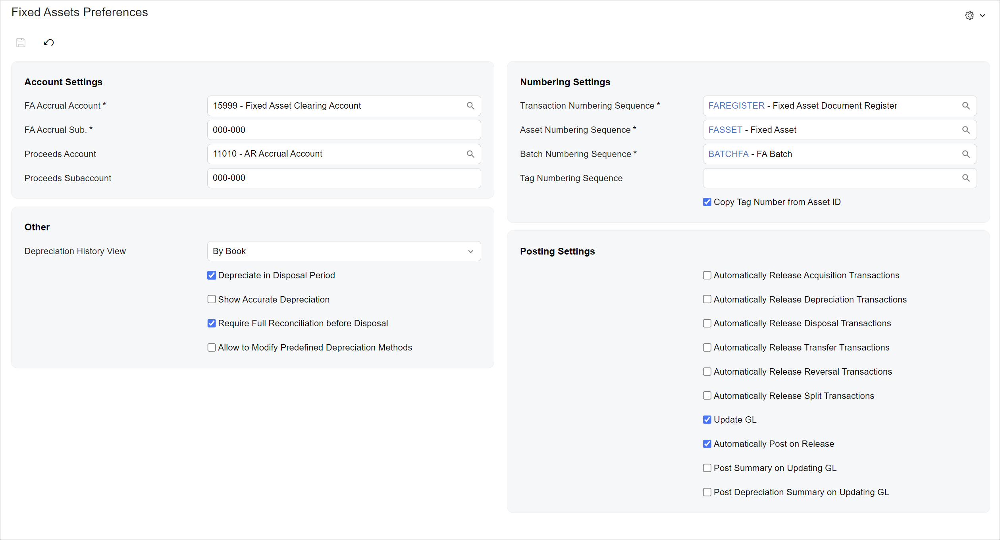

# UI of a Setup Form: A Form with Only a Summary Area {#_866e3b3f-c302-4939-ad28-38c911e0f639 .concept}

The following topic describes how to configure a form that contains only a Summary area. \(In the Classic UI, these forms were based on the FormView template.\) The following screenshot shows an example of a form with this layout.



## View Definition in TypeScript { .section}

To configure a form with only a Summary area in the TypeScript file, you do the following:

-   For the view of the Summary area, you use the createSingle method.
-   You use a class that extends PXView with the full list of the fields of the Summary area.

The following code shows an example of the TypeScript configuration for the form in the screenshot above.

```
import {
    PXScreen, createSingle, graphInfo, PXView,
    PXFieldState, PXFieldOptions, controlConfig
} from 'client-controls';
 
export class FASetup extends PXView {
    FAAccrualAcctID: PXFieldState<PXFieldOptions.CommitChanges>;
    FAAccrualSubID: PXFieldState<PXFieldOptions.CommitChanges>;
    ProceedsAcctID: PXFieldState<PXFieldOptions.CommitChanges>;
    ProceedsSubID: PXFieldState<PXFieldOptions.CommitChanges>;
    DeprHistoryView: PXFieldState;
    DepreciateInDisposalPeriod: PXFieldState;
    AccurateDepreciation: PXFieldState;
    ReconcileBeforeDisposal: PXFieldState;
    AllowEditPredefinedDeprMethod: PXFieldState;

    @controlConfig({allowEdit: true, }) 
    RegisterNumberingID: PXFieldState;

    @controlConfig({allowEdit: true, }) 
    AssetNumberingID: PXFieldState;

    @controlConfig({allowEdit: true, }) 
    BatchNumberingID: PXFieldState;

    @controlConfig({allowEdit: true, }) 
    TagNumberingID: PXFieldState;
    CopyTagFromAssetID: PXFieldState;
    AutoReleaseAsset: PXFieldState;
    AutoReleaseDepr: PXFieldState;
    AutoReleaseDisp: PXFieldState;
    AutoReleaseTransfer: PXFieldState;
    AutoReleaseReversal: PXFieldState;
    AutoReleaseSplit: PXFieldState;
    UpdateGL: PXFieldState;
    AutoPost: PXFieldState;
    SummPost: PXFieldState;
    SummPostDepreciation: PXFieldState;
}
 
@graphInfo({ 
    graphType: 'PX.Objects.FA.SetupMaint', 
    primaryView: 'FASetupRecord' 
})
export class FA101000 extends PXScreen {
    FASetupRecord = createSingle(FASetup);
}
```

## Layout in HTML { .section}

You define the layout of a setup form with only a Summary area by adding one qp-template control to the HTML code of the form with slots for each column. For details on the available templates, see [Form Layout: Predefined Templates](UIDev_DesigningLayout_Templates.md).

The following code shows the HTML template for the form in the screenshot above.

```
<template>
    <qp-template name="1-1" id="formDocument" wg-container="FASetupRecord_form">
        <div slot="A">
            <qp-fieldset id="groupAccountSettings" view.bind="FASetupRecord" 
                caption="Account Settings">
                <field name="FAAccrualAcctID"></field>
                <field name="FAAccrualSubID"></field>
                <field name="ProceedsAcctID"></field>
                <field name="ProceedsSubID"></field>
            </qp-fieldset>
            <qp-fieldset id="groupOther" view.bind="FASetupRecord" caption="Other">
                <field name="DeprHistoryView"></field>
                <field name="DepreciateInDisposalPeriod"></field>
                <field name="AccurateDepreciation"></field>
                <field name="ReconcileBeforeDisposal"></field>
                <field name="AllowEditPredefinedDeprMethod"></field>
            </qp-fieldset>
        </div>
        <div slot="B">
            <qp-fieldset id="groupNumberingSettings" view.bind="FASetupRecord" 
                caption="Numbering Settings">
                <field name="RegisterNumberingID"></field>
                <field name="AssetNumberingID"></field>
                <field name="BatchNumberingID"></field>
                <field name="TagNumberingID"></field>
                <field name="CopyTagFromAssetID"></field>
            </qp-fieldset>
            <qp-fieldset id="groupPostingSettings" view.bind="FASetupRecord"
                caption="Posting Settings" class="no-label">
                <field name="AutoReleaseAsset"></field>
                <field name="AutoReleaseDepr"></field>
                <field name="AutoReleaseDisp"></field>
                <field name="AutoReleaseTransfer"></field>
                <field name="AutoReleaseReversal"></field>
                <field name="AutoReleaseSplit"></field>
                <field name="UpdateGL"></field>
                <field name="AutoPost"></field>
                <field name="SummPost"></field>
                <field name="SummPostDepreciation"></field>
            </qp-fieldset>
        </div>
    </qp-template>
</template>
```

**Parent topic:**[Defining a Setup Form](../DeveloperGuide/UIDev_SetupScreen_Mapref.md)

