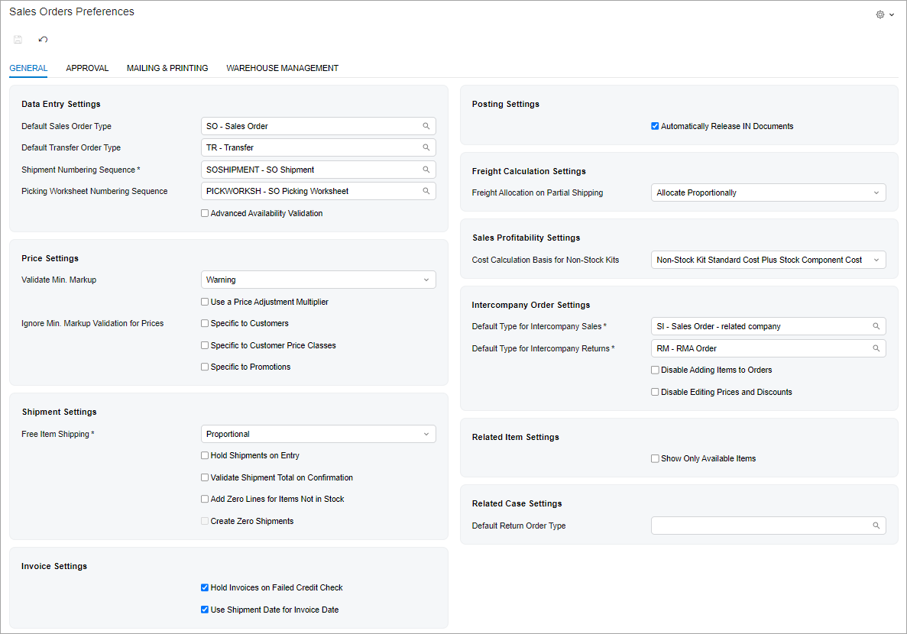

# UI of a Setup Form: A Form with Tabs {#_64cd51ba-0b4f-4671-922f-75fc40756047 .concept}

The following topic describes how to configure a form that consists of multiple tabs. \(In the Classic UI, these forms were based on the TabView template.\) The following screenshot shows an example of a form with this layout.



## View Definition in TypeScript { .section}

To configure a setup form with multiple tabs in the TypeScript file, you do the following:

-   For the views that display one record, you use the `createSingle` method.
-   For the views that display a grid, you use the `createCollection` method.
-   For each view for a tab, you use a class that extends `PXView` with the full list of fields to be displayed.
-   For each grid and its columns, you use the `gridConfig` and `columnConfig` decorators. For details, see [Table \(Grid\): Configuration of the Table and Its Columns](UIDevRef_Grid_Configuration.md).

The following code shows an example of the TypeScript configuration for the form in the screenshot above.

```
import {
	PXScreen,
	PXView,
	PXFieldState,
	PXFieldOptions,
	createSingle,
	graphInfo,
	viewInfo,
	columnConfig,
} from "client-controls";

@graphInfo({
	graphType: "PX.Objects.SO.SOSetupMaint",
	primaryView: "sosetup",
})
export class SO101000 extends PXScreen {
	@viewInfo({ containerName: "SO Preferences" })
	sosetup = createSingle(sosetup);
}

export class sosetup extends PXView {
	DefaultOrderType: PXFieldState;
	TransferOrderType: PXFieldState;
	ShipmentNumberingID: PXFieldState;

	@columnConfig({ allowNull: false })
	PickingWorksheetNumberingID: PXFieldState;

	AdvancedAvailCheck: PXFieldState;

	MinGrossProfitValidation: PXFieldState;
	UsePriceAdjustmentMultiplier: PXFieldState;
	IgnoreMinGrossProfitCustomerPrice: PXFieldState;
	IgnoreMinGrossProfitCustomerPriceClass: PXFieldState;
	IgnoreMinGrossProfitPromotionalPrice: PXFieldState;

	FreightAllocation: PXFieldState;

	FreeItemShipping: PXFieldState;
	HoldShipments: PXFieldState;
	RequireShipmentTotal: PXFieldState;
	AddAllToShipment: PXFieldState<PXFieldOptions.CommitChanges>;
	CreateZeroShipments: PXFieldState<PXFieldOptions.CommitChanges>;

	CreditCheckError: PXFieldState;
	UseShipDateForInvoiceDate: PXFieldState;

	AutoReleaseIN: PXFieldState;

	SalesProfitabilityForNSKits: PXFieldState;

	DfltIntercompanyOrderType: PXFieldState;
	OrderType: PXFieldState;
	DfltIntercompanyRMAType: PXFieldState;
	DisableAddingItemsForIntercompany: PXFieldState;
	DisableEditingPricesDiscountsForIntercompany: 
        PXFieldState<PXFieldOptions.CommitChanges>;

	ShowOnlyAvailableRelatedItems: PXFieldState;
	DefaultReturnOrderType: PXFieldState;

	OrderRequestApproval: PXFieldState<PXFieldOptions.Disabled | 
        PXFieldOptions.Hidden>;
}
```

## Layout in HTML { .section}

You define the layout of a setup form with tabs by adding the following tags to the HTML code of the form:

-   A qp-tabbar tag with a nested qp-tab element for each tab.
-   For each tab that does not contain a grid, a nested qp-template tag. For details on using templates, see [Form Layout: Predefined Templates](UIDev_DesigningLayout_Templates.md).

The following code shows the HTML template for the form in the screenshot above.

```
<template>
  <qp-tabbar id="tabbar">
    <qp-tab id="tab-General" caption="General" class="label-size-xm">
      <qp-template id="form-General" name="1-1" wg-container="sosetup_tab">
        <div id="divColumnA-General" slot="A">
          <qp-fieldset id="fsDataEntry-General" 
            view.bind="sosetup" caption="Data Entry Settings">
            <field name="DefaultOrderType"></field>
            <field name="TransferOrderType"></field>
            <field name="ShipmentNumberingID"></field>
            <field name="PickingWorksheetNumberingID"></field>
            <field name="AdvancedAvailCheck"></field>
          </qp-fieldset>
          <qp-fieldset id="fsPrice-General" view.bind="sosetup" 
            caption="Price Settings">
            <field name="MinGrossProfitValidation"></field>
            <field name="UsePriceAdjustmentMultiplier"></field>
            <field name="IgnoreMinGrossProfitCustomerPrice">
              <qp-label slot="label" 
                caption="Ignore Min. Markup Validation for Prices">
              </qp-label>
            </field>
            <field name="IgnoreMinGrossProfitCustomerPriceClass"></field>
            <field name="IgnoreMinGrossProfitPromotionalPrice"></field>
          </qp-fieldset>
          <qp-fieldset id="fsShipment-General" view.bind="sosetup"
            caption="Shipment Settings">
            <field name="FreeItemShipping"></field>
            <field name="HoldShipments"></field>
            <field name="RequireShipmentTotal"></field>
            <field name="AddAllToShipment"></field>
            <field name="CreateZeroShipments"></field>
          </qp-fieldset>
          <qp-fieldset id="fsInvoice-General" view.bind="sosetup"
            caption="Invoice Settings">
            <field name="CreditCheckError"></field>
            <field name="UseShipDateForInvoiceDate"></field>
          </qp-fieldset>
        </div>
        <div id="divColumnB-General" slot="B">
          <qp-fieldset id="fsPosting-General" view.bind="sosetup"
            caption="Posting Settings">
            <field name="AutoReleaseIN"></field>
          </qp-fieldset>
          <qp-fieldset id="fsFreightCalculation-General"
            view.bind="sosetup" 
            caption="Freight Calculation Settings">
            <field name="FreightAllocation"></field>
          </qp-fieldset>
          <qp-fieldset id="fsSalesProfitability-General"
            view.bind="sosetup"
            caption="Sales Profitability Settings">
            <field name="SalesProfitabilityForNSKits"></field>
          </qp-fieldset>
          <qp-fieldset id="fsIntercompanyOrder-General" 
            view.bind="sosetup"
            caption="Intercompany Order Settings">
            <field name="DfltIntercompanyOrderType"></field>
            <field name="DfltIntercompanyRMAType"></field>
            <field name="DisableAddingItemsForIntercompany"></field>
            <field name="DisableEditingPricesDiscountsForIntercompany"></field>
          </qp-fieldset>
          <qp-fieldset id="fsRelatedItem-General" 
            view.bind="sosetup"
            caption="Related Item Settings">
            <field name="ShowOnlyAvailableRelatedItems"></field>
          </qp-fieldset>
          <qp-fieldset id="fsRelatedCase-General"
            view.bind="sosetup" caption="Related Case Settings">
            <field name="DefaultReturnOrderType"></field>
          </qp-fieldset>
        </div>
      </qp-template>
    </qp-tab>
  </qp-tabbar>
</template>
```

**Parent topic:**[Defining a Setup Form](../DeveloperGuide/UIDev_SetupScreen_Mapref.md)

