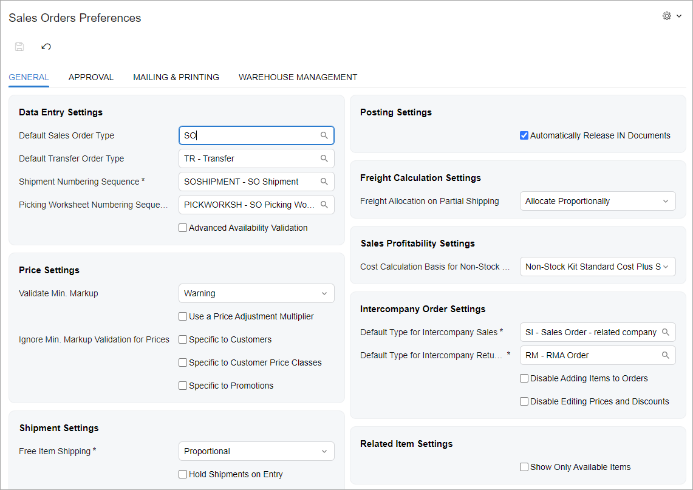
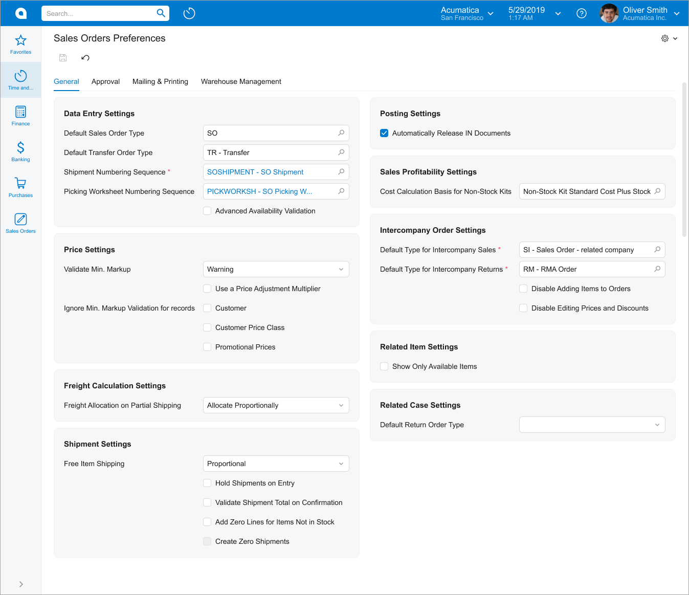
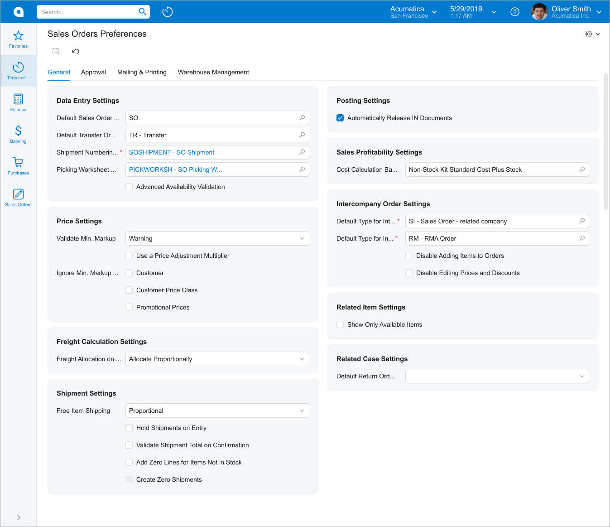

# UI of a Setup Form: General Information {#_d04d25ca-2203-41df-94b9-de91e9be0894 .concept}

On a setup form, an administrator provides configuration or maintenance settings for some functionality in the instance. In the Acumatica ERP workspaces, setup forms are typically listed under **Preferences**. This topic provides recommendations and guidelines on organizing the layout of a setup form.

The following screenshot shows an example of a setup form with tabs.

## Learning Objectives { .section}

In this chapter, you will learn how to do the following to define the setup form:

-   Organize the layout of a setup form
-   Configure a setup form with only a Summary area
-   Configure a setup form with tabs

## Applicable Scenarios { .section}

You configure the setup form in the following cases:

-   You are migrating an existing setup form to the Modern UI.
-   You are creating a new setup form by using the Modern UI.

## Template and Label Sizes { .section}

The recommended template for a setup form is `1-1`. For details about the available templates, see [Form Layout: Predefined Templates](UIDev_DesigningLayout_Templates.md).

The recommended size for labels on setup forms is *xm*.

## Recommendations for Organizing the Layout {#section_vv2_1y4_y4b .section}

The following table shows recommendations for organizing the layout of a setup form.

|Correct|Incorrect|
|-------|---------|
|When most labels are long, make all labels long \(with `class="label-size-<SIZE>"` in qp-template\). They should be as long as is needed to make most labels visible without a user needing to hover over the label to see the full name.|
|||

## UX and Functional Design Guidelines { .section}

The form design should be tailored for screens with a resolution of 1280 x 720.

The number of the setup form should start with *10*. For details, see [Form and Report Numbering](../StudioDeveloperGuide/DA__con_Form_Numbering.md).

**Parent topic:**[Defining a Setup Form](../DeveloperGuide/UIDev_SetupScreen_Mapref.md)

