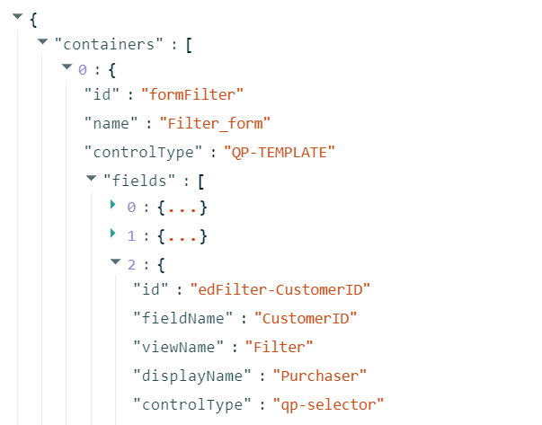

# Testing of the Modern UI: General Information {#_e65efe65-1949-48bd-8bf3-dcab5a3790ce .concept}

This topic describes WG containers and the WG containers’ structure that is used in tests for both the Classic UI and the Modern UI.

## Learning Objectives { .section}

In this chapter, you will learn how to do the following:

-   Get the structure of WG containers for a form
-   Specify the names of WG containers
-   Update tests for the Modern UI

## Applicable Scenarios { .section}

You need to learn about WG containers when you are doing the following:

-   Testing forms written in the Modern UI by using tests created for the same forms in the Classic UI
-   Migrating tests from the Classic UI to the Modern UI

## Overview of WG Containers { .section}

*WG* stands for *wrapper generator*. A*wrapper* is a part of tests that functions as an interface for tests for the UI of Acumatica ERP. A wrapper describes the structure of UI elements located in different containers on the form—that is, it describes the structure of containers and elements they include.

A *container* is an entity that contains fields. Thus, a *WG container* is a container of fields that are used in tests, and the wrapper describes the structure of WG containers. Every WG container is referred to by a name. The name of the WG container is generated automatically unless it is specified explicitly. For a container that has both the view name and the ID specified, the name of the WG container is generated according to the following rule: `<view_name>_<container_id>`.

The following screenshot shows an example of a file that describes WG containers.



The generation of wrappers does not depend on any features being enabled or disabled.

## Access to the Wrapper of a Form { .section}

You can access a wrapper of any form that has been switched to the Modern UI by using a URL with the following format: `<instance_URL>/ui/wrappers/<Screen_ID>`. For example, you would access a wrapper for the [Invoices and Memos](../UserGuide/AR_30_10_00.md) \(AR301000\) form on the `PhoneRepairShop` instance with the following URL: *http://localhost/PhoneRepairShop/ui/wrappers/AR301000*.

The following code is the beginning of the JSON file that is opened by this URL. The file shows the structure of WG containers of this form.

```
{
  "containers": [
    {
      "id": "formDocument",
      "name": "Document_form",
      "controlType": "QP-TEMPLATE",
      "fields": [
        {
          "id": "edDocument-DocType",
          "fieldName": "DocType",
          "viewName": "Document",
          "displayName": "Type",
          "controlType": "qp-drop-down",
          "dataType": "String",
          "containerPath": [
            "formDocument"
          ],
          "supportLocalizationPanel": false
        },
        {
          "id": "edDocument-RefNbr",
          "fieldName": "RefNbr",
          "viewName": "Document",
          "displayName": "Reference Nbr.",
          "controlType": "qp-selector",
          "dataType": "String",
          "containerPath": [
            "formDocument"
          ],
          "supportLocalizationPanel": false
        },
      ...]
    }
  ]
}
```

## Structure of UI Containers { .section}

In ASPX files, tags, such as `PXFormView` and `PXGrid`, are used to define containers for tests.

In the Modern UI, the fields are organized in containers differently. For example, in the Classic UI, the form contained three columns inside one `PXFormView`, as shown in the following example.

```
<px:PXFormView ID="form" runat="server" DataSourceID="ds" 
  Style="z-index: 100" Width="100%" 
  DataMember="Filter" Caption="Selection" DefaultControlID="edAction">
  <Template>
    <px:PXLayoutRule runat="server" StartColumn="True" LabelsWidth="SM" ControlSize="XM" />
    <px:PXDropDown CommitChanges="True" ID="edAction" runat="server" 
       DataField="Action" />
    <px:PXSelector CommitChanges="True" ID="edStatementCycleId" runat="server" 
       DataField="StatementCycleId" />
    <px:PXDateTimeEdit CommitChanges="True" ID="edStatementDate" runat="server" 
       DataField="StatementDate" />
    <px:PXLayoutRule runat="server" StartColumn="True" LabelsWidth="S" ControlSize="XM" />
    <px:PXSegmentMask CommitChanges="True" ID="edBranchID" runat="server" 
       DataField="BranchID" />
    <px:PXSegmentMask CommitChanges="True" ID="edOrganizationID" runat="server" 
       DataField="OrganizationID" />
    <px:PXCheckBox CommitChanges="True" ID="chkCuryStatements" runat="server" 
       DataField="CuryStatements" />
    <px:PXCheckBox CommitChanges="True" ID="chkShowAll" runat="server" 
       DataField="ShowAll" />
    <px:PXLayoutRule runat="server" StartColumn="True" LabelsWidth="S" ControlSize="SM" />
    <px:PXCheckBox CommitChanges="True" ID="chkPrintWithDeviceHub" runat="server" 
       DataField="PrintWithDeviceHub" AlignLeft="true" />
    <px:PXCheckBox CommitChanges="True" ID="chkDefinePrinterManually" runat="server" 
       DataField="DefinePrinterManually" AlignLeft="true" />
    <px:PXSelector CommitChanges="True" ID="edPrinterID" runat="server" 
       DataField="PrinterID" />
    <px:PXTextEdit CommitChanges="true" ID="edNumberOfCopies" runat="server" 
       DataField="NumberOfCopies" />
    <px:PXLayoutRule runat="server" StartRow="true" LabelsWidth="SM" ControlSize="XXL" />
    <px:PXTextEdit CommitChanges="True" ID="edStatementMessage" runat="server" 
       DataField="StatementMessage" TextMode="MultiLine" Height="55px" />
  </Template>
</px:PXFormView>
```

In the Modern UI, every such column is a separate `qp-fieldset` container, as shown in the following code.

```
<qp-template name="top-17-17-14" id="formFilter" wg-container="Filter_form">
    <qp-fieldset slot="A" id="columnFirst" view.bind="Filter">
        <field name="Date"></field>
        <field name="VendorID"></field>
        <field name="CustomerID"></field>
    </qp-fieldset>
    <qp-fieldset slot="B" id="columnSecond" view.bind="Filter">
        <field name="CreateOnHold"></field>
        <field name="CreateInSpecificPeriod"></field>
        <field name="FinPeriodID"></field>
    </qp-fieldset>
    <qp-fieldset slot="C" id="columnThird" view.bind="Filter">
        <field name="ProjectID"></field>
        <field name="CopyProjectInformation"></field>
    </qp-fieldset>
</qp-template>
```

`qp-fieldset` is a minimum container entity in the Modern UI. The wrapper generator treats it as a container entity. As a result, the structure of the containers has changed.

If you do not specify WG containers explicitly, the wrapper will not be generated correctly for a test written for the Classic UI to work: Instead of one container with fields of the old `PXFormVIew` tag, you will get three containers with fields \(one for each `qp-fieldset`\).

## Summary { .section}

Current tests rely on the structure of the UI elements on the form of the Classic UI.

In order for these tests to work property, wrappers need to describe the same structure of the form. But in the Modern UI, the structure of the form is different. So for the current tests to work on the Modern UI, you need to specify the names of WG containers explicitly for most of the tags \(except those for which the names are generated properly\). You can specify names of WG containers in several ways. For more information on specifying the names of WG containers, see [Testing of the Modern UI: Names of WG Containers](UIDev_Testing_SpecifyingWgContainers_Concept.md).

**Parent topic:**[Testing the Modern UI](../DeveloperGuide/UIDev_Testing_Mapref.md)

