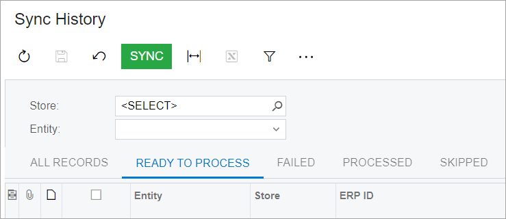

# Testing of the Modern UI: Update of Tests Written for the Classic UI {#_5dbd95ef-b87c-4f5b-9737-05d0559171fc .concept}

In some cases, wrapper generation may fail due to changes between the Classic UI and the Modern UI. In that case, you need to update tests as described in this topic.

## Table Filters { .section}

In the Classic UI, table filters are displayed as tabs, such as **All Records** and **Ready to Process** in the following screenshot.



The test code for these filters looks as follows.

```
Screen.Grid.AllRecords();
Screen.Grid.ReadyToProcess();
```

In the Modern UI, filter tabs do not exist. Instead, table filters are presented as a menu, as shown in the following screenshot.


You should change the test code for such filters to the following.

```
Screen.Grid.SelectFilter("Filter Name Here");
```

## User-Defined Fields { .section}

In the Classic UI, user-defined fields were located on a separate tab of the applicable data entry form. The name of the tab was **User-Defined Fields** \(Attributes in the test code\). So to test the user-defined field, the test code had to open the tab and find the specified control.

In the Modern UI, no such tab is displayed. All user-defined fields are added to the fieldsets manually by the user and displayed among the pre-defined fields.

To support backward compatibility with the Classic UI, in the test code, you need to use the GetUDF&lt;Type&gt;\(UDF\_Name, Container\_Name\) method to access the user-defined field. In the method, Type is the type of the control for the user-defined field. In the method parameters, you specify the name of the user-defined field and the name of the container \(fieldset\) where the user-defined field is located on the Modern UI form.

Suppose that the selection of a value for a user-defined field on the form in the Classic UI looks as follows.

```
OrderSo.Attributes.DynamicControl<Selector>(UDF_Name).Select("UDF_Value")
```

For the Modern UI, the selection of a value for a user-defined field should look as follows.

```
OrderSo.GetUDF<Selector>(UDF_Name, Container_Name).Select("UDF_Value")
```

When you are using the GetUDF method, for the Classic UI, the behavior will be the same as before: The method will open the **User-Defined Fields** tab, find the specified control, and select the value.

For the Modern UI, the method searches for the specified user-defined field in the specified container. If the field is found, the method selects the field value. If the field is not found, the method opens the personalization dialog box; it then finds the user-defined field in the list, adds it to the container, saves the changes, and selects the value in the user-defined field.

**Parent topic:**[Testing the Modern UI](../DeveloperGuide/UIDev_Testing_Mapref.md)

