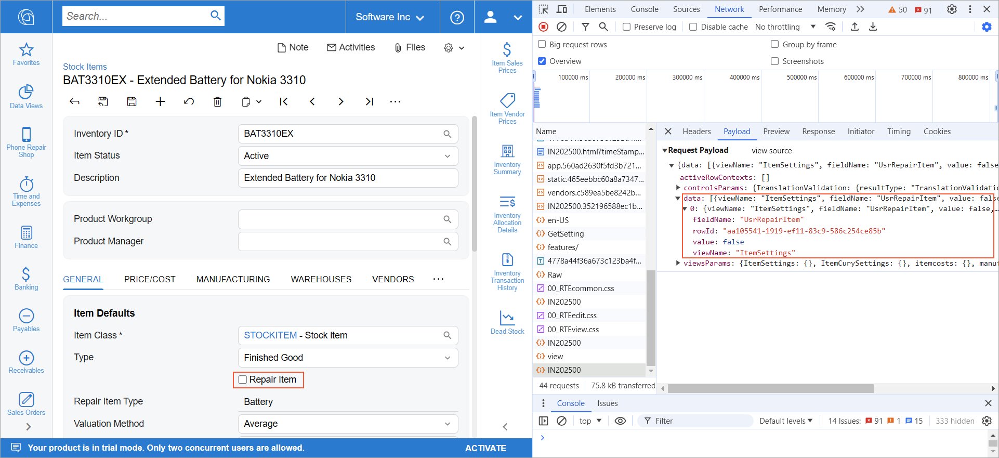
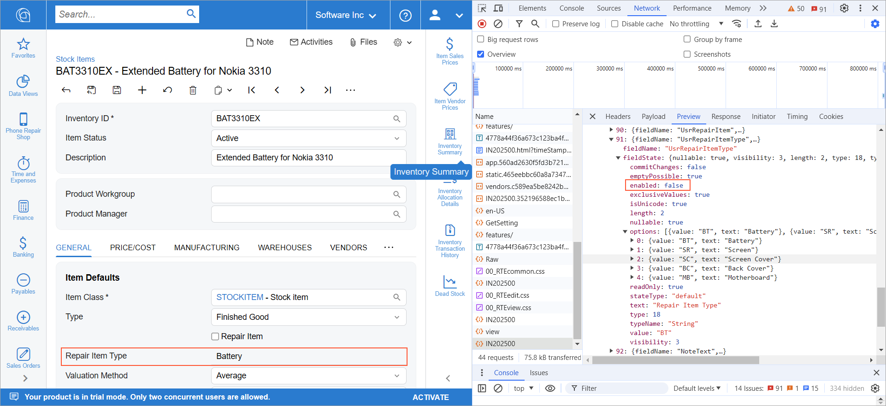

# Modern UI Troubleshooting: Developer Tools in the Browser {#_b7492a37-c1cd-4637-aa17-43b715d6e50e .concept}

You may need to use the developer tools available in the web browser to troubleshoot the Modern UI. The sections below provide details about troubleshooting in the Chrome web browser. The details for other web browsers may be slightly different.

To open the developer tools of the browser, you press F12 on the keyboard or select **Developer tools** in the menu of the browser.

For information on debugging source code using the developer tools, see [UI Events: Debugging the UI Code in the Browser](UIDev_HandlingEvents_DebugInBrowser.md).

## Viewing the Data that Is Posted to the Server and Returned from the Server { .section}

On the **Network** tab of the developer tools, you can find information about the requests that have been used to display the Acumatica ERP form. The requests that may be useful for debugging have the form ID as their name. You can filter out these requests by using the Filter button on the toolbar of the **Network** tab and selecting the **Fetch/XHR** filter.

**Tip:** You can select the **Preserve Log** check box on the toolbar of the **Network** tab to keep the requests during navigation or a page reload.

When you open a form, you have the first GET request with `structure` as the name. This request retrieves all the screen information from the server. If this request has already been executed, most of the data returned with this request is cached. You can turn off this behavior by selecting the **Disable cache** check box on the toolbar of the **Network** tab.

The POST requests with the form ID as the name are not cached. They contain information about the changes made on the form and the responses to these changes from the server. The **Payload** tab provides information about what has been posted to the server in JSON format. In the data field of the payload, you can see the data changes that has been posted to the server. The server will use this data to update PXCache data. For example, the following screenshot shows the data that is sent when the **Repair Item** check box is cleared on the form.

The viewsParams and controlsParams fields contain information about the views and controls that need to be reloaded. The viewsParams field contains the views that are initialized with the CreateSingle method in TypeScript. The controlsParams field contains the views that are initialized with the CreateCollection method and other controls, such as the form toolbar.

For the POST request, on the **Preview** tab \(on the right pane of the **Network** tab\), you can see the data that is posted back from the server. In the fieldStates field, you see the field states for all fields that are defined in the TypeScript code. You can use this data to check whether the correct field state has been sent from the server. For example, in the following screenshot, the **Repair Item Type** box is unavailable for editing, as indicated by `enabled: false` in the field state for the `UsrRepairItemType` field.

**Tip:** For the GET request, in the fieldStates field on the **Preview** tab, you can see the default state of the element.

## Opening Developer Tools for a Form That Opens in a New Tab { .section}

By default, when an Acumatica ERP form is opened in a new tab, such as when you click on a link on a form, the developer tools are not open for the form in the tab and you miss the request that loads the form for the first time. You can turn on the opening of the developer tools for a new tab if the developer tools are open in the current tab. In Chrome, you select the **Auto-Open DevTools for popups** check box on the Settings menu of the developer tools.

## Importing and Exporting HAR Files { .section}

You can export information about all requests that have been made during the current session with developer tools by using the **Export HAR** button on the toolbar of the **Network** tab of the developer tools. You may need to provide this file to your Acumatica support provider. To import the HAR file, you use the **Import HAR file** button.

**Parent topic:**[Troubleshooting the Modern UI](../DeveloperGuide/UIDev_Troubleshooting_Mapref.md)

