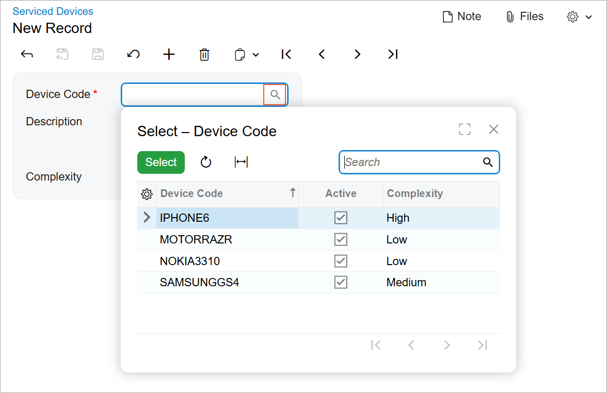
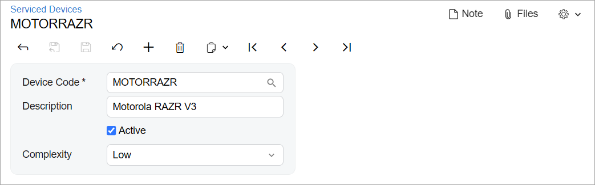

# UI Definition in HTML and TypeScript:To Convert an Acumatica ERP Form to the Modern UI with the Converter {#_f2bc25a1-e320-438c-baab-91c13236896a .task}

The following activity will walk you through the conversion of an Acumatica ERP form from the Classic UI to the Modern UI. You will convert the form by using the form converter.

## Story { .section}

Suppose that you’ve developed the Serviced Devices \(RS202000\) form for the Smart Fix company. The form has been developed for a previous version of Acumatica ERP and is displayed in the Classic UI. You need to convert the form to the Modern UI and want to use the form converter.

## Process Overview { .section}

You will modify the converter settings to fit your needs and convert the form to the Modern UI. You will then review the contents of the TypeScript and HTML files and adjust them. You will build the Modern UI sources for the form and review the resulting form.

## System Preparation { .section}

Before you begin converting the Serviced Devices \(RS202000\) form, do the following:

1.  Complete the following prerequisite activity: [Modern UI Development: To Deploy an Instance with Custom Forms and the Modern UI](UIDev_ModernUI_Activity_PrepareInstance.md). The prepared instance contains the Serviced Devices \(RS202000\) form.
2.  Perform the prerequisite actions and build the source code for the first time, as described in [Modern UI Development: To Build the Source Code of All Acumatica ERP Forms for Modern UI Development](UIDev_ModernUI_Activity_BuildingSourcesAll.md).

## Step 1: Adjusting the Converter Settings { .section}

The form converter comes with default settings. You need to adjust them to have the following results after conversion:

-   The views are declared in the `RS202000.ts` file instead of in a separate `views.ts` file.
-   The files of the Serviced Devices \(RS202000\) form are saved in the `FrontendSources\screen\src\development\screens\RS\RS202000` folder of the instance instead of a ZIP file.

To configure the converter, add the shouldFilesBeDownloaded and declareViewsInViewModelFile attributes in the `px.core\ui\screenConverter` tag of the `web.config` file of the instance, as shown in the following code.

```language-xml
<ui>
  <screenConverter usingOfPXJoinSyntaxEnabled="true" 
    shouldFilesBeDownloaded="false" 
    declareViewsInViewModelFile="true"/>
</ui>
```

**Tip:** The usingOfPXJoinSyntaxEnabled attribute is specified in the `web.config` file by default.

## Step 2: Generating the Source Files with the Converter { .section}

Now you can generate the source files of the form by using the converter. To generate the files, do the following:

1.  Open the Serviced Devices \(RS202000\) form.
2.  On the **Customization** menu, click **Convert to Modern UI**.

    The system generates the files, saves them in the `FrontendSources\screen\src\development\screens\RS\RS202000` folder of the instance, and displays a notification that the conversion has completed.

3.  Close the notification by clicking **OK**.

## Step 3: Adjusting the Generated TypeScript File { .section}

The generated TypeScript file may contain unnecessary import directives. To clean up the code, do the following:

1.  Review the `RS202000.ts` file.

    The TypeScript code contains the `RS202000` screen class, which extends the PXScreen class and includes a property for the data view of the form. The code also contains the `RSSVDevice` view class, which extends the PXView class.

2.  Adjust the file as follows:

    1.  Remove unnecessary import directives.
    2.  Fix any formatting issues.
    3.  Adjust the name in the viewInfo decorator, which specifies the container name. \(This name is used as an object name during the configuration of the particular functionality, such as workflows and import and export scenarios.\)
    The resulting file looks as follows.

    ```language-javascript
    import { 
    	createSingle, PXScreen, graphInfo, viewInfo, PXView, PXFieldState
    } from "client-controls";
    
    @graphInfo({
    	graphType: "PhoneRepairShop.RSSVDeviceMaint",
    	primaryView: "ServDevices",
    })
    export class RS202000 extends PXScreen {
    	@viewInfo({containerName: "Service Devices"})
    	ServDevices = createSingle(RSSVDevice);
    }
    
    // View
    export class RSSVDevice extends PXView  {
    	DeviceCD : PXFieldState;
    	Description : PXFieldState;
    	Active : PXFieldState;
    	AvgComplexityOfRepair : PXFieldState;
    }
    ```


## Step 4: Adjusting the Generated HTML File { .section}

The generated HTML file may contain unnecessary code elements and inaccurate IDs. To adjust the file, do the following:

1.  Review the `RS202000.html` file.

    The HTML code includes one qp-template element with the 1-1 name, which organizes the elements on the form into two columns of equal width. Each column is defined with the qp-fieldset element, which is marked with the slot attribute to identify the column of the template to which the fieldset belongs. Each fieldset includes the field elements for the form’s UI elements.

2.  Adjust the file as follows:

    1.  Move fields from the fieldset with `slot="B"` to the end of the fieldset with `slot="A"`, and remove the fieldset with `slot="B"`. Since the form has only four fields, it’s better to organize them in one column.
    2.  Change the IDs so that they match the guidelines for IDs. You can use the following IDs:

        -   For the qp-template tag: `form-ServDevices`
        -   For the qp-fieldset tag: `fsColumnA`
        **Tip:** You can find the guidelines for IDs of particular UI components in [UI Component Guide](../Shared/../DeveloperGuide/UIDevRef_Guide.md).

    3.  Remove the wg-container attribute because you don’t have tests for the Classic UI of the Serviced Devices \(RS202000\) form, which can be reused for the Modern UI. \(For details about the tests, see [Testing the Modern UI](../Shared/../DeveloperGuide/UIDev_Testing_Mapref.md).\)
    4.  Fix any formatting issues.
    The resulting HTML code looks as follows.

    ```language-csharp
    <template>
      <qp-template id="form-ServDevices" name="1-1">
        <qp-fieldset id="fsColumnA" slot="A" view.bind="ServDevices">
          <field name="DeviceCD"></field>
          <field name="Description"></field>
          <field name="Active"></field>
          <field name="AvgComplexityOfRepair"></field>
        </qp-fieldset>
      </qp-template>
    </template>
    ```


## Step 5: Building the Source Code and Viewing the Form { .section}

Now you can build the source files and view how the converted form looks in the Modern UI. Do the following:

1.  Build the source code of the Serviced Devices \(RS202000\) form. For details on how to do it, see [Modern UI Development: To Build the Source Code of a Particular Form for the Modern UI Development](UIDev_ModernUI_Activity_BuildingSourcesSingle.md).

    If your files are located in the development folder, you can use the following command.

    ``` {#codeblock_ljr_bnt_khc .language-bourne}
    npm run build-dev --- --env customFolder=development screenIds=RS202000
    ```

2.  While you are on the Classic UI of the Serviced Devices \(RS202000\) form, click **Tools** &gt; **Switch to Modern UI** on the form title bar. The Modern UI for the form is displayed.
3.  In the **Device Code** box, click the selector icon.

    The lookup table opens, as shown in the following screenshot.

    

4.  In the lookup table, select the *MotorRAZR* device.

    The rest of the elements on the form are filled in with the *MotorRAZR* device properties, as shown in the following screenshot.

    

5.  Clear the **Active** check box.
6.  On the form toolbar, click **Save**.

**Parent topic:**[Defining Acumatica ERP Forms in HTML and TypeScript](../DeveloperGuide/UIDev_UIDefinition_Mapref.md)

