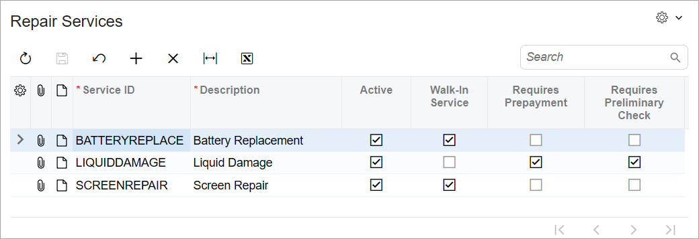

# UI Definition in HTML and TypeScript:To Create the UI of a Form {#_00801b5d-7339-4398-ae84-bbc0a78ea9be .task}

The following activity will walk you through the process of creating the UI of an Acumatica ERP form from scratch.

## Story { .section}

The Repair Services \(RS201000\) form, which you will develop, will be used to view the list of services provided by the Smart Fix company. By clicking buttons on the form toolbar, users will be able to add a new service, edit an existing service, and delete a service. Below you can see what this form should look like.



You have already implemented the backend for the form, which includes the `RSSVRepairServiceMaint` graph and the `RSSVRepairService` data access class \(DAC\). You have also already added the `RSSVRepairService` table to the application database.

## Process Overview { .section}

You will create TypeScript and HTML files for the Repair Services \(RS201000\) form. In the TypeScript file, you will define the screen class and view class for the form. In the HTML file, you will define the layout of the form.

## System Preparation { .section}

Before you begin the creation of the UI of the Repair Services \(RS201000\) form, do the following:

1.  Complete the following prerequisite activity: [Modern UI Development: To Deploy an Instance with Custom Forms and the Modern UI](UIDev_ModernUI_Activity_PrepareInstance.md). Make sure that the prepared instance contains the following items:
    -   The `RSSVRepairServiceMaint` graph in the customization code
    -   The `RSSVRepairService` DAC in the customization code
    -   The `RSSVRepairService` database table
2.  Perform the prerequisite actions and build the source code for the first time, as described in [Modern UI Development: To Build the Source Code of All Acumatica ERP Forms for Modern UI Development](UIDev_ModernUI_Activity_BuildingSourcesAll.md).

## Step 1: Creating Files for the Form { .section}

To create the Modern UI for the Repair Services \(RS201000\) form, you need to create the form’s TypeScript and HTML files as follows:

1.  In Visual Studio Code or in the file system, open the `FrontendSources\screen` folder of your Acumatica ERP instance. \(In Visual Studio Code, you can open the folder by clicking **File** &gt; **Open Folder** on the toolbar.\)
2.  In the `FrontendSources\screen\src` folder, create the `development` folder \(if it hasn't being created yet\), and within it, create the `screens` folder.
3.  In the `FrontendSources\screen\src\development\screens` folder, create a folder with the `RS` name if it hasn't been created yet. You will store the UI sources for all forms with the *RS* prefix in this folder.
4.  In the `FrontendSources\screen\src\development\screens\RS` folder, create a folder with the `RS201000` name if it has not been created yet. You will store the UI sources for the Repair Services form in this folder.
5.  In the `FrontendSources\screen\src\development\screens\RS\RS201000` folder, create the following files:
    -   `RS201000.ts`
    -   `RS201000.html`

## Step 2: Defining the Screen Class in TypeScript { .section}

To define the view of the Repair Services \(RS201000\) form in TypeScript, define a screen class and a property for the data view of the form as follows:

1.  In the `RS201000.ts` file, add the following import directives.

    ```language-javascript
    import {
    	PXScreen, graphInfo, createCollection,
    } from "client-controls";
    ```

    **Tip:** When you start typing the name of an API element in a TypeScript file in the `FrontendSources\screen` folder in Visual Studio Code, the list of available elements is shown. You can hover over an element to see its description.

2.  Define the screen class for the form as follows. The class name is the ID of the form.

    ```language-javascript
    export class RS201000 extends PXScreen {}
    ```

3.  For the screen class, add the graphInfo decorator, and specify the graph and the primary view of the form in the decorator properties, as shown below. Hide the **Note** and **Files** buttons on the form title bar by using the hideFilesIndicator and hideNotesIndicator properties. You don’t need notes and files for the whole form because each record in the table on the form has its own notes and files.

    ```language-javascript
    @graphInfo({
    	graphType: "PhoneRepairShop.RSSVRepairServiceMaint",
    	primaryView: "RepairService",
    	hideFilesIndicator: true,
    	hideNotesIndicator: true,
    })
    export class RS201000 extends PXScreen {}
    ```

4.  Define the property for the data view of the form by using the following code. Because the data view is used to display a table, you need to initialize the property with the createCollection method. The input parameter of this method is an instance of the view class, which you’ll define in the next step.

    ```language-javascript
    export class RS201000 extends PXScreen {
    	RepairService = createCollection(RSSVRepairService);
    }
    ```


## Step 3: Defining the View Class in TypeScript { .section}

You need to define a view class for the single data view of the Repair Services \(RS201000\) form. Proceed as follows:

1.  In the `RS201000.ts` file, update the list of import directives, as shown below.

    ```language-javascript
    import {
    	PXScreen, graphInfo, createCollection,
    	PXView, PXFieldState,
    	gridConfig, PXFieldOptions, GridPreset
    } from "client-controls";
    ```

2.  Define the view class as follows.

    ```language-javascript
    export class RSSVRepairService extends PXView  {}
    ```

3.  In the view class, specify the properties for all data fields of the data view, as shown below. You use the name of the data field as the property name.

    ```language-javascript
    export class RSSVRepairService extends PXView  {
    	ServiceCD: PXFieldState;
    	Description: PXFieldState;
    	Active: PXFieldState;
    	WalkInService: PXFieldState<PXFieldOptions.CommitChanges>;
    	Prepayment: PXFieldState;
    	PreliminaryCheck: PXFieldState<PXFieldOptions.CommitChanges>;
    }
    ```

    The `WalkInService` and `PreliminaryCheck` fields should commit changes to the server; that's why you’ve used the PXFieldOptions.CommitChanges option for the property type.

4.  Add the gridConfig decorator to the view class, as shown below. In the gridConfig decorator, you must specify the preset property. Because the table is the primary element of the Repair Services form, you use the *Primary* preset.

    ```language-javascript
    @gridConfig({
    	preset: GridPreset.Primary
    })
    export class RSSVRepairService extends PXView  {
    	ServiceCD: PXFieldState;
    	Description: PXFieldState;
    	Active: PXFieldState;
    	WalkInService: PXFieldState<PXFieldOptions.CommitChanges>;
    	Prepayment: PXFieldState;
    	PreliminaryCheck: PXFieldState<PXFieldOptions.CommitChanges>;
    }
    ```


## Step 4: Defining the Layout in HTML { .section}

The Repair Services \(RS201000\) form contains only a table. So to define the layout of the form, you need to include only the qp-grid element in the `RS201000.html` file, as the following code shows.

```language-xml
<template>
  <qp-grid id="grid-RepairService" view.bind="RepairService"></qp-grid>
</template>
```

You’ve specified the ID of the qp-grid control and bound the control to the `RepairServices` property, which you’ve defined in the `RS201000.ts` file.

**Tip:** If you open the `FrontendSources\screen` folder in Visual Studio Code, when you start typing the name of the tag or its attribute in an HTML file in a subfolder of this folder, the list of available tags or attributes is shown. You can also hover over an HTML element to see its description.

Now you can build the source files and view how the converted form looks in the Modern UI. For details, see [Modern UI Development: To Build the Source Code of a Particular Form for the Modern UI Development](../Shared/../DeveloperGuide/UIDev_ModernUI_Activity_BuildingSourcesSingle.md).

**Parent topic:**[Defining Acumatica ERP Forms in HTML and TypeScript](../DeveloperGuide/UIDev_UIDefinition_Mapref.md)

