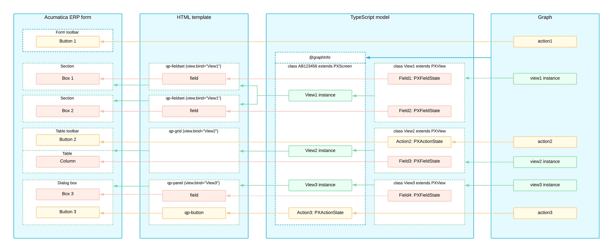

# UI Definition in HTML and TypeScript: General Information {#_910adc1e-ae5c-42b2-8310-d3bdd35a1e74 .concept}

The structure of an Acumatica ERP form in the Modern UI is represented by the following layers:

-   The presentation logic in a TypeScript \(TS\) file, which provides a definition of views and their settings
-   The layout of UI elements displayed on the form in HTML

## Learning Objectives { .section}

In this chapter, you’ll learn how to do the following:

-   Define the presentation logic and layout of a form in the Modern UI
-   Use the form converter to convert a form from the Classic UI to the Modern UI

## Applicable Scenarios { .section}

You define an Acumatica ERP form in HTML and TypeScript in the following cases:

-   In a customization project, you have developed an Acumatica ERP form for the Classic UI. Now you need to convert this form to the Modern UI to continue supporting it in future versions of Acumatica ERP.
-   You’re developing a new Acumatica ERP form.

## Controls of the Modern UI { .section}

Controls are building blocks for the layout of an Acumatica ERP form. Each control is composed of an HTML template and a TypeScript class.

A control can have the following attributes:

-   config: An attribute whose properties define the control’s appearance and behavior. Any changes to the values of these properties made in the browser are not passed to the server and can be overwritten by the server on each round trip.
-   value: The value displayed in the control, which can be changed both in the browser and on the server.

-   id: An identifier of the control, which is a shortcut for the id property of the config attribute.
-   Other bindable attributes, which are shortcuts bound to the properties in the config attribute.


You can change config directly in HTML. You can also specify particular properties defined in config:

-   As a set by using `config.bind`, as the following code shows: `config.bind="{imageSet: 'main', imageKey: 'Refresh'}"`
-   Individually, as the following code shows: `config-allow-edit.bind="true"`

**Tip:** If you specify the value for a single property, you need to transform the name of the property that is available in config. For example, suppose that the propertyName property is available in config. To specify a single property, you transform its name to config-property-name.

All controls can be divided into the following categories:

-   Simple controls: Are bindable to server fields
-   Containers: Hold other controls
-   Compound controls: Are usually bindable to a view or have their own controller
-   Abstract controls: Serve as a basis for other control types

For simple controls, you typically don’t specify their type, such as qp-checkbox, in HTML. Instead, you use the field tag in HTML. The server automatically defines the type of the field in the Modern UI. The PX\*FieldAttribute attribute assigned to the field in the backend code creates a specific type, which is an inheritor of PXFieldState. This type affects the default control used by the client.

**Attention:** You can’t use shortened versions of custom HTML tags, such as `<qp-grid .../>` or `<qp-button .../>`. An HTML limitation prohibits shortened version of tags except for a limited number of standard HTML tags.

## Acumatica ERP Form in the Modern UI {#_3a652d77-fa3c-4883-91d4-51c608d8f7af .section}

You’ll find the Modern UI source code of original Acumatica ERP forms in the `FrontendSources\screen\src\screens` folder of the Acumatica ERP instance folder.

Below you can see an example of the hierarchy of the files and folders of the Modern UI.

```
Site
- FrontendSources/screen/src/screens
- - GL
- - - GL401000
- - - - extensions (optional)
- - - - - GL401000_extension1.html
- - - - - GL401000_extension1.ts
- - - - - GL401000_extension2.html
- - - - - GL401000_extension2.ts
- - - - GL401000.html
- - - - GL401000.ts
- - - - views.ts (optional)
```

The `FrontendSources\screen\src\screens` folder contains subfolders with two-letter names. Each subfolder includes the source code of the forms whose screen IDs start with these letters. Inside each subfolder is a folder named after the screen ID, such as `GL401000`. This folder contains HTML and TS files named after the same screen ID—for example, `GL401000.ts` and `GL401000.html`. For large forms with many data views, such as [Sales Orders](../UserGuide/SO_30_10_00.md) \(SO301000\), view definitions may be located in separate files named `views.ts`.

**Attention:** You must use the import directive to refer to the view definitions from separate files, as shown below.

```language-javascript
import{
	SOOrder,
	BlanketTaxZoneOverrideFilter
} from './views';
```

The `extensions` folder contains TS and HTML files for extensions of the form. Each file name, such as `GL401000_MultiCurrency.ts`, starts with the screen ID and ends with a postfix that indicates the extension’s purpose.

You can define the views and layout in extensions of the form for:

-   The areas of the form that are specific to particular features.
-   The definitions of dialog boxes \(which are also called *smart panels* in the Classic UI\).
-   The definitions of tabs. However, for tabs in extensions, you need to specify that the tab has an external definition and provide its ID by using the ref attribute of the qp-tab tag. For details, see [Tab: Configuration](UIDevRef_Tab_Configuration.md).
-   Any UI customization of the form. For details about UI customization, see [UI Customization Development: General Information](UIDev_Customization_GeneralInfo.md).

## Screen Class in TypeScript {#_1e51a19b-363a-4595-ba4c-99bdf0d7e499 .section}

To define the views of an Acumatica ERP form in TypeScript, in the TS file of the form, you define a *screen class*—a class for the form—as shown in the following code.

```language-javascript
import { 
    graphInfo,
    PXScreen
} from "client-controls";
  
@graphInfo({
    graphType:'PX.Objects.GL.AccountHistoryEnq',
    primaryView:'Filter'
})
export class GL401000 extends PXScreen {
}
```

**Tip:** When you start typing the name of an API element in a TypeScript file in the `FrontendSources\screen` folder in Visual Studio Code, the list of available elements is shown. You can hover over an element to see its description.

The screen class must satisfy these requirements:

-   It has the screen ID as the name of the class, such as `GL401000`.

-   It extends the PXScreen class.

-   It has the [graphInfo](https://help.acumatica.com/Help?ScreenId=ShowWiki&pageid=ba15979b-3ec3-9ddb-913c-3345acb5106f) decorator, in which you specify the graph and its primary view.

    **Tip:** You can also specify optional parameters of the graphInfo decorator and use other decorators.

    **Attention:** In the Modern UI, each Acumatica ERP form must use its own graph type.


In the screen class, you define a property for each data view, as shown below.

```language-javascript
import { 
    graphInfo, PXScreen, createSingle 
} from "client-controls";
  
@graphInfo({
    graphType:'PX.Objects.GL.AccountHistoryEnq',
    primaryView:'Filter'
})
export class GL401000 extends PXScreen {
  @viewInfo({containerName: 'Filter'})
  Filter = createSingle(GLHistoryEnqFilter);
}
```

This property must satisfy the following requirements:

-   It has the same name as the name of the data view. You’ll use this name to bind a UI control to the data view in HTML.

-   It has a [viewInfo](https://help.acumatica.com/Help?ScreenId=ShowWiki&pageid=344ef905-3b77-c11f-3515-d1428ad9c9ac) decorator with the specified container name. \(This name is used as an object name during the configuration of particular functionality, such as workflows and import and export scenarios. If this value isn’t specified, the system displays the name of the data view as the object name.\)

-   If you need to display a form control, the property is initialized with the createSingle method, which takes as the input parameter an instance of the view class \(described below\).

-   If you need to display a table \(grid\) or a tree, the property is initialized with the createCollection method, which takes as the input parameter an instance of the view class. You can specify configuration parameters for the table by using the [gridConfig](https://help.acumatica.com/Help?ScreenId=ShowWiki&pageid=0307daab-31d8-32d7-f9d0-d61137b7919f) decorator and for the tree by using the [treeConfig](https://help.acumatica.com/Help?ScreenId=ShowWiki&pageid=22737b48-be73-e8b7-91db-973c9a79b4cb) decorator.

    **Tip:** The createCollection method can also be used when multiple records need to be displayed and these records are rendered without a predefined Acumatica ERP control, such as in the Outlook plug-in.


**Tip:** Multiple containers can be bound to the same graph's view. If you need to bind multiple container controls to the same graph's view and one of these controls corresponds to a table or a tree, you initialize the property in TypeScript by using the createCollection function.

## View Classes in TypeScript {#_e6e70710-e57a-4ae9-9a46-81d676ddd869 .section}

In the TS file of the form, you define a view class for each view of the graph, as shown below. The class extends the `PXView` class.

**Tip:** You can use any name for the view class. However, we recommend that you use the name of the data view’s primary DAC.

For the view classes added in a customization project, we recommend that you keep the prefix in the name. The prefix consists of a two-letter identifier indicating the part of the functional area and a two-letter prefix of the application area.

```language-javascript
import { 
    PXView 
} from "client-controls";
  
export class GLHistoryEnqFilter extends PXView {
}
```

In each view class, you specify the properties for all data fields of the data view that you want to be able to show or use in the UI, as shown below. You use the name of the data field as the property name.

```language-javascript
Description: PXFieldState;
ShowCuryDetail: PXFieldState<PXFieldOptions.Hidden | 
  PXFieldOptions.CommitChanges>;
OrderDate: PXFieldState<PXFieldOptions.CommitChanges>;
```

**Tip:** The fields that you’ve included in view classes are also used in various integration-related functionality, such as in the Acumatica Mobile Framework, the screen-based SOAP API, and the copy-paste functionality.

You specify the type of each property, which can be:

-   PXFieldState.
-   `PXFieldState<list_of_options>,` where you specify the options by using the [`PXFieldOptions`](https://help.acumatica.com/(W(6))/Help?ScreenId=ShowWiki&pageid=da180a08-b380-09c7-07c6-b5b63a806087) enum. The options can be combined.

You can also use decorators for fields. For information about decorators for fields, see [Fieldset: Field Configuration](UIDevRef_Fieldset_Configuration.md).

For details about how to add a field from a joined data access class of the data view, see [UI Definition in HTML and TypeScript: Joined Fields](UIDev_UIDefinition_JoinedFields.md).

## Action Definitions in TypeScript {#_48f6ba21-06dc-442b-bdbf-4af7bea5e024 .section}

The actions defined in the graph or in the workflow have corresponding commands displayed on the More menu by default. You do not need to define them in the TypeScript code of the Acumatica ERP form.

However, if you need to place a button for an action somewhere on the form other than the toolbar or the More menu, you need to include the action’s definition in TypeScript. For details, see [Button: Configuration](UIDevRef_Button_Configuration.md).

**Important:** When you include the property of the PXActionState type for the action in the TypeScript code of a form, this action is automatically bound by name to an action in the graph. The action is not displayed on the form toolbar by default. To specify explicitly whether the button for the action is displayed on the form toolbar, you can use the [PXButton.DisplayOnMainToolbar](https://help.acumatica.com/(W(1))/Help?ScreenId=ShowWiki&pageid=1a7069c4-95d5-456b-41ec-5b19371358db) property in the graph’s action declaration.

## Layout in HTML { .section}

In the HTML file, you define the layout of an Acumatica ERP form, as shown in the following example. You must place all HTML controls inside the template tag.

```language-xml
<template>​
 <qp-template id="form-Filter" name="7-10-7" class="equal-height">​
  <qp-fieldset id="fsColumnA-Filter" slot="A" view.bind="Filter">​
   <field name="OrderDate"></field>​
   <field name="ShowCuryDetail"></field>​
  </qp-fieldset>​
  <qp-fieldset id="fsColumnB-Filter" slot="B" view.bind="Filter">​
   <field name="Description"></field>​
  </qp-fieldset>​
 </qp-template>​
  <qp-grid id="grid-Details" view.bind="transactions"></qp-grid>​
</template>​
```

**Tip:** If you open the `FrontendSources\screen` folder in Visual Studio Code, when you start typing the name of the tag or its attribute in an HTML file in a subfolder of this folder, the list of available tags or attributes is shown. You can also hover over an HTML element to see its description.

In the HTML file, you use the rules described in the following resources:

-   [Designing the Layout of an Acumatica ERP Form](UIDev_DesigningLayout_Mapref.md): The general approach you should follow

-   [UI Component Guide](UIDevRef_Guide.md): Guidelines for particular UI elements


**Attention:** We recommend that you configure the appearance of UI controls by using TypeScript decorators instead of properties of the config attribute in HTML. These decorators include [fieldConfig](https://help.acumatica.com/Help?ScreenId=ShowWiki&pageid=a1284c74-b44a-cdf3-6d8f-3ebd9938f5fa), [controlConfig](https://help.acumatica.com/Help?ScreenId=ShowWiki&pageid=ece136fa-9f2c-a8b2-3b3c-aff23a4d1156), [gridConfig](https://help.acumatica.com/Help?ScreenId=ShowWiki&pageid=0307daab-31d8-32d7-f9d0-d61137b7919f), and [columnConfig](https://help.acumatica.com/Help?ScreenId=ShowWiki&pageid=174c3931-2148-bc0c-ee45-705f27e1aec6). For details about the configuration of particular controls, see [UI Component Guide](UIDevRef_Guide.md).

## UI Components of an Acumatica ERP Form { .section}

The following diagram shows the UI components of an Acumatica ERP form and the interactions between them.



**Parent topic:**[Defining Acumatica ERP Forms in HTML and TypeScript](../DeveloperGuide/UIDev_UIDefinition_Mapref.md)

