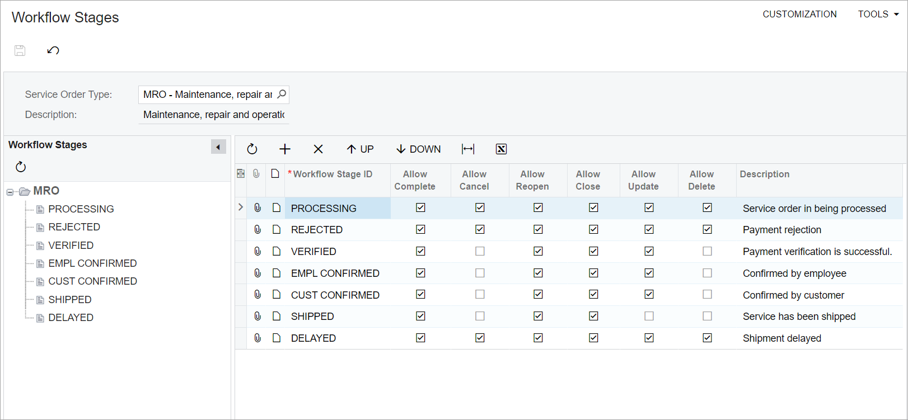

# UI Definition in HTML and TypeScript: View Parameters in the viewInfo Decorator {#_c33948ad-b383-4eac-99e2-c9df7d4f5165 .concept}

Suppose that one control depends on parameters from another control. For example, depending on the value selected in a tree \(qp-tree\), a different view should be displayed in the table.

In this case, you can define a list of parameters in the viewInfo decorator for the view of the dependent control and then specify them in the view delegate in the graph.

## Declaring View Parameters { .section}

To define parameters in the viewInfo decorator, you do the following:

1.  In the viewInfo decorator, specify the `parameters` property with an array.

    ```language-javascript
    {parameters : []}
    ```

2.  Declare each parameter in the array by creating the ControlParameter object with the following values:
    1.  The name of the parameter \(it will be used later in the view delegate\)
    2.  The view where the parameter is located
    3.  The name of the field in this view that holds the parameter value

The following code shows a declaration of the `parent` parameter for the `Items` view. The `parent` parameter is defined by the `WFStageID` field in the `Nodes` view.

```language-javascript
@viewInfo({ parameters: [ new ControlParameter("parent", "Nodes", "WFStageID") ] })
Items = createCollection(FSWFStage);
```

**Tip:** This functionality was implemented by using the PXControlParam tag in the Classic UI. For details about conversion to the Modern UI, see [Reference for the parameters Property of the viewInfo Decorator](#_5d355baf-7214-4390-b914-7a45c097fecc).

## Using View Parameters in the View Delegate { .section}

To use the view parameter in the graph, you declare the view delegate with the same parameter. Inside the view delegate, you can use this parameter to return a different query. For details on defining data view delegates, see [Filtering Records Dynamically with Data View Delegates](../StudioDeveloperGuide/CodeCustomization_DataViewDelegates_Mapref.md).

The following code shows an example of a data view delegate for the `Items` view. Note that the parent parameter is declared in the view delegate. This parameter will have the value specified in the TypeScript declaration.

```language-csharp
protected virtual IEnumerable items([PXInt] int? parent)
{
  NodeFilter.Current.ParentWFStageID = (parent == null) ? RootNodeID : parent;
 
  PXResultset<FSWFStage> bqlResultSet;
 
  if (parent == null || parent == RootNodeID)
  {
    bqlResultSet = PXSelect<FSWFStage,
      Where<
        FSWFStage.wFID, Equal<Current<SelectedNode.wFID>>,
        And<FSWFStage.parentWFStageID, 
          Equal<Current<SelectedNode.parentWFStageID>>>>>
      .Select(this);
  }
  else
  {
    bqlResultSet = PXSelect<FSWFStage,
      Where<
        FSWFStage.wFID, Equal<Current<SelectedNode.wFID>>,
        And<FSWFStage.parentWFStageID,
          Equal<Required<FSWFStage.parentWFStageID>>>>>
      .Select(this, parent);
  }
   
  return bqlResultSet;
}
```

As a result, you can display a different grid depending on the node selected in the tree. The following screenshot shows the example implemented in the code above. \(In the **Workflow Stages** tree, the *MRO* node is selected.\)



## Reference for the parameters Property of the viewInfo Decorator {#_5d355baf-7214-4390-b914-7a45c097fecc .section}

The following table shows the correspondence between PXControlParam and the TypeScript elements that are involved in configuring view parameters.

|ASPX|TypeScript|
|----|----------|
|PXControlParam```language-xml
<px:PXGrid ID="grid" ...>
  <Levels>
    <px:PXGridLevel 
      DataMember="Items">
      ...
    </px:PXGridLevel>
  </Levels>
  <Parameters>
    <px:PXControlParam 
      ControlID="tree" 
      Name="parent" 
      PropertyName="SelectedValue" 
      Type="String" >
    </px:PXControlParam>
  </Parameters>
  ...
</px:PXGrid>
```

|ControlParameter: The class that is used to create an instance of a view parameter.```language-javascript
@viewInfo({ 
  parameters: [ 
    new ControlParameter(
      "parent", 
      "Nodes", 
      "WFStageID"
    )
  ]
})
Items = createCollection(FSWFStage);
```

|
|ControlID```language-xml
ControlID="tree"
```

|viewName \(the second parameter of the ControlParameter constructor\): The name of the view on which the current view depends.|
|Name```language-xml
Name="parent"
```

|name \(the first parameter of the ControlParameter constructor\): The name of the parameter.|
|PropertyName```language-xml
PropertyName="SelectedValue"
```

|fieldName\( the third parameter of the ControlParameter constructor\): The name of the field in the view specified in the second parameter.|

**Parent topic:**[Defining Acumatica ERP Forms in HTML and TypeScript](../DeveloperGuide/UIDev_UIDefinition_Mapref.md)

