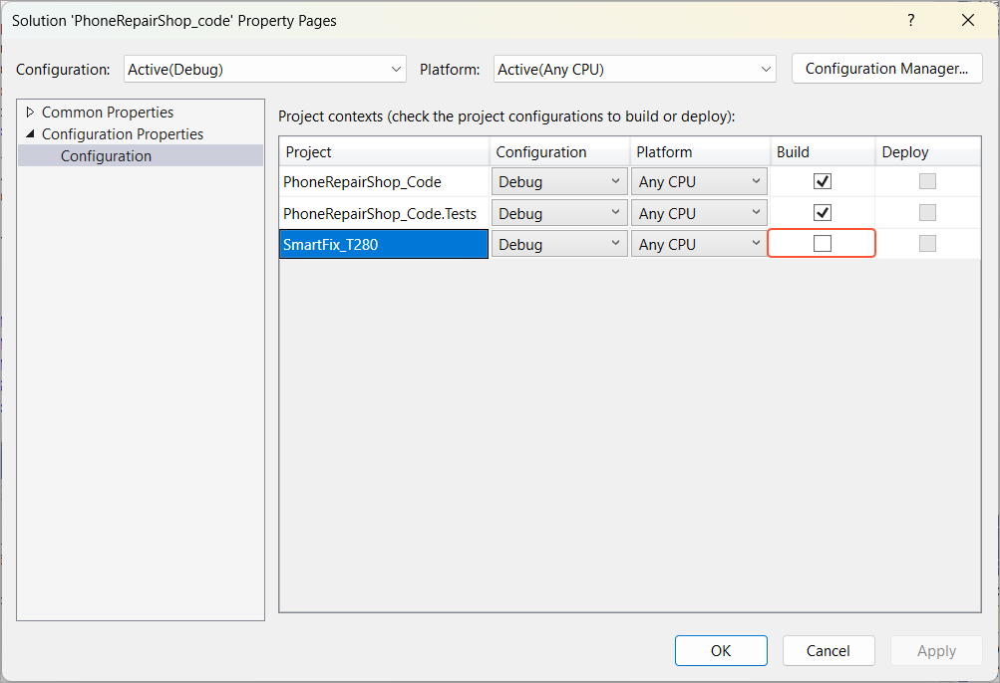
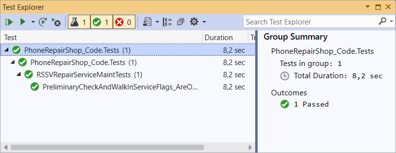

# Test Method:To Run a Test Method {#_38c67178-c40e-4eaf-9efd-781a132e6c75 .task}

The following activity will walk you through the process of running a single test method.

## Story { .section}

Suppose that you have a test method implemented in a test class. You need to run the test method.

## Process Overview { .section}

In the **Test Explorer** window of Visual Studio, you will select a method and run it.

## System Preparation { .section}

Before you begin running the test method, make sure that you have performed the following prerequisite activities:

1.  [Test Instance for Unit Testing: To Deploy an Instance](UnitTest_InitialConfiguration_Activity_DeployInstance.md), to prepare the Acumatica ERP instance that you will use
2.  [Test Project and Test Class: To Create a Test Project](UnitTest_TestProject_Activity_CreateProject.md), to create and configure the `PhoneRepairShop_Code.Tests.csproj` test project
3.  [Test Project and Test Class: To Create a Test Class](UnitTest_TestProject_Activity_CreateClass.md), to create the `RSSVRepairServiceMaintTests` test class
4.  [Test Method: To Create a Test Method Without Parameters](UnitTest_TestMethod_Activity_CreateTestMethodNoParam.md), to create the `PreliminaryCheckAndWalkInServiceFlags_AreOpposite` test method

## Step: Running a Test Method { .section}

**Tip:** If your code contains test methods other than the one created in [Test Method: To Create a Test Method Without Parameters](UnitTest_TestMethod_Activity_CreateTestMethodNoParam.md), or if you have already run the existing test method before, the number of items mentioned in the following instruction may differ.

Do the following to run the method created in [Test Method: To Create a Test Method Without Parameters](UnitTest_TestMethod_Activity_CreateTestMethodNoParam.md):

1.  In Visual Studio, in the solution properties, make sure the website project is excluded from the solution building \(see below\).

    

2.  Select the **Test** &gt; **Test Explorer** menu item. The **Test Explorer** window opens, which currently displays no tests.
3.  Click **Run All Tests In View**. The solution is built, and one test for the `PreliminaryCheckAndWalkInServiceFlags_AreOpposite` test method appears in the **Test Explorer** window \(shown in the following screenshot\) and is run.

    

**Parent topic:**[Creating a Test Method](../DeveloperGuide/UnitTest_TestMethod_Mapref.md)

