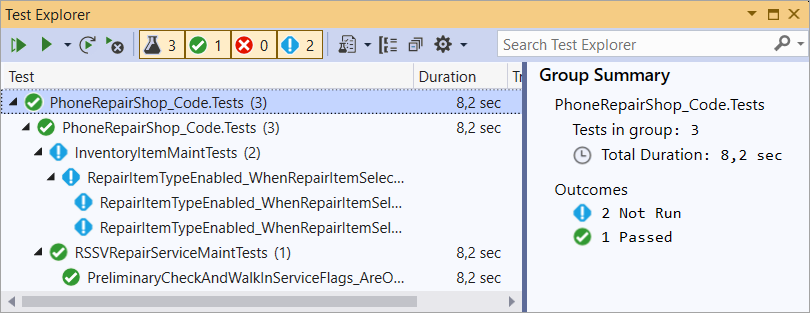

# Test Method: Test Management in Visual Studio {#_bd33767d-4d22-46b2-ba60-780f3e4209e2 .concept}

The test methods that you have created appear in the **Test Explorer** window of Visual Studio, which is shown in the following screenshot.

For each test method without parameters \(see [Test Method: To Create a Test Method Without Parameters](UnitTest_TestMethod_Activity_CreateTestMethodNoParam.md)\), a test is added. For parameterized test methods \(see [Test Method: To Create a Test Method with Parameters](UnitTest_TestMethod_Activity_CreateTestMethodWithParams.md)\), a test is added for each set of parameter values that you have specified for the method.

In the **Test Explorer** window of Visual Studio, you can select the desired test, test method, or group of test methods, and you can run \(see [Test Method: To Run a Test Method](UnitTest_TestMethod_Activity_RunTestMethod.md)\) or debug \(see [Test Method: To Debug a Test Method](UnitTest_TestMethod_Activity_DebugTestMethod.md)\) them. You can also get information about the tests' outcomes \(whether they have succeeded or not\) and execution time.

**Parent topic:**[Creating a Test Method](../DeveloperGuide/UnitTest_TestMethod_Mapref.md)

