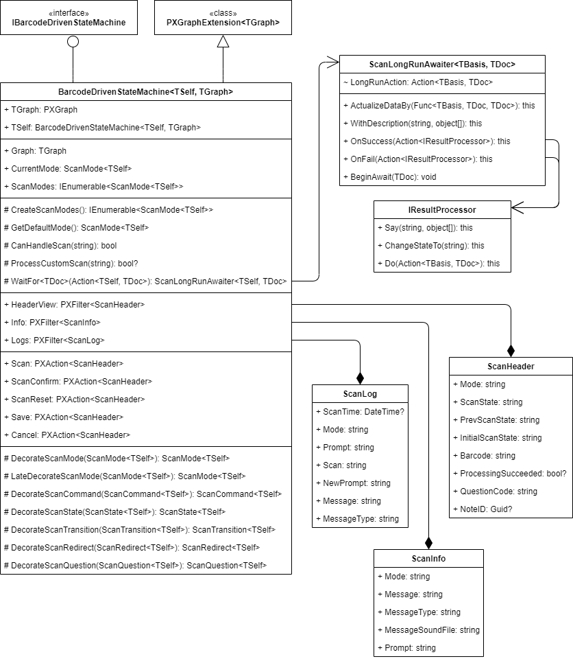

# Barcode Scan Class: General Information {#_9cac75a9-31f1-4ca6-a760-e2811ff5edf3 .concept}

A barcode scan class is the main class of a barcode-driven form.

## Learning Objectives { .section}

In this chapter, you will learn how to do the following:

-   Create a barcode scan class
-   Make the barcode scan class usable

## Applicable Scenarios { .section}

You create a barcode scan class if you are creating a custom barcode-driven Acumatica ERP form.

## Core Class { .section}

BarcodeDrivenStateMachine&lt;TSelf, TGraph&gt; is the core class of the Acumatica barcode-driven engine. This is a generic graph extension that connects all components of the barcode-driven engine. The class implements the IBarcodeDrivenStateMachine interface and inherits from the PXGraphExtension&lt;TGraph&gt; class. All components can access the core class via their Basis property.

**Tip:** All components of the barcode-driven engine are available in the `PX.BarcodeProcessing.dll` assembly. To make the barcode-driven engine usable, you need to add a reference to this assembly in the project of your Acumatica ERP extension library and add a `using` directive for the `PX.BarcodeProcessing` namespace to the source files.

The core class contains the components shown in the following diagram. For details about the properties and methods of the core class, see [BarcodeDrivenStateMachine&lt;TSelf,TGraph&gt; Class](https://help.acumatica.com/(W(9))/Help?ScreenId=ShowWiki&pageid=4673e448-9392-65f2-693a-e4952694457e).

## Barcode Scan Class { .section}

While creating a barcode-driven form, you introduce a barcode scan class as a descendant of the core class \(that is, BarcodeDrivenStateMachine&lt;TSelf, TGraph&gt;\). The barcode scan class is a graph extension that meets the following requirements:

-   The class is enclosed with itself in the `TSelf` type parameter. All the components of the barcode scan class will have the TScanBasis type parameter set to the class passed into the `TSelf` type parameter.
-   The class has a host graph in the `TGraph` type parameter. For details about the host graph, see the next section of this topic.

You then implement abstract members of the barcode scan class.

As is true of any other graph extension, the barcode scan class can contain views, actions, event handlers, and any other types of members. However, to make the barcode-driven part of the extension work, you must implement the `CreateScanModes()` abstract method. This method returns the set of scan modes available on the barcode-driven form. The scan mode creates and maintains scan states, transitions between them, available commands, and user dialogs. Scan modes are parameterized with the current barcode scan class type.

## Host Graph { .section}

The host graph is a supplementary graph that connects the barcode scan class with the target graph to which the barcode-driven engine functionality is applied.

**Important:** Do not apply a barcode scan class directly to a target graph because this can significantly change the way the form works and break the graph's standard workflow.

You can use one of the following ways to introduce a host graph:

-   By making the host graph an empty descendant of an existing graph.

    With this approach, you reuse the business logic of the existing graph, while the barcode scan class is applied only to that descendant and not to the original graph. Therefore, both versions of the graph \(the original one and the one with the barcode scan functionality\) are available in the system.

    The barcode scan class and all its components can use the inherited functionality of the host graph by accessing the Graph property of the barcode scan class.

-   By making the host graph a new empty graph \(that is, a direct descendant of the `PXGraph<T>` class\).

    This approach is useful when the original graph you want to utilize is pretty expensive to use, so you want to instantiate it manually and only when it is actually needed. That is, you want to instantiate it manually only when the barcode scan class applies the changes accumulated during scan cycles.

**Parent topic:**[Creating a Barcode Scan Class](../DeveloperGuide/WMSEngine_BarcodeScanClass_Mapref.md)

