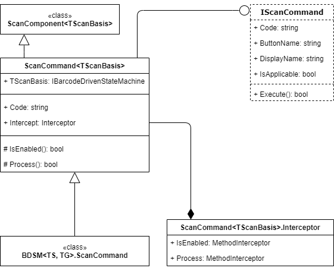

# Barcode Scan Commands: General Information {#_0bf90006-ca50-40c5-8219-c19d98d57e65 .concept}

A barcode scan command is a piece of logic that can be executed in any scan state either by clicking a button associated with this command in the UI, or by scanning a fixed barcode associated with it. For example, this logic can change the current state of the barcode-driven engine or start a long-running process.

## Learning Objectives { .section}

In this chapter, you will learn how to do the following:

-   Define the set of barcode scan commands of a scan mode
-   Implement a custom barcode scan command
-   Add to a scan mode the logic that handles an input of the quantity

## Applicable Scenarios { .section}

You define scan commands in the following cases:

-   You have created a scan mode on a custom form and need to implement the set of scan commands of this mode.
-   You have added a new scan mode on an existing barcode-driven form and need to implement the set of scan commands of this mode.
-   You have created a scan mode on a custom form and need to add to this scan mode the command for the input of the quantity

## Scan Command Component { .section}

The logic of a scan command is implemented in the ScanCommand component. You use `ScanCommand<TScanBasis>` to bind custom logic to a particular barcode command.

All commands produce a related `PXAction`. Therefore, the command can be executed in two ways: by clicking the button in the user interface, or by scanning a barcode.

The following diagram shows the classes and interfaces that are related to the scan command component. For details about the properties and methods of these classes and interfaces, see [ScanCommand&lt;TScanBasis&gt; Class](https://help.acumatica.com/(W(9))/Help?ScreenId=ShowWiki&pageid=2661025c-aa5a-7126-6553-fff43d52c32f).

## Implementation of a Scan Command { .section}

You create particular instances of this class in the `ScanMode<TScanBasis>.CreateCommands()` method.

For each scan command, you specify the following required properties:

-   Code: The code that is used to perform the command. The system automatically adds the `*` character to the beginning of all command codes and uses this character to distinguish them from the codes intended for processing by input state processors.
-   ButtonName: The name of the PXAction instance that is created for this command component.
-   DisplayName: The display name of the button for the PXAction instance that is created for this command component.
-   IsEnabled: A Boolean value that indicates \(if set to `true`\) that the command can be executed.

In the Process\(\) method, you implement the logic that is performed when the scan command is executed.

If you want to run a long-running process in the scope of a command component, you use the Basis.WaitFor\(\) method.

**Parent topic:**[Defining the List of Barcode Scan Commands](../DeveloperGuide/WMSEngine_Command_Mapref.md)

