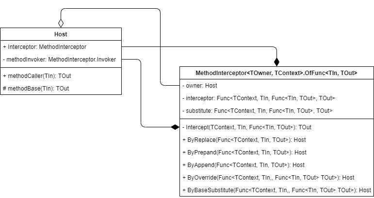

# Extension of Scan Components: Method Interceptors {#_19debcb9-2615-4670-86c6-2d7235d77fda .concept}

A method interception approach provides multiple overriding strategies that could facilitate the customization process.

## Method Interceptors { .section}

All components of BarcodeDrivenStateMachine should be either `abstract` or `sealed`. An `abstract` class should be used as a template for a `sealed` class. Only `sealed` classes can be used as scan components. These components should not contain any customizable logic. All customizable logic should be located in the `Basis` class or in its extensions \(which are ScanExtension descendants\). You perform the configuration of the components by using method interceptors.

A method interceptor is a special class that can simulate inheritance and overriding in the scope of a particular method. The following diagram shows the classes related to method interceptors.



A host class of the interceptor class creates a method interceptor for one of its methods by passing the base method to the interceptor. The host provides the public access to the interceptor so that the interception can be performed by the external classes \(via the By method group\). The host calls the target method only through the interceptor's method invoker, which is provided by the interceptor and is not accessible for external code. The host may have an additional `public` method that makes it possible for external code to use the target method properly.

## Interception Approaches { .section}

The barcode-driven engine provides the following interception approaches:

-   Override: This approach is similar to an original overriding that is used in object-oriented programming except that the base method is passed as the last parameter of the overriding method. A base method is a multicast delegate that accumulates all injected delegates that have been applied previously.
-   Replace: This approach simplifies the override strategy. The base method and all previously injected delegates are not invoked because the replacing delegate replaces them completely.
-   Prepend: This approach simplifies of the override strategy. The base method and all previously injected delegates are automatically invoked after the prepended delegate.
-   Append: This approach simplifies of the override strategy. The base method and all previously injected delegates are automatically invoked before the appended delegate.
-   Base substitution: This approach overrides only the original method of a component and does not affect any injected delegates.

All approaches can accept two versions of related delegates—that is, with or without `basis` as the first parameter. Although a delegate can capture the Basis property of the ScanMode instance or the `this` reference of the BarcodeDrivenStateMachine instance, we recommend that you use the `basis` parameter of the delegate instead. This helps to minimize extra memory allocations that are produced by C\# closures.

The following example shows additional validation for a certain entity state.

```
protected override ScanState<MyBarcodeExt> DecorateScanState(ScanState<MyBarcodeExt> original)
{
    var state = base.DecorateScanState(original); // all other interceptions should also take place
  
    if (state is MySomeState myState)
    {
        myState
            .Intercept.Validate.ByAppend((basis, entity) =>
            {
                // use the basis parameter to avoid variable capture
                if (basis.SomeSetup.Current.SomeRestriction == true && 
                    entity.SomeFlag == false)
                    return Validation.Fail("Some reason");
                return Validation.Ok;
            });
    }
  
    return state;
}
```

**Note:** Within a patch method, only the `basis` parameter should be used—that is, we recommend that you do not use the `Basis` property in this method. Otherwise, the compiler does not create a `static` lambda method, which leads to unnecessary memory allocation.

The replace strategy of a method interceptor is not compatible with any other interceptions made by other extensions. Therefore, we recommend that you use it only when you are creating the topmost extension. In other cases, use the override approach—that is, get the result of the base method and use it to produce the changes you want to achieve. The replace strategy is easier to use, while the override approach is more flexible and makes further customization possible.

**Parent topic:**[Extending Scan Components](../DeveloperGuide/WMSEngine_ExtendedComponent_Mapref.md)

