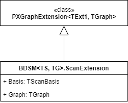

# Extension of Scan Components: Scan Extensions {#_93ad3cca-f871-4c73-8352-39984ef1226f .concept}

Because all scan components have to be `sealed` classes, they cannot have `virtual` methods and thus cannot be customized through class inheritance. Components use method interceptors for customizations instead. A component can provide its own `ScanExtension` class where all virtual methods are placed.

## Scan Extension { .section}

The `ScanExtension` classes are `PXGraphExtension` descendants, which can simplify the creation of customizable logic that should be used in the scope of barcode processing. For example, if a ScanCommand&lt;TScanBasis&gt; descendant must have complex logic that should be split into multiple methods, you should create a ScanExtension descendant that holds all these methods. This extension can be placed inside the ScanCommand&lt;TScanBasis&gt; descendant so that its customizable logic is not mixed with the logic of other components.

The ScanExtension descendant can be customized as any other PXGraphExtension can via PXOverrideAttribute. Any component can access the extension by using the Basis.Get&lt;TScanExtension&gt;\(\) method, which is a shortcut for the Basis.Graph.FindImplementation&lt;TScanExtension&gt;\(\) call.

**Tip:** When you create an extension for a scan component, you can use a `PXGraphExtension<>` class descendant instead of ScanExtension. However, in this case, the definition of the extension lacks the `Basis` property that is used by all scan components. You need to define this property manually, as shown in the following code.

```
public class BoycottAntarcticaItems : PXGraphExtension<ReceivePutAway, 
    ReceivePutAway.Host> 
{
    public ReceivePutAway Basis => Base1; 
}
```

The classes related to scan extensions are shown in the following diagram.



## Example of the ScanExtension Approach { .section}

The following code shows the initial definition of a scan component.

```
public class MyBarcodeExt : BarcodeDrivenStateMachine<MyBarcodeExt, Host>
{
    public class Host : TargetGraph { }
  
    // All overridable logic is moved to the Logic class
    public sealed class MyCommand : ScanCommand 
    {
        protected override bool Process()
        {
            Basis.Get<Logic>().Foo();
            return true;
        }
  
        public class Logic : ScanExtension 
        {
            public virtual void Foo()
            {
                int bar = Bar("madskillz");
                Basis.DoBar(bar); 
            }
  
            public virtual int Bar(string input)
            {
                return 7;
            }
        }
    }
}
```

The following code shows the customization.

```
// Overrides MyBarcodeExt.MyCommand.Logic
public class SomeCustomization : PXGraphExtension<
    MyBarcodeExt.MyCommand.Logic, // the logic you want to customize
    MyBarcodeExt, // optional, is useful if Basis is needed to be used in scope of the customization
    MyBarcodeExt.Host // an actual graph
>
{
    public MyBarcodeExt Basis => Base1; 
    /// Overrides <seealso cref="MyBarcodeExt.MyCommand.Logic.Bar(string)"/>
    [PXOverride]
    public virtual int Bar(string input, Func<string, int> base_Bar)
    {
        return base_Bar(input) + 42;
    }
}
```

## ScanExtension&lt;TScanExtension&gt; Class { .section}

The `ScanExtension<TScanExtension>` class is a ScanExtension component that is parameterized with another ScanExtension component type. This class is useful if you want to customize a ScanExtension component.

For example, you can define an extension for the `INScanCount.CountMode.ConfirmState.Logic` class in the following ways:

-   By using the PXGraphExtension&lt;&gt; class

    ```
    public class AlterCountModeConfirmStateLogic : 
        PXGraphExtension<INScanCount.CountMode.ConfirmState.Logic, 
        INScanCount, INScanCount.Host>
    {
        // some logic
    }
    ```

-   By using the ScanExtension&lt;&gt; class

    ```
    public class AlterCountModeConfirmStateLogic : 
        INScanCount.ScanExtension<INScanCount.CountMode.ConfirmState.Logic>>
    {
        // some logic
    }
    ```


Although you can use the way you prefer, we recommend that you use the second one.

**Parent topic:**[Extending Scan Components](../DeveloperGuide/WMSEngine_ExtendedComponent_Mapref.md)

