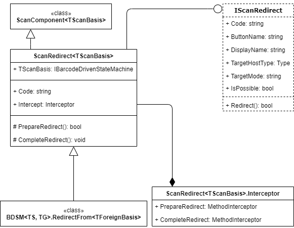

# Scan Mode Redirects: General Information {#_da9db1bb-f8d0-4be6-9e1f-d72bbedace38 .concept}

You can use the ScanRedirect component to give a user the ability to change the scan mode. A user will be able to change the scan mode in any scan state either by clicking a button associated with this redirect in the UI \(only in the mobile app\), or by scanning a barcode associated with it \(only in the web application\).

## Learning Objectives { .section}

In this chapter, you will learn how to define the set of mode redirects.

## Applicable Scenarios { .section}

You perform this business process in the following cases:

-   You have created a scan mode on a custom form and need to implement the redirects for this mode.
-   You have added a new scan mode on an existing barcode-driven form and need to implement the redirects for this mode.

## The ScanRedirect Component { .section}

ScanRedirect&lt;TScanBasis&gt; is a component that contains logic related to a transition from one mode to another. It works similarly to the `ScanCommand<TScanBasis>` class. It produces a `PXAction` member and can be invoked by scanning a barcode.

The following diagram shows the classes and interfaces that are related to the scan redirect component. For details about the properties and methods of these classes and interfaces, see [ScanRedirect&lt;TScanBasis&gt; Class](https://help.acumatica.com/(W(9))/Help?ScreenId=ShowWiki&pageid=9f47c100-5465-bb1c-84ea-9d736ea5e3af).

## Default Set of Mode Redirects { .section}

Because all predefined barcode-driven forms are known when the form is designed, the system provides a global list of redirects, which contains redirects to any barcode-driven form. You can access this list through the AllWMSRedirects.CreateFor&lt;TScanBasis&gt;\(\) method. Therefore, you can implement redirection of a user from any predefined barcode-driven form to any other barcode-driven form.

If you need to add a redirect to a custom mode, you cannot extend this list itself, but you can create a generic extension that adds a redirect \(to a new form\) to all other forms.

## Implementation of a Redirect Object { .section}

You create particular instances of the ScanRedirect&lt;TScanBasis&gt; class in the `ScanMode<TScanBasis>.CreateRedirects()` method. Typically, you use AllWMSRedirects.CreateFor&lt;TScanBasis&gt;\(\) in this method to define the full set of redirects for a mode. However, the list of available redirects could still be listed manually if you create the proper redirect object.

No redirect object is used by its nesting class. Instead, other barcode-driven forms or modes use these objects. For a scan redirect object of a custom mode, you need to define the following required properties:

-   Code: The code that is used to perform the redirect. The `@` character is added to the beginning of all redirect codes so that the system can distinguish them from the codes intended for processing by input state processors.
-   DisplayName: The display name of the button for the PXAction instance that is created for this redirect.
-   IsPossible: The Boolean value that specifies \(if set to `true`\) that it is possible to scan the redirect code and the redirect button is displayed in the UI. Redirects that are not possible are invisible in the UI.

You should keep in mind that any redirect object refers to two barcode-driven forms: the source and the target. Sometimes the source and the target can be the same form.

**Parent topic:**[Defining the Set of Scan Mode Redirects](../DeveloperGuide/WMSEngine_Redirect_Mapref.md)

