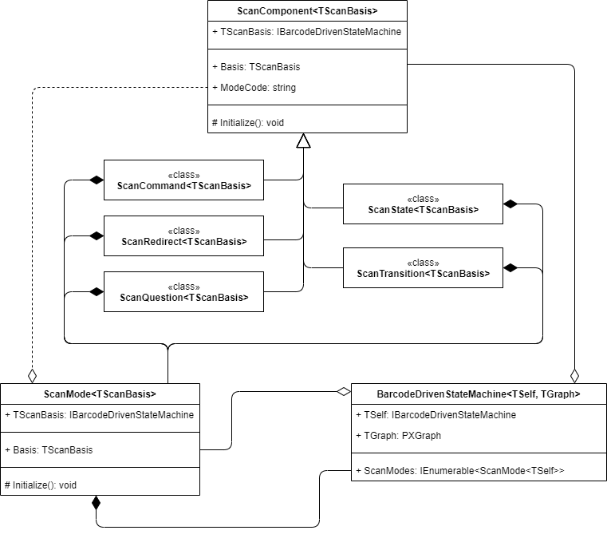
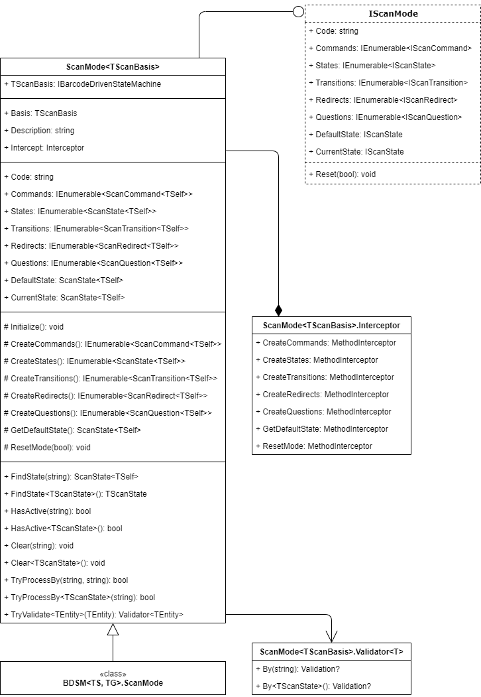

# Barcode Scan Mode: General Information {#_aeb82445-150f-4318-bb5c-d85097646dec .concept}

A barcode scan mode is the main scan component of the Acumatica barcode-driven engine.

## Learning Objectives { .section}

In this chapter, you will learn how to define the required properties of the barcode scan mode.

## Applicable Scenarios { .section}

You create a barcode scan mode in the following cases:

-   You are creating a custom barcode-driven form. You have defined a barcode scan class for this form and created an instance of the descendant of the ScanMode class in the CreateScanModes\(\) method implementation. Now you need to define this descendant itself.
-   You need to add a scan mode to an existing barcode-driven form. You have created a scan extension of a barcode scan class and overridden the CreateScanModes\(\) method to return the new scan mode, as described in [Extension of Scan Components: Customization of Components](WMSEngine_ExtendedComponent_CustomizedComponents.md). Now you need to implement this new mode.

## Barcode Scan Components { .section}

All barcode scan components except ScanMode&lt;TScanBasis&gt; are descendants of the ScanComponent&lt;TScanBasis&gt; class. ScanComponent&lt;TScanBasis&gt; provides access to the barcode scan class via its `Basis` property. The class also contains information about the mode to which it belongs.

The following diagram shows all barcode scan components and the relations between them. For details on the properties of the components, see the API Reference.

## Scan Mode { .section}

ScanMode&lt;TScanBasis&gt; is the main component of the BarcodeDrivenStateMachine and the base class for all modes. It provides access to all other components and defines their structure and the relationships between them.

The following diagram shows the structure of the scan mode. For details on the properties and methods, see [ScanMode&lt;TScanBasis&gt; Class](https://help.acumatica.com/(W(9))/Help?ScreenId=ShowWiki&pageid=55a078e8-2c69-ef63-57a9-6084fad1d81c).

## Recommendations for Scan Components {#section_vv2_1y4_y4b .section}

All scan components that you create should be either `abstract` classes or `sealed` classes. You can introduce an `abstract` component to provide a base implementation that is shared by multiple `sealed` components. We recommend this approach to prevent other developers from using inheritance to alter the behavior of the components defined in your code. Inheritance should be used only when the developer creates a new scan mode or a new barcode-driven Acumatica ERP form from scratch. To alter the behavior of scan components, the developer should use the method interception approach because this approach makes it possible to apply multiple customizations to one component. For details on this approach, see [Extension of Scan Components: Method Interceptors](WMSEngine_ExtendedComponent_MethodInterceptors.md).

**Note:** In the source code of Acumatica ERP, there are multiple exceptions to this approach in the definition of component classes. Most of them are the components defined in the WarehouseManagementSystem&lt;TSelf, TGraph&gt; class \(such as InventoryItemState, LocationState, and RemoveCommand\). These components can be used either without changes or by providing its descendant with mode-related modifications. These classes are neither `abstract` nor `sealed`. However, you should not use inheritance to customize their behavior. In customization scenarios, you should use only the method interception approach.

Because scan components are strictly bound to a specific barcode-driven form, you can nest these components within the barcode scan class or even within each other. For example, you can nest the following: scan modes within the barcode scan class; scan states, scan transitions, and scan commands within the scan mode; and scan extensions within the components that use them.

## Implementation of a Scan Mode { .section}

You implement a scan mode as follows:

1.  You define the required properties of the mode, as shown in [Barcode Scan Mode: To Define the Required Properties](WMSEngine_ScanMode_CreateScanMode_Activity.md).

    For a scan mode, you must define the mode identifier and a user-friendly description, which are the required properties. We recommend that you make the code value of the mode statically available, and also available as a C\# constant and a BQL constant.

2.  You implement the component creation methods, as described in the following chapters:

    -   [Implementing Barcode Scan States](WMSEngine_ScanState_Mapref.md)
    -   [Implementing Barcode Scan Transitions](WMSEngine_ScanTransition_Mapref.md)
    -   [Defining the List of Barcode Scan Commands](WMSEngine_Command_Mapref.md)
    -   [Defining the Set of Scan Mode Redirects](WMSEngine_Redirect_Mapref.md)
    The component creation methods are optional for implementation. By default, they return empty sets; however, in most cases, the default behavior would be insufficient to make the barcode scan mode usable.

3.  You define the mode resetting logic, as specified in the [Resetting a Barcode Scan Mode](WMSEngine_ModeReset_Mapref.md) chapter.

**Parent topic:**[Creating a Barcode Scan Mode](../DeveloperGuide/WMSEngine_ScanMode_Mapref.md)

