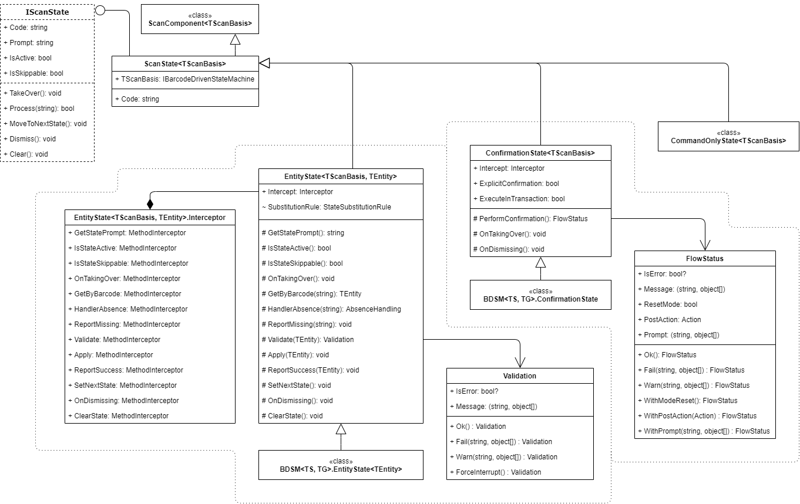

# Barcode Scan States: General Information {#_350b042e-9c11-41d1-a6db-4ebc53bf83ea .concept}

ScanState&lt;TScanState&gt; is a class for a barcode scan state. This class represents a component that contains the logic for handling a non-fixed input \(such as a barcode, quantity, or date\) of a barcode-driven Acumatica ERP form.

## Learning Objectives { .section}

In this chapter, you will learn how to do the following:

-   Create a set of scan states of a scan mode
-   Implement the input scan state
-   Implement the confirmation scan state

## Applicable Scenarios { .section}

You create scan states in the following cases:

-   You have created a scan mode on a custom form and need to implement the set of scan states of this mode.
-   You have added a new scan mode on an existing barcode-driven form and need to implement the set of scan states of this mode.
-   You need to define a new scan state for an existing scan mode of a barcode-driven from.

## Scan State Classes { .section}

You create particular instances of the ScanState&lt;TScanState&gt; class in the ScanMode&lt;TScanBasis&gt;.CreateStates\(\) method. The order of states used in this method doesn't imply the actual order of the input states.

A scan state class can be one of the following types:

-   EntityState&lt;TScanBasis, TEntity&gt;: An input scan state that is used to transform a barcode to a particular entity, validate it, and then apply it to the barcode-driven form
-   ConfirmationState&lt;TScanBasis&gt;: A confirmation scan state that validates and confirms all changes accumulated by other scan states and completes the barcode processing cycle
-   CommandOnlyState&lt;TScanBasis&gt;: A built-in scan state that rejects any non-fixed input and reports to users that they should use only commands

Usually a scan mode has multiple input states and no more than one confirmation state.

The following diagram shows the relationships between these classes. For details about the methods and properties of these classes, see [ScanState&lt;TScanBasis&gt; Class](https://help.acumatica.com/(W(9))/Help?ScreenId=ShowWiki&pageid=271cdb16-9178-c8ba-a484-bad1f0e653d8), [EntityState&lt;TScanBasis,TEntity&gt; Class](https://help.acumatica.com/(W(9))/Help?ScreenId=ShowWiki&pageid=11418098-4329-edf5-12a3-0b18bd212824), [ConfirmationState&lt;TScanBasis&gt; Class](https://help.acumatica.com/(W(9))/Help?ScreenId=ShowWiki&pageid=4dabb989-35ed-64a9-2895-5e049625a7f1), and [CommandOnlyStateBase&lt;TScanBasis&gt; Class](https://help.acumatica.com/(W(9))/Help?ScreenId=ShowWiki&pageid=87dbb62b-9ff1-86c8-a3a9-aa4e96d9ddb9).

**Parent topic:**[Implementing Barcode Scan States](../DeveloperGuide/WMSEngine_ScanState_Mapref.md)

