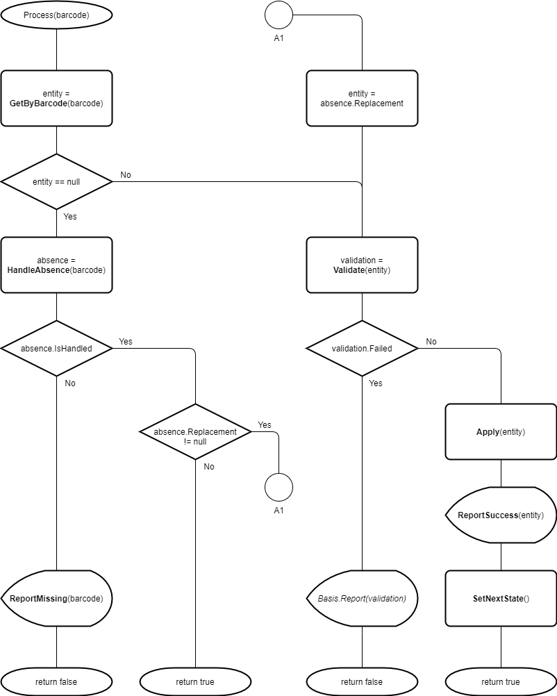

# Barcode Scan States: Input State {#_63e66759-f99a-4f89-8166-94311a0deed5 .concept}

The input state is a barcode scan state that is used to transform a barcode to a particular entity, validate it and then apply it to the barcode-driven form, without changing a certain document.

## Required Properties { .section}

For an input state, you must define the following required properties:

-   Code, which is the state identifier.
-   StatePrompt, which is an input prompt. The input prompt should clearly explain what is expected from a user.

## Cycle-Processing Methods { .section}

You can also implement the following additional methods, which affect the order in which the states are executed: IsStateActive\(\) and IsStateSkippable\(\).

Depending on the purpose of the state, you may need to implement some of the methods shown in the following code.

```
protected override TEntity GetByBarcode(string barcode) { ... }
protected override AbsenceHandling.Of<TEntity> HandleAbsence(string barcode)  { ... }
protected override void ReportMissing(string barcode)  { ... }
protected override Validation Validate(TEntity entity) { ... }
protected override void Apply(TEntity entity) { ... }
protected override void ReportSuccess(TEntity entity)  { ... }
protected override void SetNextState() { ... }
protected override void ClearState() { ... }
```

In the GetByBarcode\(\) method, you can define how a barcode should be transformed into the entity that it represents. We recommend that in this method you define the query that requests the entity only by the keys and that you move all restrictions to the Validate\(\) method.

You can provide the validation of an entity in the Validate\(\) method. If in this method implementation, you need to use the field's UI representation, you can retrieve it by using the Basis.SightOf&lt;&gt;\(\) method.

You usually implement both the Apply\(\) method and the ClearState\(\) method. The Apply\(\) method applies the found entity to the state of the barcode-driven form. The method is called when the barcode is processed by the state upon data input. The ClearState\(\) method reverts the application done by the Apply\(\) method. The ClearState\(\) method is called once the Basis.Clear&lt;TState&gt;\(\) or ScanMode.Clear&lt;TState&gt;\(\) method is executed, which usually occurs when the mode is reset. For details on the resetting of the mode, see [Resetting a Barcode Scan Mode](WMSEngine_ModeReset_Mapref.md).

For details about these methods, see [EntityState&lt;TScanBasis,TEntity&gt; Class](https://help.acumatica.com/(W(9))/Help?ScreenId=ShowWiki&pageid=11418098-4329-edf5-12a3-0b18bd212824).

The following diagram illustrates the processing cycle.



**Parent topic:**[Implementing Barcode Scan States](../DeveloperGuide/WMSEngine_ScanState_Mapref.md)

