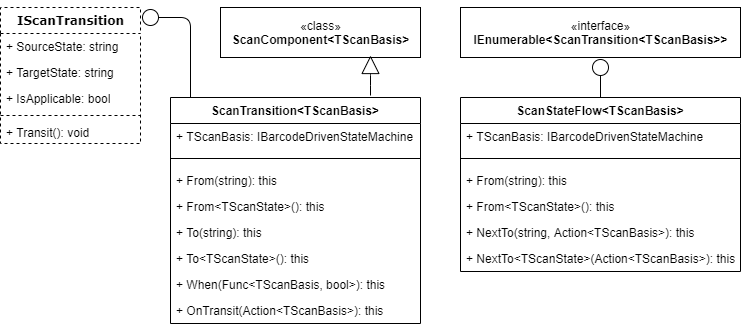

# Barcode Scan Transitions: General Information {#_28a73634-69f4-4495-96d1-1d2e6bcf2687 .concept}

ScanTransition&lt;TScanBasis&gt; is a class for a barcode scan transition. This class represents a component that defines the rules of automatic transitions between scan states.

## Learning Objectives { .section}

In this chapter, you will learn how to do the following:

-   Implement transitions between scan states
-   Implement a simple transition flow between scan states

## Applicable Scenarios { .section}

You implement scan transitions in the following cases:

-   You have defined a set of scan states of a custom scan mode. You need to implement transitions between these states.
-   You have defined a new scan state of a predefined scan mode. You need to implement transitions between the predefined scan states and the new scan state.

## Transition Between Scan States { .section}

You move the barcode-driven engine to another scan state in either of the following ways:

-   Call Basis.SetScanState\(string state\) or Basis.SetScanState&lt;TScanState&gt;\(\) to change the current scan state to another certain scan state. This way requires a particular state to be specified and is not flexible because scan states become highly coupled.
-   Call `Basis.DispatchNext()` to indicate to the system that the current scan state should be moved further. This way does not include information about a specific next scan state. The system derives the information about the next scan state from the transition map, which is defined by the scan transition component.

## Transition Map { .section}

You can use the scan transition component to create a complex map of transitions by using conditions and additional actions that can be performed when the transition is triggered.

Unlike all other scan components, ScanTransition&lt;TScanBasis&gt; is not an `abstract` class. However, it still can be configured by a condition or by additional transition logic. Also, in some cases, a transition map does not contain any branches; it contains only a group of optional states. In these cases, the creation of the transition map can be simplified by the ScanStateFlow&lt;TScanBasis&gt; class, which you can use to create the transition map sequentially.

The following diagram shows the classes and interfaces related to scan transitions.

## Implementation of the Transition Map { .section}

You create particular instances of the ScanTransition&lt;TScanBasis&gt; class in the ScanMode&lt;TScanBasis&gt;.CreateTransitions\(\) method.

To define the transition map, you can use the following methods:

-   Transition\(Func&lt;ScanTransition&lt;TSelf&gt;, ScanTransition&lt;TSelf&gt;&gt; config\)

    The Transition object can be used for producing a branching structure of transitions. This approach is shown in [Barcode Scan Transitions: To Implement Transitions](WMSEngine_ScanTransition_Activity.md).

-   StateFlow\(Func&lt;ScanStateFlow&lt;TSelf&gt;.IFrom, ScanStateFlow&lt;TSelf&gt;.IFlow&gt; config\)

    The StateFlow object implements the IEnumerable&lt;ScanTransition&lt;TScanBasis&gt;&gt; interface—that is, it produces a sequence of transition objects. The StateFlow object cannot be used for producing a branching structure of transitions. However, it supports additional actions that can be performed upon transition. To specify this actions, you use the overload of the NextTo method that accepts an Action&lt;TScanBasis&gt; delegate. This approach is shown in [Barcode Scan Transitions: To Implement a Simple Transition Flow](WMSEngine_ScanTransition_Activity_SimpleTransitionFlow.md).

**Parent topic:**[Implementing Barcode Scan Transitions](../DeveloperGuide/WMSEngine_ScanTransition_Mapref.md)

