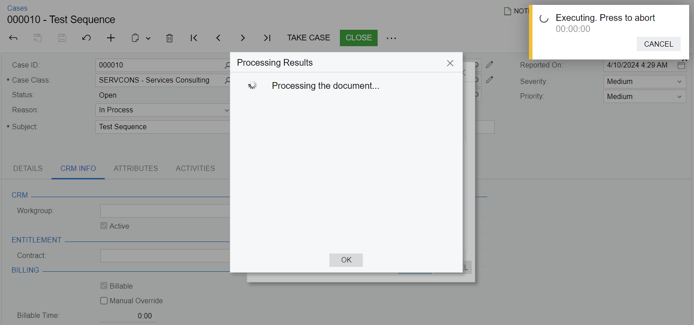
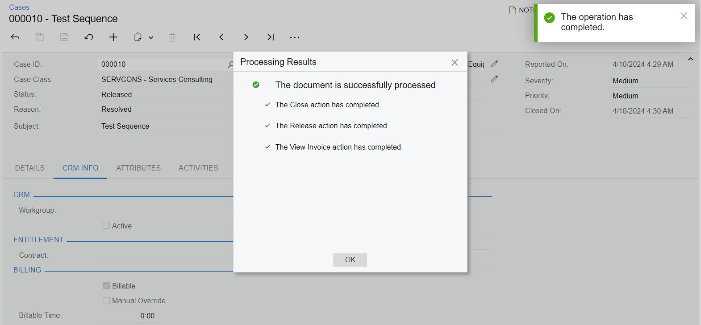

# Action Sequences: To Define an Action Sequence {#_cae2d53d-4243-4046-ac3c-7fd9517bd728 .task}

The following activity will walk you through the process of defining an action sequence.

## Story { .section}

Suppose that when a user clicks the **Close** command on the [Cases](../UserGuide/CR_30_60_00.md) \(CR306000\) form, you need to execute the actions that correspond to the following commands on the form:

-   **Release** to release the case
-   **View Invoice** if the case is billable \(that is, if the **Billable** check box is selected on the **CRM Info** tab of the [Cases](../UserGuide/CR_30_60_00.md) form\)

## Process Overview { .section}

First, you will learn the internal names of the entities used in the workflow: the actions and fields, workflow class, graph, and DAC.

Then you will extend the default workflow for the [Cases](../UserGuide/CR_30_60_00.md) \(CR306000\) form and define the action sequences in the extension. In order to define an action sequence for more than two actions, you need to define an action sequence for each pair. Thus, you will first define an action sequence for the Close and Release actions, and then an action sequence for the Release and View Invoice actions.

## System Preparation { .section}

Before you begin, you should make sure that you have configured your instance of Acumatica ERP, as described in the [Preparing an Instance for Workflow Customization](WorkflowAPI_PrepareInstance_Mapref.md) chapter.

You also need to create an extension library for the instance. For details, see [To Create an Extension Library](../CustomizationPlatform/cg_platform_tocreateextensionlib.md).

## Step 1: Investigate the Internal Names of Elements on the Cases Form { .section}

To define a sequence of existing actions, you need to learn the internal names of these actions in the graph of the [Cases](../UserGuide/CR_30_60_00.md) \(CR306000\) form, as well as other relevant internal names. Do the following:

1.  Open the [Cases](../UserGuide/CR_30_60_00.md) form.
2.  By using the Element Inspector, learn the name of the graph and the DAC for the form: CRCaseMaint and CRCase
3.  By using the Element Inspector, learn the action names of the following commands on the More menu:
    -   **Release**: release
    -   **Close**: Close
    -   **View Invoice**: viewInvoice
4.  By using the Element Inspector, learn the internal name for the **Billable** check box on the **CRM Info** tab: `CRCase.IsBillable`.
5.  In the website project of the Visual Studio solution, find the source code of the PX.Objects.CR namespace, and find the class that defines the code of the workflow for the [Cases](../UserGuide/CR_30_60_00.md) form: The CaseWorkflow class is located in `App_Data/CodeRepository/PX.Objects/CR/Workflows/CaseWorkflow.cs`.

## Step 2: Implement the First Action Sequence { .section}

To implement the first action sequence to be executed, do the following:

1.  In the extension library, create a C\# file named `CaseWorkflow_Extension.cs`.
2.  In the file, extend the class that implements the workflow for the [Cases](../UserGuide/CR_30_60_00.md) \(CR306000\) form, as shown in the following code.

    ```
    public class CaseWorkflow_Extension : PXGraphExtension<CaseWorkflow, CRCaseMaint>
    {
        public sealed override void Configure(PXScreenConfiguration config) =>
            Configure(config.GetScreenConfigurationContext<CRCaseMaint, CRCase>());
    
        protected static void Configure(WorkflowContext<CRCaseMaint, CRCase> context)
        {
        }
    }
    ```

3.  In the `Configure(WorkflowContext<CRCaseMaint, CRCase> context)` method, implement the action sequence as shown in the following code.

    ```
    context.UpdateScreenConfigurationFor(screen =>
    {
      return screen
        .WithActionSequences(sequences =>
        {
          sequences.Add(s => s
            .AfterAction("Close")
            .RunAction("release")
            .StopOnError(true));
        });
    });
    ```

    In the code above, you have defined a sequence by calling the Add method in the WithActionSequences method. In the lambda expression for the Add method, you have specified the first action of the sequence \(the triggering action\) in the AfterAction method and the second action of the sequence in the RunAction method. In the StopOnError method, you have also specified that the second action should not be performed if an error occurs during the execution of the first action of the sequence.

4.  Add the necessary using directives.

    ```
    using PX.Data;
    using PX.Data.WorkflowAPI;
    using PX.Objects.CR;
    using PX.Objects.CR.Workflows;
    ```

5.  Build the project.

## Step 3: Implement the Second Action Sequence { .section}

To implement an action sequence containing the release and viewInvoice actions, you need to add a separate sequence after the first one. Because the viewInvoice action should be executed only if the case is billable, you need to define a condition and specify it in the action sequence. Do the following:

1.  Define a condition that is true when the case is billable.
    1.  In the `CaseWorkflow_Extension` class, define the `Conditions` class with the condition.

        ```
        public class Conditions : Condition.Pack
        {
            public Condition IsBillable =>
              GetOrCreate(b => b.FromBql<CRCase.isBillable.IsEqual<True>>());
        }
        ```

    2.  Add the necessary using directive.

        ```
        using static PX.Data.WorkflowAPI.BoundedTo<PX.Objects.CR.CRCaseMaint, PX.Objects.CR.CRCase>;
        
        ```

    3.  In the `Configure(WorkflowContext<CRCaseMaint, CRCase> context)` method, create an instance of the `Conditions` class.

        ```
        var conditions = context.Conditions.GetPack<Conditions>();
        ```

2.  In the WithActionSequences method, add the second sequence after the sequence defined in the previous step. Specify the `IsBillable` condition in the AppliesWhen method.

    ```
    sequences.Add(s => s
      .AfterAction("release")
      .RunAction("viewInvoice")
      .AppliesWhen(conditions.IsBillable)
      .StopOnError(true));
    ```

3.  Build the project.

## Step 3: Test the Modified Workflow { .section}

To test the implemented sequence, do the following:

1.  Open the [Cases](../UserGuide/CR_30_60_00.md) \(CR306000\) form.

    **Note:** To make sure that the workflow has been modified correctly, note that the More button is displayed and the toolbar buttons have connotations. If you suspect an error, you can check the workflow output on the **System Events** tab of the [System Monitor](../UserGuide/SM_20_15_30.md) form. For details, see [Test Instance for Workflow Customization: To Turn On Workflow Validation](WorkflowAPI_PrepareInstance_Activity_EnableValidation.md).

2.  Create a new case with the following settings:
    -   **Case Class**: *PRODSUPINC*

        You need to specify this class because it is billable; this causes the **Billable** check box to be selected on the **CRM Info** tab of the form.

    -   **Business Account**: *C000000001*
    -   **Subject**: `Test Sequence`
3.  On the form toolbar, click **Open**.
4.  In the **Open** dialog box which opens, click **OK**.
5.  On the form toolbar, click **Close**.
6.  In the **Close** dialog box which opens, click **OK**.

    Note that the form shows the **Processing Results** dialog box and the timer indicating a long-running operation. The **Processing Results** dialog box indicates that the action sequence is being performed. The timer indicates that the release action which contains the long-running operation is being performed.

    

    After the sequence is completed, in the **Processing Results** dialog box, note the list of actions that have been performed: **Close**, **Release**, and **View Invoice**, as shown in the following screenshot. The [Invoices and Memos](../UserGuide/AR_30_10_00.md) \(AR301000\) form is opened in a new tab with the invoice created for the case.

    

7.  In the **Processing Results** dialog box, click **OK**.

**Parent topic:**[Defining Action Sequences](../DeveloperGuide/WorkflowAPI_ActionSequence_Mapref.md)

