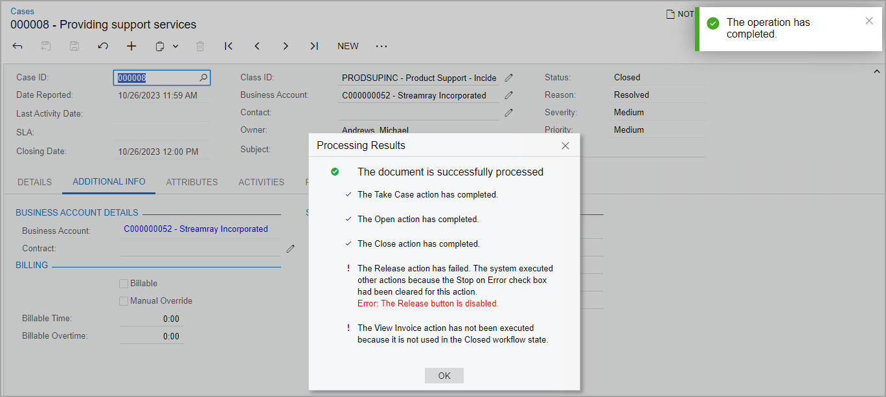

# Action Sequences: General Info {#_3c4655e7-04bc-4389-b1be-8018a9756211 .concept}

You can make the system automatically execute actions one after another if certain conditions are met. Thus, you can optimize system performance and speed up the processing of records. When a sequence of actions is performed, the system shows a dialog box with the progress and results of performing the sequence.

## Learning Objectives { .section}

In this chapter, you will learn what action sequences are. You will also learn how to configure these sequences in a workflow.

## Applicable Scenarios { .section}

You implement action sequences in the following cases:

-   You want the system to execute multiple actions one after another if certain conditions are met.
-   You want the system to stop the processing of records if certain actions fail.
-   You need to see which actions have been performed successfully and which ones have failed.

## Execution of Sequential Actions { .section}

Each action can have multiple actions—referred to as *subscriber actions* or *subscribers*—that the system invokes after it executes this action. Each subscriber can also have its own subscribers. If a condition is specified for an action, the system executes a subscriber action only if the condition is met and the action is available in the current workflow state. The system executes the action even if it is hidden.

If a subscriber action is unavailable in the current state of the workflow, the system displays an error. The system then either continues the execution of other subscriber actions or stops the execution, depending on the settings specified for this action.

**Tip:** Only actions of the same form \(screen\) can be configured to run in a sequence.

If a user clicks a button \(or command\) that has an underlying action with subscribers, the system proceeds as follows:

1.  If a dialog box is specified for this action, the system displays it and updates the fields as specified in the action’s configuration.
2.  The system performs all other steps in the workflow as specified in the configuration of the transitions and states.
3.  If the action has been executed successfully, the system then executes its subscribers.

    If a dialog box is specified for a subscriber action, the system does not display this dialog box to the user; instead, it uses the dialog box values specified in the screen configuration.

4.  For each of the subscribers, the system performs all other steps in the workflow.
5.  If a subscriber action has its own subscribers, the system executes them one by one if they exist in the current workflow state and their respective conditions are met.

During the execution of each action in a sequence, the system displays a dialog box with the status of the action execution, as shown in the following screenshot. \(It is the same dialog box that the system displays when the user clicks the **Quick Process** button on a form that supports quick processing.\) For report and navigation actions, the system opens the corresponding report or data entry form in a new browser tab and continues the processing of other actions in the current tab.

For details on implementing action sequences in Workflow UI, see [Action Configuration: Action Sequences](WorkflowUI_Actions_ActionSequences.md) in the [Workflow UI Guide](WorkflowUI_Guide.md).

## Defining of an Action Sequence { .section}

To define an action sequence, you perform the following general steps:

1.  At the screen configuration level, you call the WithActionSequences method.
2.  In the lambda expression for the WithActionSequences method, you call the Add method to add a new sequence.

    **Note:** You can instead call the Replace method to replace an existing sequence or the Remove method to remove an existing sequence. To avoid errors, Workflow API offers no option to update an existing sequence.

3.  In the lambda expression for the Add method, you configure the sequence by using the following methods:
    -   AfterAction \(required\): Specifies the triggering action \(the action after which the sequence should be executed\). A developer can specify either an action from the graph or an action defined by using Workflow API.
    -   RunAction \(required\): Specifies the action that should be executed in the sequence.

        Only one action can be added to a sequence. To add a sequence of multiple actions, you need to add multiple sequences. For example, to add the A &gt; B &gt; C sequence of actions, you need to add the A &gt; B sequence and the B &gt; C sequence.

    -   StopOnError \(optional\): Specifies whether the system should stop the execution of subscribers if the triggering action fails. By default, the sequence is stopped if an error occurs.
    -   AppliesWhen \(optional\): Specifies the condition depending on which the sequence should be executed.

        A developer can instead call the AppliesAlways method to always execute the sequence.

    -   WithFieldAssignments \(optional\): Assigns the fields of a dialog box that is configured for the second action of the sequence \(specified in the RunAction method\). The assignment is performed after the first action \(specified in the AfterAction method\) is executed.

        **Note:** If a dialog box is configured for an action specified in the RunAction method \(the second action in the sequence\), this dialog box is not displayed during the execution of the sequence. So the only way to provide values that are different from default ones in the dialog box is to specify them in the WithFieldAssignments method.

## Order of Execution { .section}

The system executes action sequences in the order they are defined in the code. For example, if the code contains the action sequences A &gt; B, B &gt; C, and A &gt; D with no conditions, the system will first execute the sequence A &gt; B, then the sequence B &gt; C, and then the sequence A &gt; D, so the order of actions will be A &gt; B &gt; C &gt; D. If the sequence A &gt; B has a condition and it is not met, the system will proceed to the sequence A &gt; D.

**Parent topic:**[Defining Action Sequences](../DeveloperGuide/WorkflowAPI_ActionSequence_Mapref.md)

