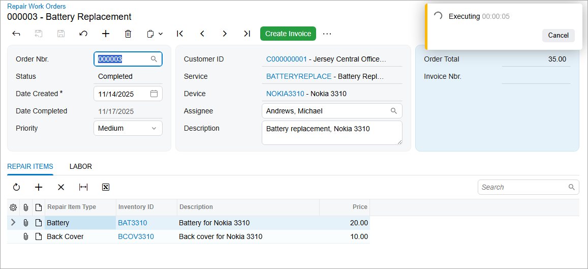
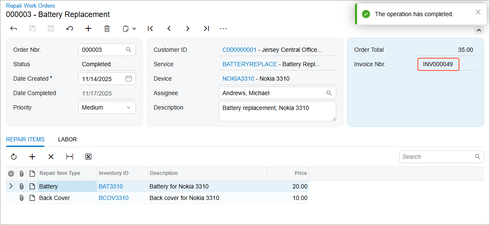

# Step 3: Testing the Action {#_dec16d92-9f58-4e92-a0bf-e063266f8135 .concept}

To test the **Create Invoice** button \(and the underlying action\), do the following:

1.  Rebuild the `PhoneRepairShop_Code` project.
2.  In Acumatica ERP, on the Repair Work Orders \(RS301000\) form, open a repair work order in the *Completed* status.
3.  On the form toolbar, click the **Create Invoice** button.

    A notification appears indicating the status of the processing, as shown in the following screenshot.

    

    When the process is complete, the number of the created invoice is displayed in the **Invoice Nbr.** box, as shown in the following screenshot.

    

**Parent topic:**[Workflow Actions: To Configure the Conditional Appearance of the Action](../DeveloperGuide/WorkflowAPI_Actions_Activity_CreateInvoice.md)

