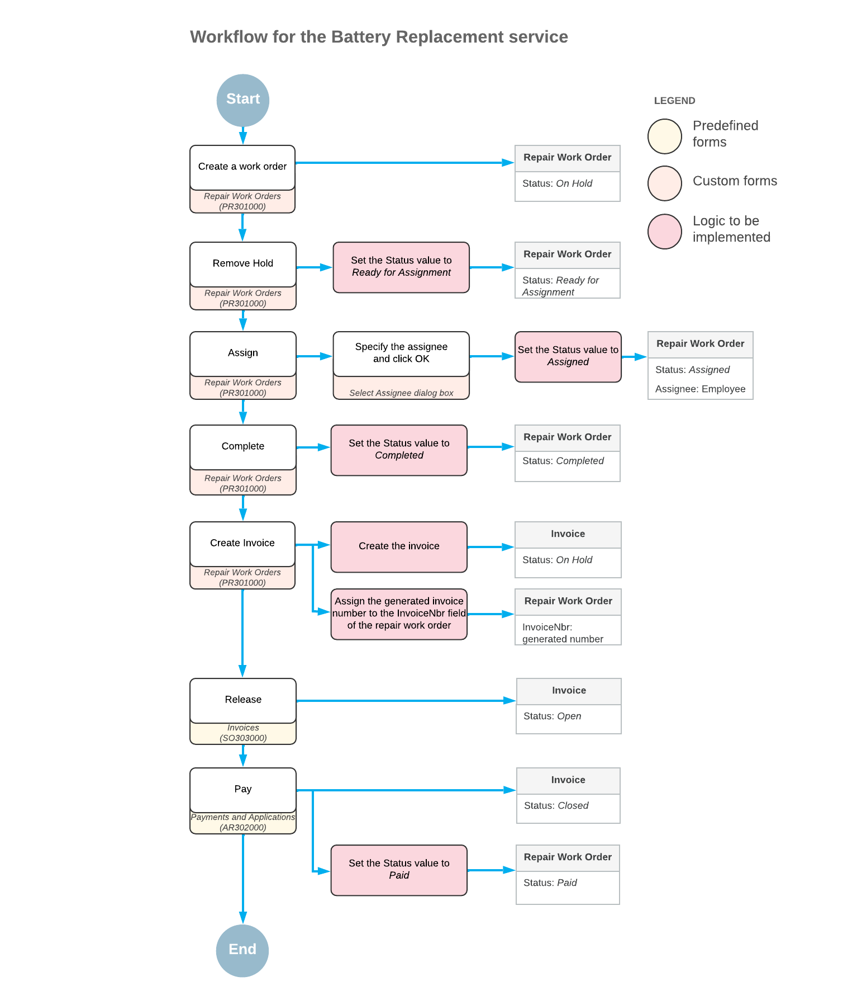
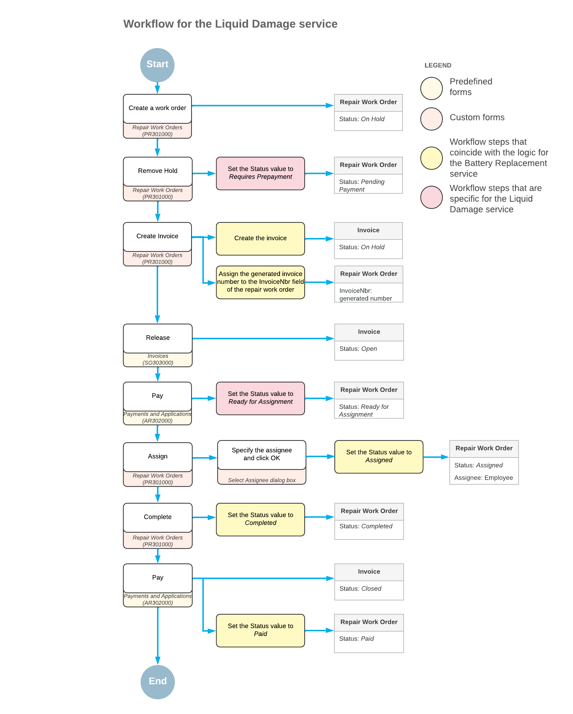

# Business Process Overview {#_65f0a094-29f4-4403-a7c5-8b55e2bcb571 .concept}

The workflow to be used for repair work orders created on the Repair Work Orders \(RS301000\) form will differ slightly depending on the particular service being performed, which can be *Battery Replacement*, *Liquid Damage*, or *Screen Repair*. This topic describes how the workflow will work for a repair work order for the *Battery Replacement* and *Liquid Damage* service.

## The Battery Replacement Service { .section}

When a user creates a repair work order for the *Battery Replacement* service on the Repair Work Orders \(RS301000\) form, the order will have the *On Hold* status. To change the order’s status to *Ready for Assignment*, a user will click the **Remove Hold** button on the form toolbar. Then a user will click the **Assign** button and specify the assignee in the **Select Assignee** dialog box. The order’s status will be changed to *Assigned*.

When work on the order is completed, a user will complete the assigned order by clicking the **Complete** button, which will give the order the *Completed* status. After that, a user creates an invoice for the order. When the invoice is fully paid, the system will assign the *Paid* status to the repair work order.

Thus, based on this workflow, a repair work order for the *Battery Replacement* service will be able to have the following statuses:

-   *On Hold*

    A newly created order has this status by default.

-   *Ready for Assignment*

    This status will be assigned when a user clicks the **Remove Hold** button.

-   *Assigned*

    This status will be assigned when a user clicks the **Assign** button.

-   *Completed*

    This status will be assigned when a user clicks the **Complete** button on the **Labor** tab.

-   *Paid*

    The system will assign this status to the order when the order is fully paid.

The following diagram shows the planned workflow for a repair work order for the *Battery Replacement* service. The system actions that have been or will be implemented in the *PhoneRepairShop* customization project are shown in the middle column.

## The Liquid Damage Service { .section}

When a user creates a repair work order for the *Liquid Damage* service on the Repair Work Orders \(RS301000\) form, the order has the *On Hold* status. To cause the system to change the order’s status to *Pending Payment*, a user will click the **Remove Hold** button on the form toolbar. This status indicates that a user needs to create, release, and apply a prepayment.

**Tip:** A repair work order for the *Liquid Damage* service requires prepayment if the **Requires Prepayment** check box is selected on the Repair Services \(RS201000\) form. The required percent to be prepaid has been specified in the **Prepayment Percent** box of the Repair Work Order Preferences \(RS101000\) form.

To create and apply the prepayment, a user should first create an invoice for the repair work order, and then create, release, and apply the prepayment on the [Payments and Applications](../UserGuide/AR_30_20_00.md) \(AR302000\) form; the repair work order’s status will be changed to *Ready for Assignment*. Then a user will assign the order to an employee, and the order’s status will be changed to *Assigned*.

When work on the order is completed, a user can complete the assigned order by clicking the **Complete** button on the **Labor** tab, which will cause the order to be assigned the *Completed* status. After that, a user will apply the rest of the payment to the invoice created for the order. When the invoice is fully paid, the system will assign the *Paid* status to the repair work order.

Thus, based on this workflow, a repair work order for the *Liquid Damage* service will be able to have the following statuses:

-   *On Hold*

    A newly created order has this status by default.

-   *Pending Payment*

    This status will be assigned when a user clicks the **Remove Hold** button on the form toolbar.

-   *Ready for Assignment*

    This status will be assigned to an order when a prepayment for it has been created, released, and applied, and the prepayment percent is greater than or equal to the required prepayment percent.

-   *Assigned*

    This status will be assigned when a user clicks the **Assign** button.

-   *Completed*

    This status will be assigned when a user clicks the **Complete** button on the **Labor** tab.

-   *Paid*

    The system will assign this status to the order when the order is fully paid. The payment will be applied to the same invoice to which the prepayment was applied.

The following diagram shows the planned workflow for a repair work order for the *Liquid Damage* service. The system actions that have been or will be implemented in the *PhoneRepairShop* customization project are shown in the middle column.

**Parent topic:**[Company Story and Customization Description](../DeveloperGuide/WorkflowAPI_CustomizationStory.md)

