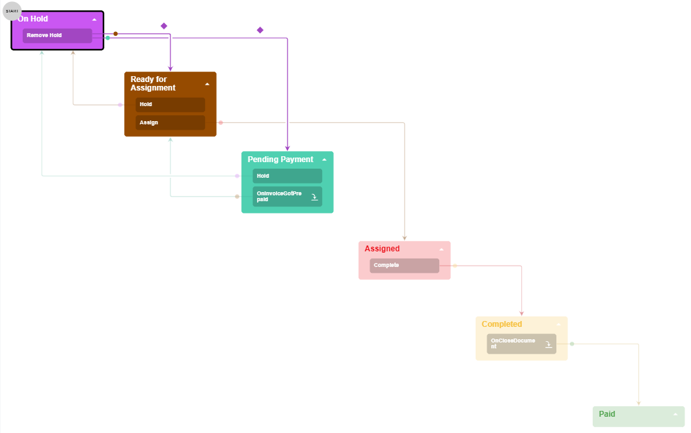
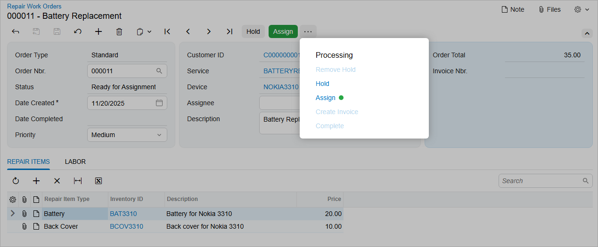
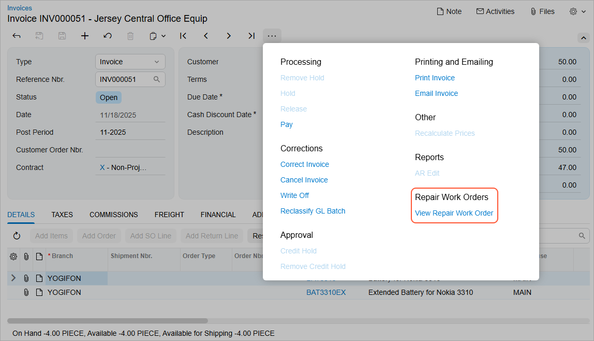

# Customization Description {#_a700d54a-17a4-4167-83e6-847e725e19fb .concept}

This topic describes the changes that will be implemented as part of the customization for the Smart Fix company.

## Custom Workflow for the Repair Work Orders Form { .section}

A review of the company's business processes has illustrated that the workflow for both services \(one of which requires prepayment and one of which does not\) can be united into a single workflow, which is shown in the following diagram. In the activities of this guide, you will implement this workflow for the Repair Work Orders \(RS301000\) form.

In the workflow, you will implement the following items:

-   The following states of the workflow, which correspond to the noted statuses of a repair work order:
    -   `WorkOrderStatusConstants.OnHold` \(*On Hold*\)
    -   `WorkOrderStatusConstants.PendingPayment` \(*Pending Payment*\)
    -   `WorkOrderStatusConstants.ReadyForAssignment` \(*Ready for Assignment*\)
    -   `WorkOrderStatusConstants.Assigned` \(*Assigned*\)
    -   `WorkOrderStatusConstants.Completed` \(*Completed*\)
    -   `WorkOrderStatusConstants.Paid` \(*Paid*\)
-   The following actions, which trigger the transitions of a repair work order and correspond to the noted command and button on the UI:

    -   `ReleaseFromHold` \(**Remove Hold**\), which triggers a transition from the `OnHold` state to the `PendingPayment` or `ReadyForAssignment` state
    -   `Assign` \(**Assign**\), which triggers a transition from the `ReadyForAssignment` state to the `Assigned` state
    -   `Complete` \(**Complete**\), which triggers a transition from the `Assigned` state to the `Completed` status
    You will also define the `CreateInvoice` action, which generates an invoice for the repair work order.

-   The transitions between states of the workflow
-   A dialog box that is shown when a user clicks the `Assign` action
-   The following workflow event handlers, which trigger transitions for a repair work order:
    -   `OnInvoiceGotPrepaid`, which triggers a transition from the `PendingPayment` workflow state to the `ReadyForAssignment` workflow state
    -   `OnCloseDocument`, which triggers a transition from the `Completed` workflow state to the `Paid` workflow state
-   The conditions that determine for a record created on the form to which workflow state the system should transit from the `OnHold` workflow state

You will also customize an existing Acumatica ERP graph to implement a transition in your custom workflow.

The resulting Repair Work Orders \(RS301000\) form will appear as shown in the following screenshot.

## Customized Workflow for the Invoices Form { .section}

To continue working on a repair work order after an invoice has been prepaid, a user needs an action that opens the corresponding repair work order from the [Invoices](../UserGuide/SO_30_30_00.md) \(SO303000\) form. Accordingly, you need to customize the predefined workflow of that form. The command corresponding to the action should be named **View Repair Work Order** and should be displayed on the More menu under the **Repair Work Orders** category, as shown in the following screenshot.

To implement this task, you will extend the graph to define the action and customize the predefined workflow of the [Invoices](../UserGuide/SO_30_30_00.md) \(SO303000\) form. In the customized workflow, you will do the following:

-   Define the workflow action
-   Define the action category
-   Add the action to the workflow state

**Parent topic:**[Company Story and Customization Description](../DeveloperGuide/WorkflowAPI_CustomizationStory.md)

