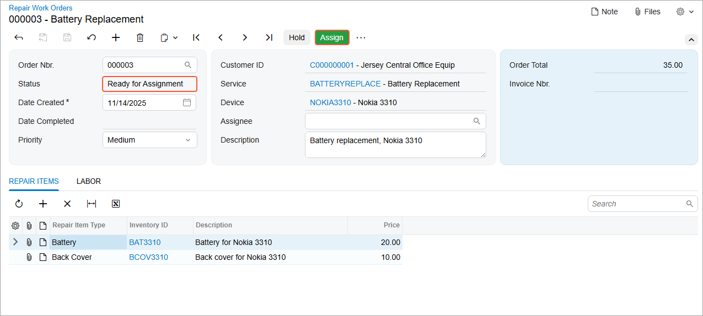
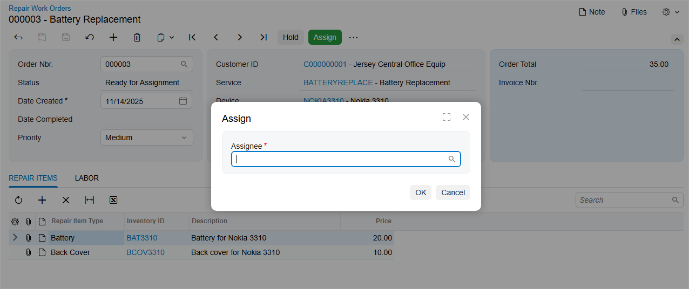

# Step 4: Testing the Assign Action {#_bb4f023c-962c-4b56-81e3-a82c165f3a51 .task}

In this step, you will test the **Assign** button \(and the associated action\) and the **Assign** dialog box. Do the following:

1.  Rebuild the `PhoneRepairShop_Code` project.
2.  In Acumatica ERP, open a repair work order with the *On Hold* status on the Repair Work Orders \(RS301000\) form.
3.  On the form toolbar, click **Remove Hold**.

    The status of the repair work order changes to *Ready for Assignment*. The **Assign** button is displayed on the form toolbar, as shown in the following screenshot.

    

4.  On the form toolbar, click **Assign**.

    The **Assign** dialog box appears, as shown in the following screenshot.

    

5.  In the **Assign** dialog box, select *Andrews, Michael*.
6.  Click **OK**.
7.  Notice that the status of the record has been changed to *Assigned* and that the specified assignee is displayed in the **Assignee** box.

**Parent topic:**[Workflow Dialog Boxes: To Implement a Transition with a Dialog Box](../DeveloperGuide/WorkflowAPI_DialogBox_Activity_ImplementTransition.md)

