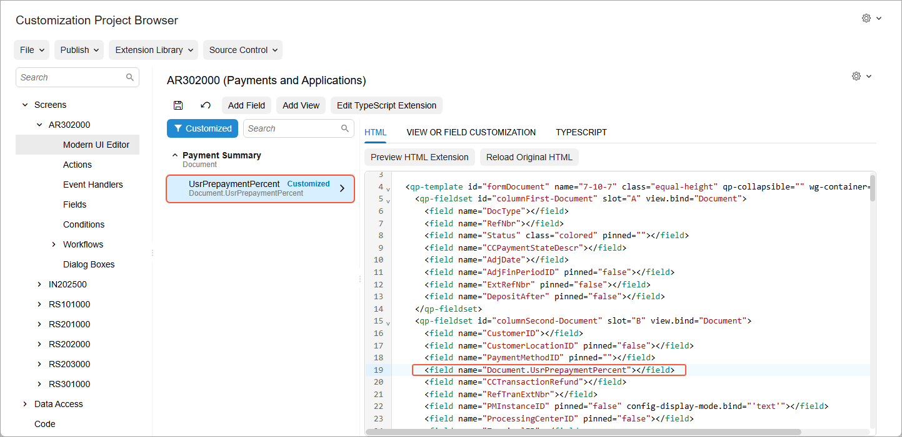

# Step 1: Creating a Custom Field {#_33808827-be45-49c9-90cf-0e3ff5d2bfc4 .task}

In Acumatica ERP, a user can create a payment for an invoice by clicking the **Pay** button or command on the [Invoices](../Shared/../UserGuide/SO_30_30_00.md) \(SO303000\) form. When the payment is created, it is opened on the [Payments and Applications](../Shared/../UserGuide/AR_30_20_00.md) \(AR302000\) form.

The workflow for the *Battery Replacement* service involves one payment, which is made upon completion of the work. Conversely, the workflow for the *Liquid Damage* service involves both a prepayment before the repair work is assigned and a final payment after the work is complete.

For the creation of the prepayment, you now need to have the default prepayment percentage for the payment displayed on the [Payments and Applications](../Shared/../UserGuide/AR_30_20_00.md) \(AR302000\) form to facilitate the entry of the prepayment amount, and to make it possible for a user to change that percentage for the current payment. To do that, you need to derive the value of the **Prepayment Percent** element on the Repair Work Order Preferences \(RS101000\) form and assign it to the corresponding custom field of the [Payments and Applications](../Shared/../UserGuide/AR_30_20_00.md) \(AR302000\) form.

You will create the custom field in this step and derive the field value in the next step.

## Adding a Custom Field to the Payments and Applications Form { .section}

To give users the ability to enter, view, and modify the prepayment percentage on the [Payments and Applications](../Shared/../UserGuide/AR_30_20_00.md) \(AR302000\) form, you need to add the **Prepayment Percent** box to the form. Complete the following general tasks:

1.  By using the Element Inspector, learn the name of the DAC and graph that define the Summary area of the [Payments and Applications](../Shared/../UserGuide/AR_30_20_00.md) \(AR302000\) form. In this case, the DAC is `ARPayment` and the graph is `ARPaymentEntry`. You need the DAC name to know which database table and DAC to extend. You’ll need the graph name in the next step.
2.  Add a column named `UsrPrepaymentPercent` to the `ARPayment` table with the same parameters as are specified for the `PrepaymentPercent` field of the `RSSVSetup` table. The data type of the column is `decimal(9, 6)`.

    Add the column on the **Data Access** page of the Customization Project Editor, generate the DAC extension from the added item, and move it to the extension library. The generated extension file has the `ARRegisterExtensions.cs` name, and the `UsrPrepaymentPercent` field is added to it.

    **Tip:** If you create a DAC extension by using the Customization Project Editor, it creates an extension of the base DAC. So in the case above, the system creates an extension of the ARRegister DAC because this DAC is the base DAC for the ARPayment DAC.

3.  Modify the code of the generated DAC extension in the `ARRegisterExtensions.cs` file so that the code in the file is the same as the code shown below.

    ```language-csharp
    using PX.Data;
    using PX.Objects.AR;
    using System;
    
    namespace PhoneRepairShop
    {
        // Acuminator disable once PX1016 ExtensionDoesNotDeclareIsActiveMethod extension
        // should be constantly active
        public sealed class ARRegisterExt : PXCacheExtension<ARRegister>
    	{
            #region UsrPrepaymentPercent
            [PXDBDecimal()]
            [PXDefault(TypeCode.Decimal, "0.0",
                PersistingCheck = PXPersistingCheck.Nothing)]
            [PXUIField(DisplayName = "Prepayment Percent")]
            public Decimal? UsrPrepaymentPercent { get; set; }
            public abstract class usrPrepaymentPercent :
                PX.Data.BQL.BqlDecimal.Field<usrPrepaymentPercent>
            { }
            #endregion
        }
    }
    ```

4.  Build the project in Visual Studio.
5.  Publish the customization project.
6.  Add a box for the custom `UsrPrepaymentPercent` field to the Summary area of the [Payments and Applications](../Shared/../UserGuide/AR_30_20_00.md) \(AR302000\) form as follows:
    1.  Add the [Payments and Applications](../Shared/../UserGuide/AR_30_20_00.md) form to the customization project.
    2.  On the [Modern UI Editor](../Shared/../UserGuide/AU_20_10_80.md) page for the [Payments and Applications](../Shared/../UserGuide/AR_30_20_00.md) form, use the **Add Field** button on the page toolbar to generate the TypeScript extension for the custom field. Note that the data view that corresponds to the Summary area is `Document`.
    3.  Specify the location for the corresponding control of the custom field in the HTML code and generate the HTML extension. The field should be placed after the `PaymentMethodID` field. On the **HTML** tab of the [Modern UI Editor](../Shared/../UserGuide/AU_20_10_80.md) page, the location of the added field appears, as shown below.

        

7.  Save your changes and publish the customization project.

**Parent topic:**[Workflow Events: To Create a Workflow Event](../DeveloperGuide/WorkflowAPI_Events_Activity_CreateNew.md)

