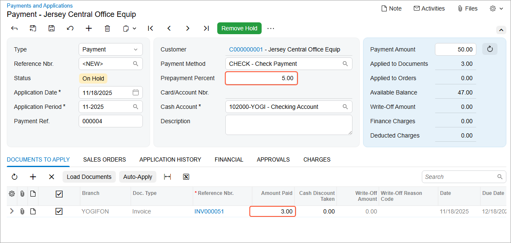
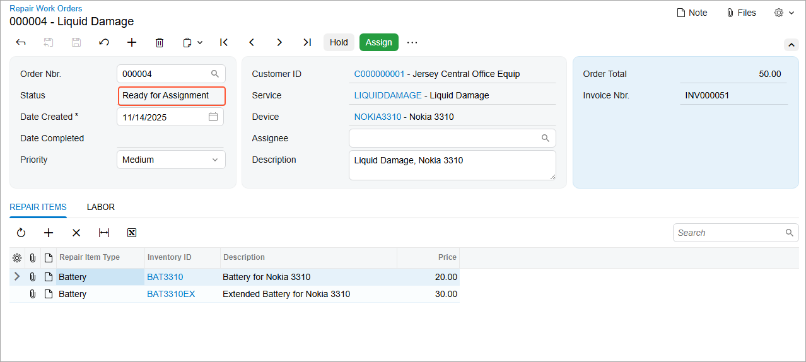

# Step 6: Testing the Transition {#_7c4852fe-e96c-4475-81d1-551f7be2f7c4 .task}

In this step, you will test the transition from the `PendingPayment` workflow state to the `ReadyForAssignment` workflow state. Do the following:

1.  Rebuild the `PhoneRepairShop_Code` project.
2.  In Acumatica ERP, on the Repair Work Orders \(RS301000\) form, open the repair work order with the *Pending Payment* status.
3.  On the form toolbar, click **Create Invoice**.

    In the **Invoice Nbr.** box, note the number of the invoice created for the repair work order.

4.  On the [Invoices](../UserGuide/SO_30_30_00.md) \(SO303000\) form, open the invoice created in the previous instruction.
5.  On the form toolbar, click **Remove Hold** and then **Release**.

    The invoice is assigned the *Open* status.

6.  On the More menu, click **Pay**.

    The [Payments and Applications](../UserGuide/AR_30_20_00.md) \(AR302000\) form opens. Notice that the **Prepayment Percent** box contains *10.00*, which has been copied from the Repair Work Order Preferences \(RS101000\) form.

7.  On the [Payments and Applications](../UserGuide/AR_30_20_00.md) \(AR302000\) form, change the existing values to the following values, as shown in the following screenshot:

    -   **Prepayment Percent**: `5.00`
    -   **Amount Paid** \(in the only row of the **Documents to Apply** tab\): `3.00`

        **Tip:** As you have noticed previously, the total amount of the invoice is $50.00. The paid amount \($3.00\) is greater than the amount \($2.50\) corresponding to the prepayment percent you specified on the form \(which is 5%\). Thus, $3 is enough to prepay the work order.

    

8.  On the form toolbar, click **Remove Hold** and then **Release**.

    The prepayment is applied.

9.  On the Repair Work Orders form, open the repair work order for which you have created the invoice in this step.

    Notice that the status of the created order has changed to *Ready for Assignment*, as shown in the following screenshot.

    

**Parent topic:**[Workflow Events: To Create a Workflow Event](../DeveloperGuide/WorkflowAPI_Events_Activity_CreateNew.md)

