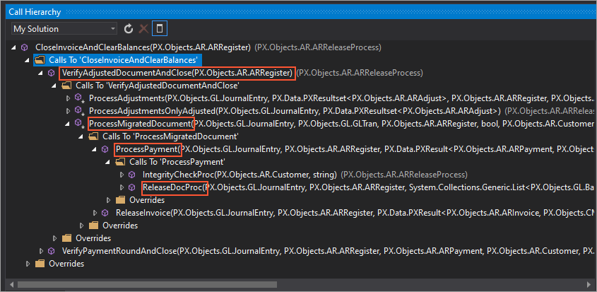
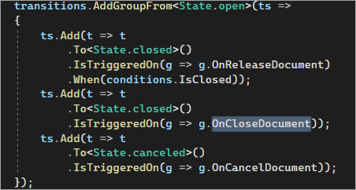

# Step 3: Exploring and Debugging the Code {#_98cc1909-b18c-49df-8f3a-2995bbd4abab .task}

Now that you have prepared the `PhoneRepairShop_Code` project for debugging in Visual Studio, you can continue exploring the code of the `Release` action to find the workflow event that you should use in the customization project. Do the following:

1.  In the code of the `Release` method, find the call of the `ARDocumentRelease.ReleaseDoc` method.

    The `ReleaseDoc` static method of the `ARDocumentRelease` static class is used to process the list of records in an invoice which are displayed on the **Details** tab of the form.

    **Tip:** You may notice that the `ReleaseDoc` operation starts within the StartOperation static method of the PXLongOperation static class to be executed in a background thread.

2.  Go to the definition of the `ARDocumentRelease.ReleaseDoc` method, which is in the `ARDocumentRelease.cs` file.

    Notice that for the created instance, the `ReleaseDoc` method invokes the `ARReleaseProcess.ReleaseDocProc` static method, which is applied for each document in the list of the documents to be released.

3.  Go to the definition of the `ARReleaseProcess.ReleaseDocProc` method.

    Notice that the `ARReleaseProcess.ReleaseDocProc` method receives the document as a record of the `ARRegister` data access class. During the document processing, the method creates a working copy of the record, specifies the fields of the record in the copy, and then restores the record in the cache from the completely ready copy. Inside the method, you can find the call to the `ProcessPayment` method.

4.  Go to the definition of the `ARReleaseProcess.ProcessPayment` method, and explore its code. The method processes the release of a payment.

    Continue exploring the methods that are called inside the `ARReleaseProcess.ProcessPayments` method. You can find the `ARReleaseProcess.CloseInvoiceAndClearBalances` method. The call hierarchy is shown in the following screenshot.

    

    Notice the following line in the code of the CloseInvoiceAndClearBalances method.

    ```language-csharp
    RaiseInvoiceEvent(ardoc, PXEntityEventBase<ARInvoice>.Container<ARInvoice.Events>
      .Select((ARInvoice.Events ev) => ev.CloseDocument));
    ```

    If you go to the definition of the RaiseInvoiceEvent\(ARRegister doc, SelectedEntityEvent&lt;ARInvoice&gt; invEvent\) method, you can find that the CloseDocument workflow event is fired in this method, as shown in the following line of the method.

    ```language-csharp
    invEvent.FireOn(this, (ARInvoice)doc);
    ```

5.  To make sure that CloseDocument is the workflow event that changes the invoice status to *Closed*, do the following:
    1.  Navigate to the `ARInvoiceEntry_Workflow.cs` file, which contains the definition of the workflow for the [Invoices](../UserGuide/SO_30_30_00.md) \(SO303000\) form.
    2.  In the WithHandlers method, locate the handler for the CloseDocument workflow event. The handler's name is OnCloseDocument.
    3.  Locate the transition from the `Open` state to the `Closed` state. Notice that the transition is triggered by the OnCloseDocument workflow event handler, as shown in the following screenshot.

        

6.  To make sure that the firing of the `CloseDocument` workflow event in the `ARReleaseProcess.CloseInvoiceAndClearBalances` method indeed happens when an invoice is fully paid, do the following:
    1.  Add a breakpoint to the line that fires the `OnCloseDocument` workflow event of the `ARReleaseProcess.CloseInvoiceAndClearBalances` method.
    2.  Prepare a payment for debugging by doing the following:
        1.  Open the invoice you created in [Workflow Actions: To Configure the Conditional Appearance of the Action](WorkflowAPI_Actions_Activity_CreateInvoice.md) by searching for its number on the [Invoices](../UserGuide/SO_30_30_00.md) \(SO303000\) form.
        2.  On the form toolbar of the [Invoices](../UserGuide/SO_30_30_00.md) \(SO303000\) form, click **Remove Hold**.

            The invoice is assigned the *Balanced* status.

        3.  On the form toolbar, click **Release**. The invoice is released.
        4.  On the More menu, click **Pay**.

            The [Payments and Applications](../UserGuide/AR_30_20_00.md) \(AR302000\) form opens.

    3.  On the form toolbar of the [Payments and Applications](../UserGuide/AR_30_20_00.md) \(AR302000\) form, click **Remove Hold**, and then click **Release**.
    4.  In Visual Studio, notice that a breakpoint in the `ARReleaseProcess.CloseInvoiceAndClearBalances` method was hit when an invoice was closed.
    5.  Stop debugging.

**Parent topic:**[Workflow Events: To Use an Existing Event](../DeveloperGuide/WorkflowAPI_Events_Activity_UseExisting.md)

